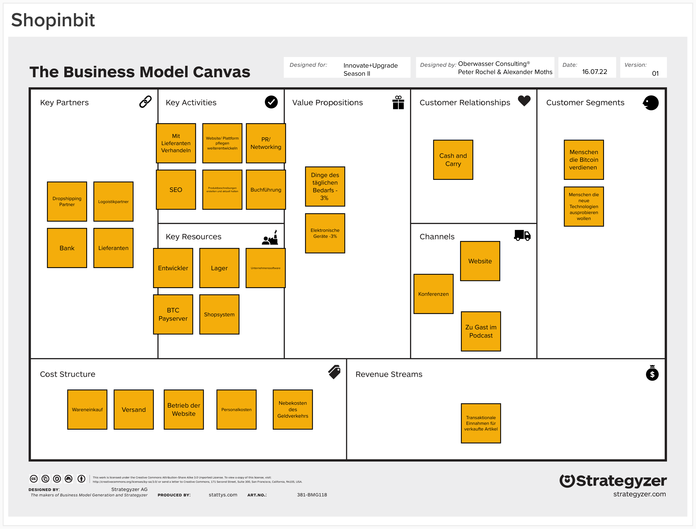

Business Model Design ist heute eine Pflichtübung für jedes Unternehmen. In dieser Folge zerlegen wir das Business Model Design von Shopinbit aus der Episode mit Lawrence Bahr. Dabei schauen wir nach Potenzialen und Möglichkeiten, das Erfolgsgeheimnis auf andere Unternehmen zu übertragen. Höre zu und erfahre, wie man das Business Model eines Onlinehändlers innovativ und strategisch verbessern kann.

### Überall da zu hören, wo es Podcasts gibt...

#### Diese Episode kannst du auch hier auf der Website hören:

<iframe data-osano="MARKETING" src="https://embed.podcasts.apple.com/us/podcast/business-model-hacking-e-commerce/id1354901024?i=1000570141455&amp;itsct=podcast_box_player&amp;itscg=30200&amp;ls=1&amp;theme=auto" height="175px" frameborder="0" sandbox="allow-forms allow-popups allow-same-origin allow-scripts allow-top-navigation-by-user-activation" allow="autoplay *; encrypted-media *; clipboard-write" style="width: 100%; max-width: 660px; overflow: hidden; border-radius: 10px; background-color: transparent;"></iframe>

  Bitte <a href="javascript:Osano.cm.showDialog()">akzeptiere Marketing-Cookies</a> um diese Folge im eingebetteten Player zu hören.

## Alle Themen und Kapitelmarken dieser Podcastfolge:

00:00:00 Intro 
00:01:47 Frage an unser Publikum 
00:03:15 Themeneinstieg 
00:08:25 Vorteile durch Bitcoin im E-Commerce 
00:09:31 Wiederholung Business Model Canvas 
00:12:19 Bausteine im Business Model Canvas 
00:13:50 Desirability im Business Model von Shopinbit 
00:16:39 Feasibility im Shopinbit Business Model 
00:32:47 Profitabilität im Shopinbit Business Model 
00:37:27 Unfairer Vorteil 
00:44:32 Learning für das eigene Business Model Design 
00:51:59 Get Out

### Alle Episodenlinks:

[JTBD on Bitcoin](https://oberwasser-consulting.de/open-source-jtbd-research/)
[Zur Episode mit Lawrence](https://oberwasser-consulting.de/shopinbit-unfair-advantage/)
[Bitcoin Beratung für Unternehmen](https://consulting-bitcoin.de)
[Einfach Bitcoinzahlungen entgegennehmen mit Lipa](https://getlipa.com)
[BTC Payserver](https://btcpayserver.org)

**Literaturtipps:**

- [55 innovative Konzepte mit dem St. Galler Business Model Navigator](http://amzn.to/2FotRLX)

- [Business Model Generation](https://amzn.to/2pKfnAu)
