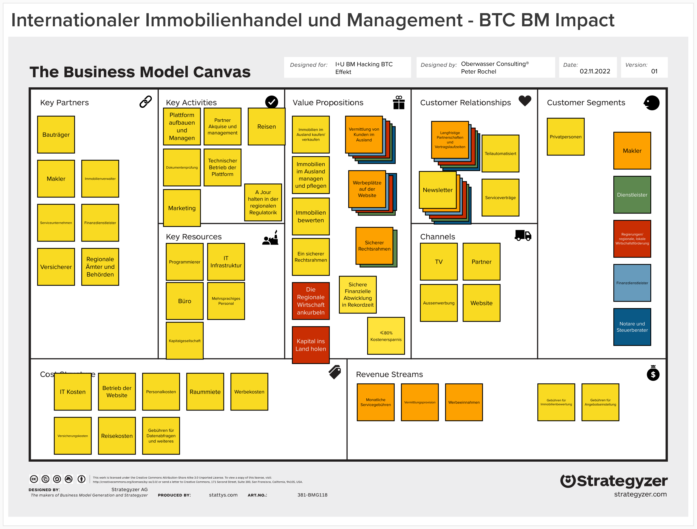
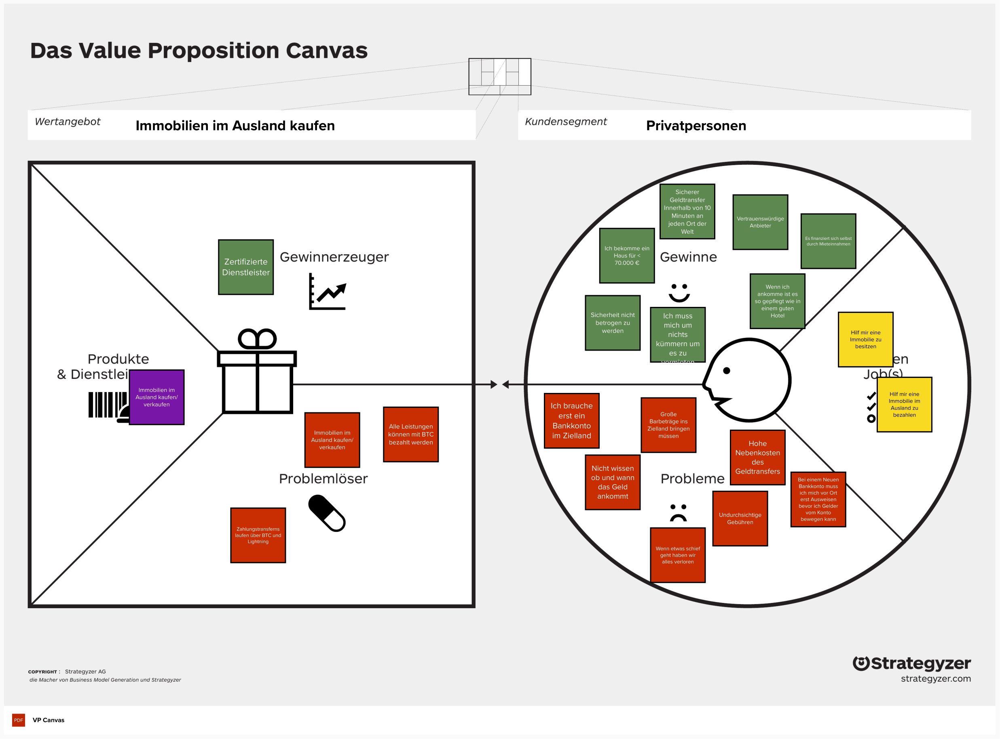

## Wie sieht das aus im internationalen Immobilienhandel?

Business Model Designs zu verstehen und zu hinterfragen ist für jedes Unternehmen überlebenswichtig. Besonders gilt das, wenn innovative Technologien bestehende Geschäftsmodelle in Frage stellen. In dieser Folge zerlegen wir das Business Model einer Plattform, die internationalen Immobilienhandel ermöglicht und stellen die Frage: "Wie könnte Bitcoin einen Einfluss haben?" Dabei schauen wir mit der Unterstützung von [Martin Betz](https://oberwasser-consulting.de/jtbd-on-bitcoin-update-v/) nach Potenzialen und Möglichkeiten, das Model durch Bitcoin zu verbessern und Potenziale zu identifizieren. Höre zu und erfahre, wie man das Business Model Denken am Beispiel einer PropTech Plattform wie [Emlak24](https://oberwasser-consulting.de/emlak24-ist-proptech-als-kulturbruecke/) inspirierend üben kann.

### Überall da zu hören, wo es Podcasts gibt...

#### Diese Episode kannst du auch hier auf der Website hören:

<iframe data-osano="MARKETING" src="https://embed.podcasts.apple.com/us/podcast/bm-hacking-mit-bitcoin-effekt-immobilienhandel-international/id1354901024?i=1000585193849&amp;itsct=podcast_box_player&amp;itscg=30200&amp;ls=1&amp;theme=auto" height="175px" frameborder="0" sandbox="allow-forms allow-popups allow-same-origin allow-scripts allow-top-navigation-by-user-activation" allow="autoplay *; encrypted-media *; clipboard-write" style="width: 100%; max-width: 660px; overflow: hidden; border-radius: 10px; background-color: transparent;"></iframe>

## Hier findest du alle Kapitel dieser Episode mit Zeitangabe:

00:00:00 Intro 
00:02:53 Was bisher geschah 
00:07:30 Internationaler Immoblienhandel 
00:08:54 Die Wertangebote 
00:10:33 Kundensegmente im mehrseitigen Business Model 
00:14:32 Kurzer Exkurs: Zoom in VP& WoP 
00:18:46 Kanäle 
00:27:58 Kundenbeziehungen 
00:34:48 Einnahmeströme 
00:40:11 Schlüsselaktivitäten 
00:45:22 Schlüsselressourcen 
00:49:35 Schlüsselpartner 
00:51:52 Kostenstruktur 
00:53:35 Bitcoin Effekt für das Geschäftsmodell 
00:54:16 Einführung zu Bitcoin 
00:56:27 Volatilität - Ein Problem? 
01:01:23 Chancen durch Multisignaturen 
01:06:52 Marketing und Transfergeschwindigkeit 
01:07:31 Bitcoiner als neue Zielgruppe 
01:09:06 Nebenkosten und Paymentsplitting 
01:13:06 Bankfunktionen übernehmen 
01:14:41 Regulatorischer Rahmen 
01:18:13 Finanzielle Inklusion und Sicherheit 
01:20:30 Get Out

https://www.youtube.com/watch?v=iviH\_uh1rg4&t=2102s

## Business Model Canvas internationaler Immobilienhandel

## Eine der Value Propositions unter der Lupe betrachtet

## Wünsch dir was!

**Welches Business Model sollten wir noch besprechen?** Lass es uns wissen, zum Beispiel mit einer Nachricht auf unserer Sprachbox oder per Email an podcast\[at\]oberwasser-consulting.de.

### Alle Episodenlinks:

- [Episode 047 über Emlak24 mit Dogan Gündogdu](https://oberwasser-consulting.de/emlak24-ist-proptech-als-kulturbruecke/)

- [Martin auf LinkedIn treffen oder folgen](https://www.linkedin.com/in/martin-betz/)

- [Mehr Beiträge von uns zum Thema Bitcoin](https://oberwasser-consulting.de/was-ist-bitcoin/)
