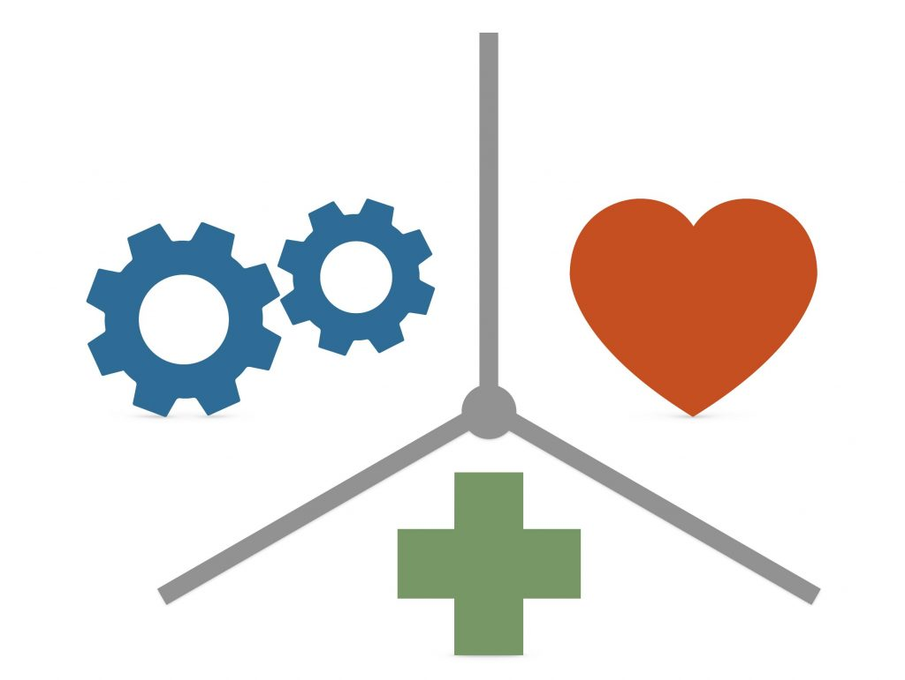
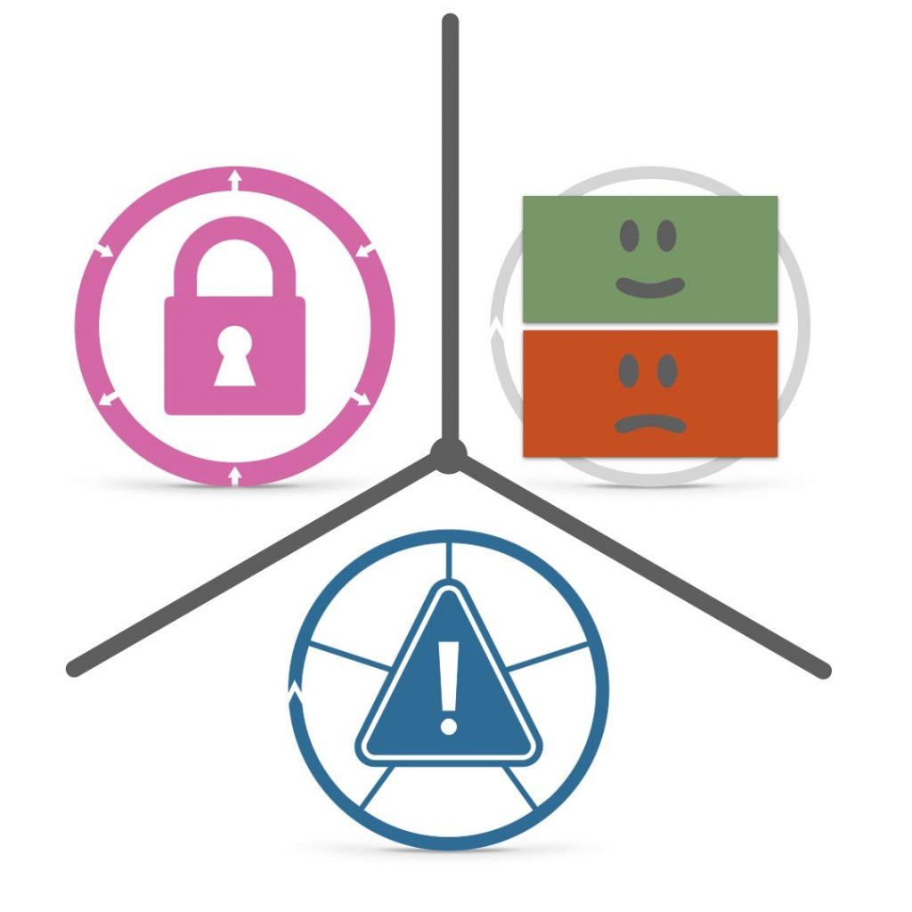
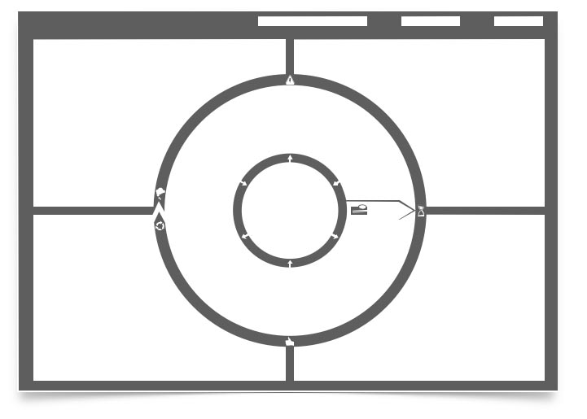

## Was ist ein JTBD?

Ein Job to Be Done, oder auch Kunden-Job, beschreibt wie Menschen in konkreten Situationen Fortschritt machen wollen – ganz egal ob geschäftlich, oder privat.

### Überall zu hören, wo es Podcasts gibt:

**Hier direkt I+U Staffel 2 Episode 016 anhören**

<iframe data-cookie-consent="marketing" data-cookieblock-src="https://embed.podcasts.apple.com/us/podcast/was-ist-ein-job-to-be-done/id1354901024?i=1000522034342&amp;itsct=podcast_box_player&amp;itscg=30200&amp;theme=auto" height="175px" frameborder="0" sandbox="allow-forms allow-popups allow-same-origin allow-scripts allow-top-navigation-by-user-activation" allow="autoplay *; encrypted-media *;" style="width: 100%; max-width: 660px; overflow: hidden; border-top-left-radius: 10px; border-top-right-radius: 10px; border-bottom-right-radius: 10px; border-bottom-left-radius: 10px; background-color: transparent;"></iframe>

00:00:00 Intro 
00:00:47 Definition JTBD 
00:01:05 Job Beispiele 
00:01:53 Gute JTBD Beschreibungen 
00:02:52 Problem Solution Gap überwinden 
00:03:48 Get out

### Einen Bohrer beauftragen?

Gute Beispiele für solche JTBD könnten etwa sein: hilf mir dabei, ein Loch in die Wand zu bekommen; oder hilf mir dabei, ein Bild aufzuhängen; oder hilf mir dabei, schöner zu wohnen; oder hilf mir dabei, als guter Heimwerker zu gelten und so weiter.
Für alle diese JTBD könnte ich einen Bohrer beauftragen um ihn komplett zu erledigen oder zumindest einen gewissen Fortschritt zu machen. Genauso gut hätte ich aber auch etwas ganz anderes damit beauftragen können.
Also können Jobs, funktionale, emotionale oder soziale Dimensionen haben.

_Jobs haben funktionale, emotionale und soziale Dimensionen_

Wichtig dabei ist es, den Job und vor allem die Umstände, unter denen er auftaucht, möglichst genau zu verstehen. Die genaue Beschreibung eines Jobs zeigt, unter welchen Bedingungen Menschen dauerhaft zu neuen Verhaltensmustern, Lösungen, Produkten, Services oder Marken wechseln.

## Customer Jobs Beschreiben - mit drei zentralen Elementen

_Zu einer genauen Beschreibung, mit der sich besonders gut arbeiten lässt, gehören immer drei Elemente: [Ereignisse](/trigger-events-des-jtbd-fortschrittszyklus/), [Kräfte](/kraefte-im-jobs-to-be-done-modell/) und limitierender Kontext._

### Den Job to Be Done genau Beschreiben

[Ereignisse](/trigger-events-des-jtbd-fortschrittszyklus/) werden dabei meistens in bis zu 5 verschiedene Kategorien aufgeteilt, Kräfte in bis zu 8, limitierender Kontext in bis zu 3 Kategorien.
Damit es nicht zu komplex wird, gilt auch hier die Faustregel: So viel wie nötig, so wenig wie möglich.

### Das ganze Bild sehen und verstehen: JTBD Canvas

_Hilft dir dabei, so einfach wie möglich und so präzise wie nötig, Kunden-Jobs zu beschreiben: Der **The Wheel of Progress®** Canvas_

## Die Jobs-Brille

Die Perspektive der Jobs-Brille hilft dabei, die **unsichtbare Mauer** zwischen der Anbieterperspektive und der Kundensicht aufzubrechen, das **Problem-Solution Gap** etwas überwindbarer zu machen, an dem ein hoher mehrstelliger Prozentbetrag aller Innovationen scheitert. Frag dich doch in Zukunft öfter mal: Für welchen Job du gerade eigentlich ein bestimmtes Produkt beauftragt hast. Oder für welchen Job deine Kunden dein Produkt beauftragen…

### Weitere Episoden dazu direkt hier

- [In Episode 03 der ersten Staffel besprechen wir die JTBD Theorie ausführlich](https://oberwasser-consulting.de/podcast003/)

- [In dieser Episode geht es mit Sonja Knab von Burda Forward um JTBD in der betrieblichen Marktforschung](/betriebliche-marktforschung-mit-jobs-to-be-done/)

- [In der Episode 40 der ersten Staffel geht es um das erfolgreiche implementieren von JTBD](https://oberwasser-consulting.de/podcast040/)

- [Hier berichtet Nils Wloka über seine praktischen Erfahrungen mit Jobs to be Done und dem The Wheel of Progress® bei der Entwicklung neuer Produkte](https://oberwasser-consulting.de/jtbd-und-chaos-engineering/)

- [Eine Einführung in das JTBD Mindset, Sprache und Methodik gibt Peter Rochel hier in diesem kostenfreien Video für das Portal Meine Kundenbrille](https://oberwasser-consulting.de/praxistalk-mit-mr-kundenbrille/)

### Hier das komplette Transkript zur Podastepisode

## **Was ist eigentlich ein Job to be done?**

Ja, alleine der Begriff ist schon etwas verwirrend, um hier vorab schon mal ein bisschen etwas zu klären.

Verwendet werden die Begriffe **Job**, **Kundenjob**, zu **erledigende Aufgabe**, **JTBD** oder **Job to be done** oder **Jobs to be done**.

Wenn ich jetzt hier und heute von einem dieser Begriffe spreche, dann meine ich damit immer einen Job to be done im Sinne der **[Jobs to Be Done Theorie](https://oberwasser-consulting.de/ueber/die-jobs-to-be-done-theorie/)** und nichts anderes.

Gut, ein Job to Be Done, was ist das überhaupt?

Ein Job to Be Done beschreibt, wie Menschen in konkreten Situationen **Fortschritt** machen wollen und dabei ist es völlig egal, ob das Ganze geschäftlich oder privat stattfindet.

Gute Beispiele für einen solchen Job to Be Done könnten etwa sein: **Hilf mir dabei** ein Loch in die Wand zu bekommen oder hilf mir dabei ein **Bild aufzuhängen** oder hilf mir dabei **schöner zu wohnen** oder hilf mir dabei **als guter Heimwerker zu gelten** und so weiter.

Also du siehst, Jobs können in diesem Sinne sowohl funktionale, emotionale oder auch soziale **Dimensionen** haben.

Für alle diese Jobs oder Jobs to Be Done könnte ich einen **Bohrer** beauftragen, um ihn, also den Job, komplett zu erledigen oder zumindest einen gewissen **Fortschritt** dabei zu machen.

Genauso gut hätte ich aber auch etwas ganz anderes damit beauftragen können.

Heißt nichts anderes, als dass **Jobs** immer unterschiedliche **Lösungen** haben und jedes Produkt kann verschiedene Jobs erledigen.

Wichtig ist dabei, den Job und vor allem die **Umstände**, unter denen er auftaucht, möglichst genau zu verstehen.

Denn eine genaue Beschreibung dieses Jobs zeigt dir genau, unter welchen **Bedingungen** Menschen dauerhaft zu neuen Verhaltensmustern, Lösungen, **Produkten**, Services oder Marken **wechseln**.

Für so einer genauen Beschreibung eines Jobs to Be Done, mit der sich besonders gut arbeiten lässt, gehören immer **drei** **Elemente**, nämlich **Ereignisse**, **Kräfte** und limitierender **Kontext**.

Wobei Ereignisse dabei meistens in bis zu fünf verschiedene **Kategorien** **aufgeteilt** werden können, Kräfte in bis zu acht Kategorien und limitierender Kontext in bis zu drei.

Auch hier ist es wie bei allen Dingen, damit es nicht zu komplex wird, gilt hier die Faustregel, so viel wie nötig, so wenig wie möglich.

Jobsbeschreibungen kann man beispielsweise besonders gut darstellen auf einem **Canvas** wie auf dem [**The Wheel of Progress®** .](https://oberwasser-consulting.de/jtbd-tools/)

Tja, was bringt das Ganze?

Allein die **Perspektive** der Jobs to Be Done **Brille** hilft dir dabei, diese unsichtbare Mauer zwischen der Anbieterperspektive und der Kundensicht aufzubrechen.

Also, das **Problem-Solution-Gap** etwas überwindbarer zu machen, das ist nämlich dafür **verantwortlich**, dass ein hoher mehrstelliger Prozentbetrag aller Innovationen **scheitert**.

Setz dir also im Geiste doch einfach zukünftig mal diese **[Jobsbrille](https://oberwasser-consulting.de/praxistalk-mit-mr-kundenbrille/)** auf und frag dich, für welchen Job du gerade eigentlich ein bestimmtes Produkt beauftragt hast, was du aktuell in der Verwendung hast, oder frag dich noch besser, für welchen Job haben das wohl meine Kunden beauftragt.

Und allein das hilft dir dabei, das Problem oder sogenannte Problem-Solution-Gap etwas überwindbarer zu machen, nämlich dass Dinge gebaut werden, die **Lösungen** sind für Probleme, die kein Mensch hat.

Tja, und das war's auch schon wieder für heute.

Mehr zur Jobs to be done Theorie erfährst du in Episode 3 der ersten Staffel, da bespreche ich das Thema zusammen mit Eckhart Böhme.

Bei Fragen zum Thema oder wenn du Hilfe benötigst, dann melde dich gerne bei mir oder hör doch mal rein, wie beispielsweise die Implementierung von Jobs to be done in einem Research Management aussehen kann.

Wenn er dir gefallen hat, dann freue ich mich riesig über ein paar Sternchen an der Bewertung, zum Beispiel über Apple Podcast.

Ansonsten sonnige Grüße und ich hoffe, wir hören uns bald wieder.
