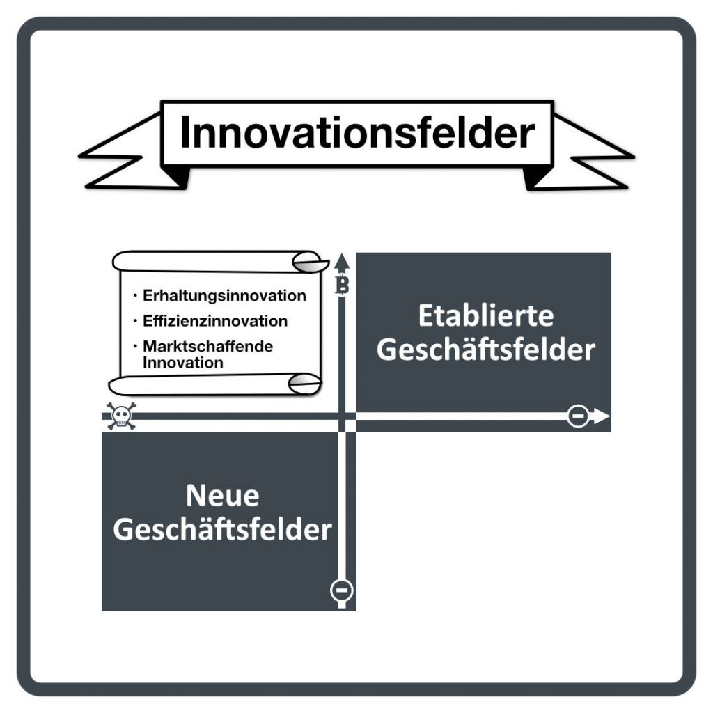

In diesem JTBD Podcast-Shot erklärt Peter Rochel die drei Arten von Innovation. Peter zeigt in knapp 11 Minuten auf, worin sich diese drei Innovationstypen unterscheiden und warum es elementar wichtig für Unternehmen ist, sie zu kennen und gezielt einzusetzen.

**Hier direkt I+U Staffel 2 Episode 045 anhören**

<iframe data-osano="MARKETING" src="https://embed.podcasts.apple.com/us/podcast/die-drei-arten-von-innovation/id1354901024?i=1000575992804&amp;itsct=podcast_box_player&amp;itscg=30200&amp;ls=1&amp;theme=auto" height="175px" frameborder="0" sandbox="allow-forms allow-popups allow-same-origin allow-scripts allow-top-navigation-by-user-activation" allow="autoplay *; encrypted-media *; clipboard-write" style="width: 100%; max-width: 660px; overflow: hidden; border-radius: 10px; background-color: transparent;"></iframe>

**Alle Zeitstempel der Kapitel dieser Episode**:

00:00:00 Intro 
00:01:06 Glückspiel-Hinweis! 
00:02:03 Drei Arten von Innovation 
00:03:01 Sustaining-Innovations 
00:04:15 Efficieny-Innovations 
00:05:41 Market-Creating Innovations 
00:07:36 Wo JTBD und WoP helfen 
00:10:33 Get out 

## Fehlt da nicht die Disruptive Innovation?

Nein - Der Begriff der Disruptiven Innovation ist zu irreführend und mehrdeutig. Clay Christensen selbst war zunehmend sehr unglücklich mit der Verwendung dieses Begriffs, da sie stark von seiner Definition abwich. Aus diesem Grund folgen wir dem Vorschlag von Christensen, den Begriff durch "Marktschaffende Innovation" zu ersetzen, der deutlich passender ist.

### Weitere Episoden dazu direkt hier

- [Podcast-Shot zum Thema Lösungen](https://www.stattys.com/de/methoden/business-model-generation/testtools)

- [Podcast-Shot Was ist ein JTBD](/der-job-to-be-done-jtbd/)

- [Artikel im Forbes-Magazin zum Disruption-Dilemma](https://www.forbes.com/sites/stevedenning/2015/12/02/fresh-insights-from-clayton-christensen-on-disruptive-innovation/?sh=22331d914702)

- [Fördermengenentwicklung von Erdöl in den USA](https://www.eia.gov/dnav/pet/hist/LeafHandler.ashx?n=PET&s=MCRFPUS2&f=A)

- [US Bureau of Labour Statistics](https://www.bls.gov)

- [Bitcoin - Marktschaffende Innovation?](https://oberwasser-consulting.de/open-source-jtbd-research/)
