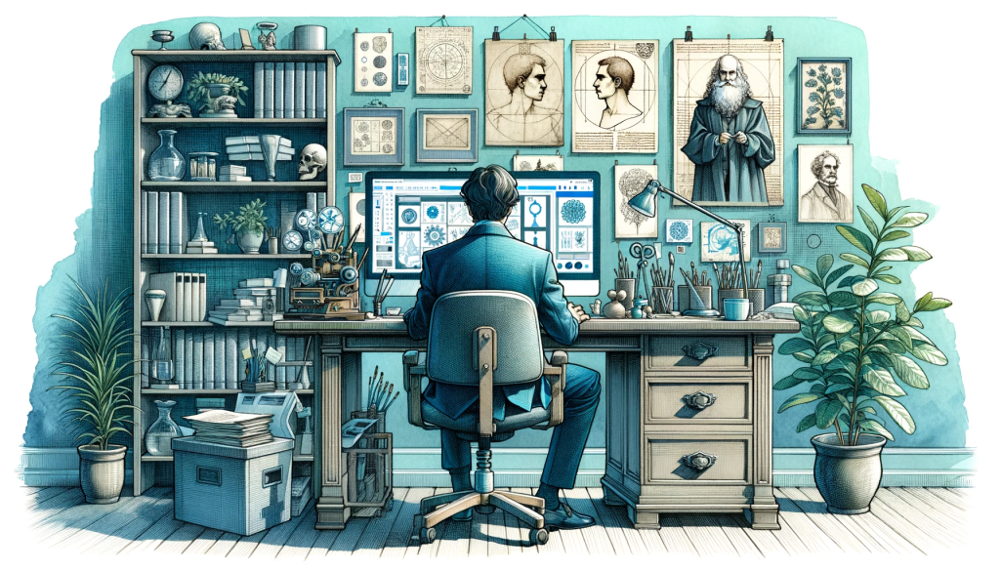

## Christmas special: AI picture outtakes

As you know, the images I use in this newsletter are all AI generated. I use Dalle-3 via ChatGPT for it. The style is a mixture of “drawn with watercolors” and “use geometric shapes” and the colors are blue and mint, as these are our primary corporate colors.

Sometimes, visualizing the ideas is pretty straightforward. But especially the topics, that are more abstract in nature, give me headache. Finding an image that represents the message you want to convey can be pretty difficult.

As a christmas gift, I wan to share with you some outtakes. These are pictures that:

I liked, but couldn’t use for some reason (like format, color or glitches)

Some that made me laugh, because of how bad they’ve been

We use the same imagestyle on our website, so I will add some from the creation process there as well. Like this illustration of the process on how to work with us. As you can see, a usual project with us has the following steps:

- We start a rocket
- The rocket is flying somewhere
- We start another rocket
- You pay us
- This makes another rocket fly in a very unusual way
- We look at the data together
- After some time, we put a butterfly and a woman in the rocket

This didn’t work, so we changed the process to:

- You send us a mail
- We interview you
- We take the data from the interview and some data from the cloud into a contract
- There will be some iterations and then we do some interviews with customers
- Then everything will work out
- It’s a greenfield approach that takes off like a rocket

We are pretty happy with the new process 😅

Getting to this picturestyle had some interesting iterations as well, like this watercolor without geometric image for the [“Where to start, when your business isn’t running”](/en/blog/where-to-start-when-your-business-isnt-running/) picture

<figure>

<figcaption>

So dreamy 😍

</figcaption>

</figure>

The style wasn’t consistently replicable, so we tried the style of different artists as additional input.

Our [“404-page not found” page](https://utxo.solutions/404) (that you have hopefully never seen), now has a ship at open sea. But before that, we had a cute dog, lost in a wide field. Here is the variation of the dog in the style of William Turner, who is famous for ship paintings in the romance art period.

This was the dog inspired by Syd Mead. 

Interesting thing: You can’t use the style from modern artist (probably after 1950). You have to extract the style and make an indirect copy. This is how by the way how we came up with the geometric style elements.

Here is also a “Da Vinci style variation” of someone taking part in our [“Mastering Jobs to be done workshop”.](/services/mastering-jobs-to-be-done-online-workshop/) My favorite is the little skull in the shelf to the left. But hey, customer research is for everyone, we are not judging.

Our dandy warhole participant was so interested, that he even moved his chair into the table 😅

The post about the [near win bias](/en/blog/we-are-so-close/) was rather difficult. I tried different chasing scenarios, like people trying to catch a butterfly. At some point, they started running away from the butterfly. The butterfly even makes a gesture of “why are you running away” with his little arms:

For the [uncertainty post](/en/blog/he-who-knows-not-does-not-buy/), I tried to create a confused brain. I guess, the picture is kind of accurate:

I also tried to develop our logos in the same way. This logo was the moment, I realized, that if your secondary colors are mint, lime and lavender, you will get something plant related. Language is difficult:

I removed lime and lavender from the prompts, but sometimes mint comes up in leafs. Like in the [product language fit post](/en/blog/how-to-achieve-product-language-fit/)\-picture. Asking it to draw a concept visualization doesn’t work that well yet. The prompt is too open.

The last outtakes are going to be from the [correlation vs causality post](https://utxo.solutions/blog/confusing-correlation-with-causality). I tried really hard to put this in a picture. One attempt was someone overly believing into all of his data being connected. It is a previous iteration of the picture that made it, just slightly more mad 🤯

And as the final image, here we have a businessman telling his wife, that the more steak he eats, the more people buy his product. It has it all:

- Glitches
- Extra limbs
- Overly crowded background
- Wrong colors
- Cropped format
- The mint-leaves

But look at his face. The conviction! It kind of says it all.

PS: The header-picture for this post is from the correlation vs causality post as well. It’s the attempt to redraw [this spurilous correlation](https://www.tylervigen.com/spurious-correlations) of per capita cheese consumption and people dying from being entangled in their bedsheets. Let’s say, the data looks cheesy 😁

With this, I wish you a happy christmas with the first attempt of “draw christmas”. Some things are just easy to explain 🎄

## Additional christmas present?

We give away one free spot in our Mastering Jobs to be done workshop in January. First come first serve. Just send us a mail.
