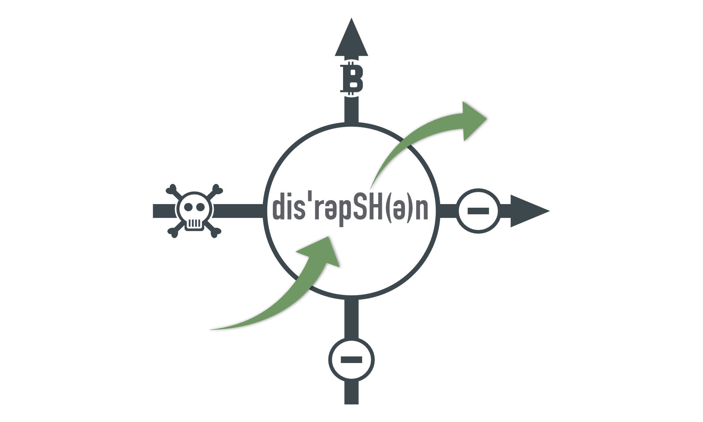

## Innovate+Upgrade mit Alexander Moths – Update II

**Alexander Moths** und Peter Rochel ordnen die Bitcoin Straßenumfragen aus Episode 026 in den Kontext einer Innovationsstudie. Dabei geht es heute vorrangig um die Herausforderung, den geeigneten Zugang zu relevanter Information in einem Markt des "Nicht-Konsums" zu finden. Über Disruption reden ist immer einfach, wenn sie schon passiert ist. Hier nehmen wir die Zuhörenden mit in ein offenes Projekt zum Mitmachen am Beispiel Bitcoin und Massenadoption. Innovation, die über Fortschritt hinaus geht. Wie wir die Innovation Beyond Progress dezentral angehen hörst du gleich hier - oder überall wo es Podcasts gibt.

**Hier direkt I+U Staffel 2 Episode 028 anhören**:

<iframe data-osano="MARKETING" src="https://embed.podcasts.apple.com/us/podcast/innovation-beyond-progress/id1354901024?i=1000540241312&amp;itsct=podcast_box_player&amp;itscg=30200&amp;ls=1&amp;theme=auto" height="175px" frameborder="0" sandbox="allow-forms allow-popups allow-same-origin allow-scripts allow-top-navigation-by-user-activation" allow="autoplay *; encrypted-media *;" style="width: 100%; max-width: 660px; overflow: hidden; border-top-left-radius: 10px; border-top-right-radius: 10px; border-bottom-right-radius: 10px; border-bottom-left-radius: 10px; background-color: transparent;"></iframe>

00:00:00 Intro 
00:01:10 Feedback auf Feedback 
00:04:12 Disruptive Innovation 
00:09:44 Fremde Menschen ansprechen 
00:11:27 Fragen um die Sprache der Menschen zu verstehen 
00:20:40 Ein Experiment zum Testen der Fragen 
00:23:39 Den Markt der (noch)Nicht-Kunden besser verstehen 
00:35:05 Get Out

#### Hier kannst du den Podcast kostenlos abonnieren:

## Weiterführende Links und Referenzen

- [Episode 026 mit der Straßenumfrage](https://oberwasser-consulting.de/disruptive-innovation-vor-unseren-augen/)

- [Laufendes open source JTBD Projekt zum Thema Bitcoin](https://oberwasser-consulting.de/open-source-jtbd-research/)

- [Open Source JTBD on Bitcoin Update III](https://oberwasser-consulting.de/jtbd-on-bitcoin-update-iii/)

- [Open Source JTBD on Bitcoin Update IV](https://oberwasser-consulting.de/von-banken-ohne-loesung-und-kleinsparern/)

- [Mehr zum Thema "bessere Fragen stellen"](https://oberwasser-consulting.de/auf-die-fragen-kommt-es-an-jtbd-meetup-35/)

- [Zu den Videos mit den Bitcoin Umfragen](https://www.youtube.com/playlist?list=PLzH0J0sBMcRr05M12kBtP1cTU8_Gj6x3N)
