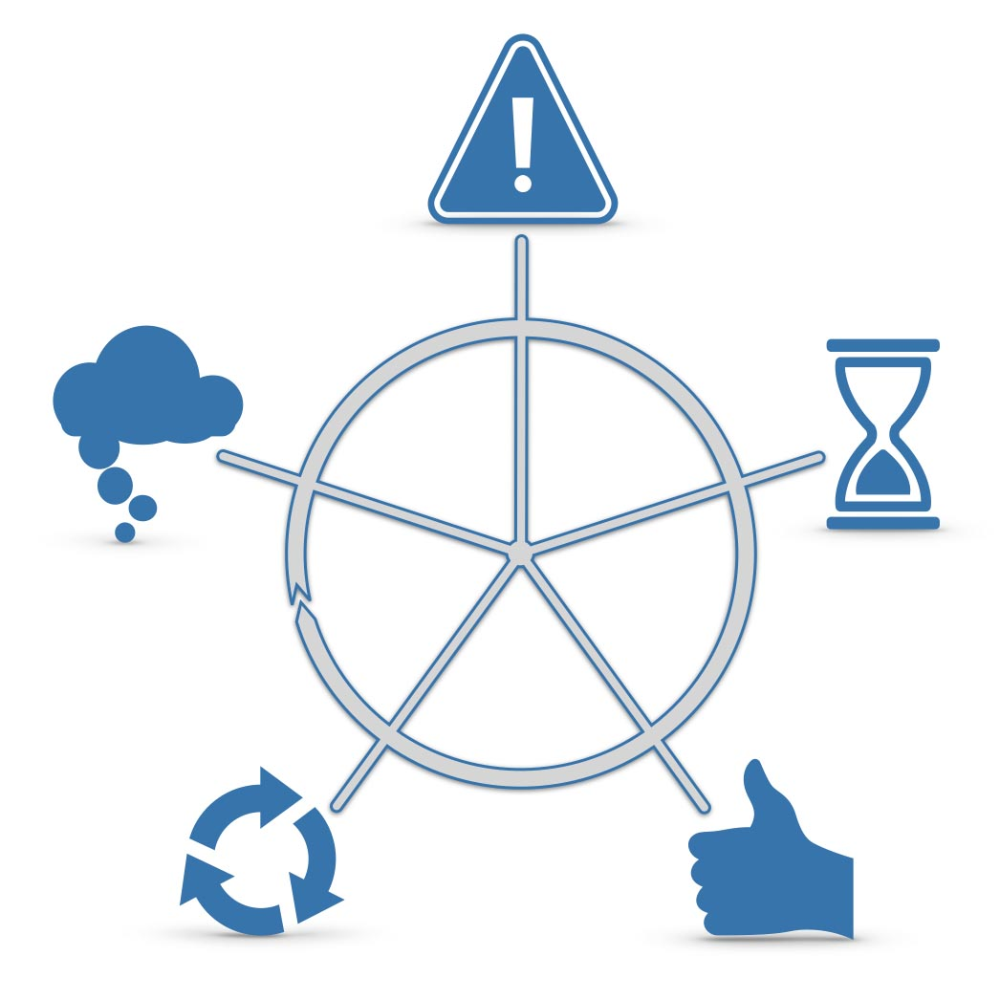

## So findest du die Events auf der Timeline 

**Hier direkt I+U Staffel 2 Episode 020 anhören**

<iframe data-osano="MARKETING" src="https://embed.podcasts.apple.com/us/podcast/jtbd-interviewtechnik/id1354901024?i=1000528479044&amp;itsct=podcast_box_player&amp;itscg=30200&amp;ls=1&amp;theme=auto" height="175px" frameborder="0" sandbox="allow-forms allow-popups allow-same-origin allow-scripts allow-top-navigation-by-user-activation" allow="autoplay *; encrypted-media *;" style="width: 100%; max-width: 660px; overflow: hidden; border-top-left-radius: 10px; border-top-right-radius: 10px; border-bottom-right-radius: 10px; border-bottom-left-radius: 10px; background-color: transparent;"></iframe>

### Überall zu hören, wo es Podcasts gibt:

00:00:00 Intro 
00:00:30 Direkt zum ersten Gedanken 
00:01:45 Ereignis 2 finden 
00:02:34 Ereignis 1 finden 
00:04:09 Wobei dir die Ereignisse nützlich sind 
00:05:14 Get out

#### Hier kannst du den Podcast kostenlos abonnieren:

### Ereignisse auf der Timeline

Ereignisse sind die Auslöser für neue Phasen auf dem Fortschrittszyklus oder der Timeline.

Gute Beispiele für ein JTBD-Ereignis könnten etwa sein: "erfährt davon, dass...", oder "bekommt den Auftrag...", oder "...dann sagt ihr/ihm jemand, dass" und so weiter. Für alle diese Ereignisse gilt: Sie lösen die nächste Phase im Fortschrittszyklus aus.

## Fünf Ereignisse im JTBD Fortschrittszyklus

1. _Erster Gedanke_ (Wolke)

3. _Ereignis 1_ (Ausrufezeichen)

5. _Ereignis 2_ (Stundenglas)

7. _Beauftragung_ (Daumen)

9. _Wiederholte Beauftragung_ (Pfeile-Kreis)

[Mehr über Trigger-Ereignisse](/trigger-events-des-jtbd-fortschrittszyklus/)

### Das ganze Bild sehen und verstehen: JTBD Canvas

_Hilft dir dabei, so einfach wie möglich und so präzise wie nötig, Kunden-Jobs zu beschreiben: Der **The Wheel of Progress®** Canvas_

### Weitere Episoden dazu direkt hier

- [Hier erklärt Peter Rochel in 4 Minuten was außer Ereignissen noch zu einem Job to Be Done gehört](https://oberwasser-consulting.de/der-job-to-be-done-jtbd/)

- [Episode 057 I+U Shot zum Thema Trigger Ereignisse]/trigger-events-des-jtbd-fortschrittszyklus/)

- [Clubhouse Talk zum Thema Kundeninterviews](https://oberwasser-consulting.de/auf-die-fragen-kommt-es-an-jtbd-meetup-35/)

- [Videoaufzeichnung eines JTBD Interviews mit Live-Mapping](https://oberwasser-consulting.de/podcast043/)
