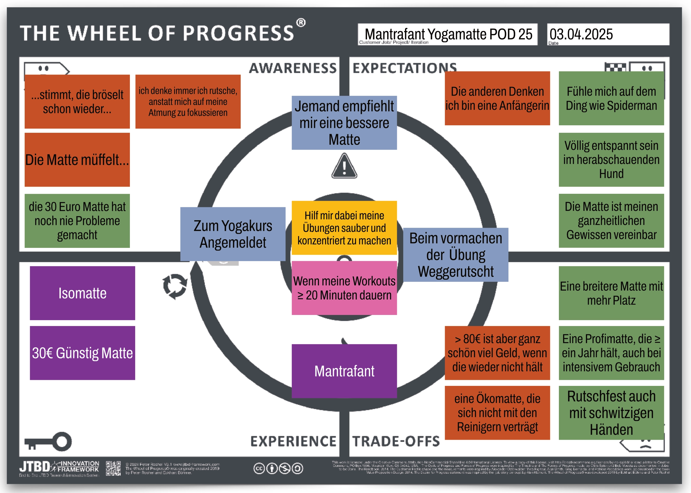

Wie kann dein Unternehmen zuverlässig Kundenbedürfnisse entdecken und Produkte erfolgreich am Markt platzieren? Am Beispiel von **Mantrafant Yogamatten** zeigt sich deutlich, wie die strukturierte JTBD-Beratung von **UTXO Solutions** genau das ermöglicht – messbar und praxisnah.

## Das Ausgangsproblem: Wenn Produkte trotz Qualität nicht wachsen – das Mantrafant-Dilemma

Obwohl Mantrafant Yogamatten von Kunden geliebt wurden, stagnierte der Umsatz trotz hoher Werbeinvestitionen. Das Team verstand nicht, warum Kunden nicht reagierten – hier kam der [JTBD-Prozess ](https://utxo.solutions/leistungen/customer-research-sprints)von UTXO ins Spiel.

## Die JTBD-Beratung im Detail: Wie UTXO Solutions mithilfe von JTBD echte Kaufmotive freilegte

In praxisnahen **JTBD-Workshops** und [systematischen Interviews](https://utxo.solutions/blog/was-sind-jtbd-interviews.html) wurden Kunden tiefgehend analysiert. UTXO nutzte dabei das eigens entwickelte [JTBD Innovation Framework](https://utxo.solutions/progress-design-map.html) und das [Wheel of Progress Canvas](https://utxo.solutions/blog/wheel-of-progress-so-verwandelst-du-kundenbeduerfnisse-systematisch-in-erfolgreiche-innovationen), um verborgene Kundenbedürfnisse sichtbar zu machen.

## Der Prozess in der Praxis – Schritt für Schritt:

1. **Strukturierte Kundeninterviews durchführen**
2. **Auswertung mit dem Wheel of Progress Canvas**
3. **Ableitung der echten Kaufmotive und Kundenbedürfnisse**
4. **Schnelle Umsetzung in Marketing, Vertrieb und Produktstrategie**

## Messbare Ergebnisse durch JTBD mit UTXO:

* ✅ **Verkäufe um Faktor 5 gesteigert**
* ✅ **Werbekosten um 60 % gesenkt**
* ✅ **Höhere Kundenbindung und Weiterempfehlungsquote**
* ✅ **Sofort sichtbarer ROI der JTBD-Beratung**

Mit JTBD gelang es Mantrafant, exakt die Bedürfnisse anzusprechen, die Kunden zu echten Käufen bewegten.

## Warum UTXO Solutions der ideale JTBD-Partner ist:

* ✅ **Klare methodische Struktur und erprobtes Innovations-Framework**
* ✅ **Praxisorientierte Workshops, schnelle Umsetzung**
* ✅ **Hoher Praxisbezug – messbare Ergebnisse in kurzer Zeit**

### Auch dein Unternehmen soll von JTBD profitieren?

**[➡️ Jetzt persönlichen Beratungstermin sichern!](https://cal.com/peterrochel)**

- - -

## Häufig gestellte Fragen (FAQs):

### Was passiert in einem JTBD Workshop bei UTXO?

Bei UTXO Solutions lernst du, systematische Kundeninterviews durchzuführen und auszuwerten, um echte Kaufmotive sichtbar zu machen.

### Warum lohnt sich die Investition in eine JTBD-Beratung?

JTBD hilft Unternehmen nachweislich, Verkäufe zu steigern, Kosten zu senken und Fehlentscheidungen zu vermeiden.

### Welche Ergebnisse liefert die JTBD-Methode konkret?

Unternehmen, die JTBD anwenden, erhöhen ihre Umsätze deutlich und verbessern messbar Kundenbindung und Produktentwicklung.

- - -

## [📥 Komplette Mantrafant Case Study als PDF herunterladen](https://oberwasser-consulting.de/wp-content/uploads/2025/04/CASE-STUDY-Mit-JTBD-zur-Verfunffachung-der-Verkaufe-Mantrafant-Yogamatten.pdf)

- - -

*UTXO Solutions – Deine Experten für kundenzentrierte Innovation mit Jobs to Be Done.*
