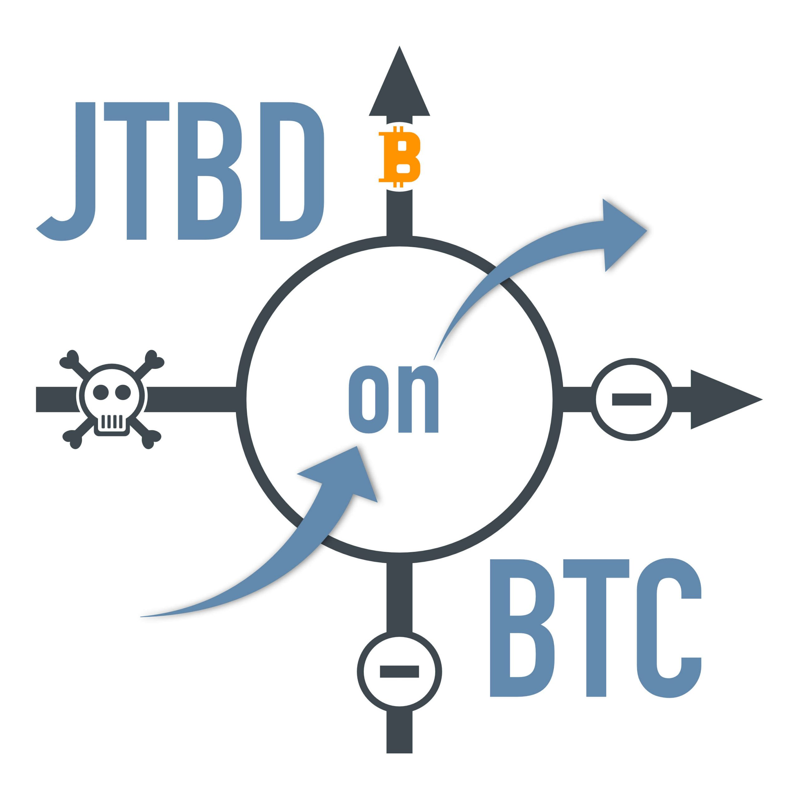

## Innovate+Upgrade mit Alexander Moths

**Alexander Moths** und Peter Rochel geben ein aktuelles Status-Update zur offenen The Wheel of Progress® Jobs to Be Done on Bitcoin Studie. Heute berichten die beiden von den Erfahrungen aus dem Kickoff und der nun startenden Research-Phase des [Projekts](https://oberwasser-consulting.de/open-source-jtbd-research/). Wie das offene Projekt verläuft und welche Erkenntnisse jetzt schon gewonnen wurden, hörst du gleich hier – oder überall, wo es Podcasts gibt.

**Hier direkt I+U Staffel 2 Episode 030 anhören**:

<iframe data-osano="MARKETING" src="https://embed.podcasts.apple.com/us/podcast/jtbd-on-bitcoin-update-iii/id1354901024?i=1000543240686&amp;itsct=podcast_box_player&amp;itscg=30200&amp;ls=1&amp;theme=auto" height="175px" frameborder="0" sandbox="allow-forms allow-popups allow-same-origin allow-scripts allow-top-navigation-by-user-activation" allow="autoplay *; encrypted-media *;" style="width: 100%; max-width: 660px; overflow: hidden; border-top-left-radius: 10px; border-top-right-radius: 10px; border-bottom-right-radius: 10px; border-bottom-left-radius: 10px; background-color: transparent;"></iframe>

00:00:00 Intro 
00:02:04 JTBD on Bitcoin Projektteam wer ist dabei 
00:04:18 Kickoff - Team Alignment 
00:05:11 Projektteam 
00:07:41 Phase 2 - Research und dann? 
00:11:39 Warum so viele Interviewiews? 
00:15:09 Was mit uns passiert 
00:20:10 Die richtigen Leute finden 
00:23:15 Was wir von wem lernen 
00:26:27 Massenadoption im Vergleich 
00:36:01 Get Out

#### Hier kannst du den Podcast kostenlos abonnieren:

## Weiterführende Links und Referenzen

- [Zur JTBD on BTC Projektseite](https://oberwasser-consulting.de/open-source-jtbd-research/)

- [Open Source JTBD on Bitcoin Projekt](https://oberwasser-consulting.de/open-source-jtbd-research/)

- [Open Source JTBD on Bitcoin Update II](https://oberwasser-consulting.de/innovation-beyond-progress/)

- [Open Source JTBD on Bitcoin Update IV](https://oberwasser-consulting.de/von-banken-ohne-loesung-und-kleinsparern/)

- [Podcast-Shot zum Thema geeignete Kandidaten](https://oberwasser-consulting.de/gute-kandidaten-fuer-jtbd-interviews/)

- [Podcast-Shot zum Thema Lösungen](https://oberwasser-consulting.de/was-sind-loesungen/)

- [Massenadoption im Vergleich - Internet vs. Bitcoin](https://bitcoinist.com/not-just-a-fad-bitcoin-adoption-curve-rivals-the-internet/)

- [Verein Einundzwanzig](https://einundzwanzig.space/verein/)
