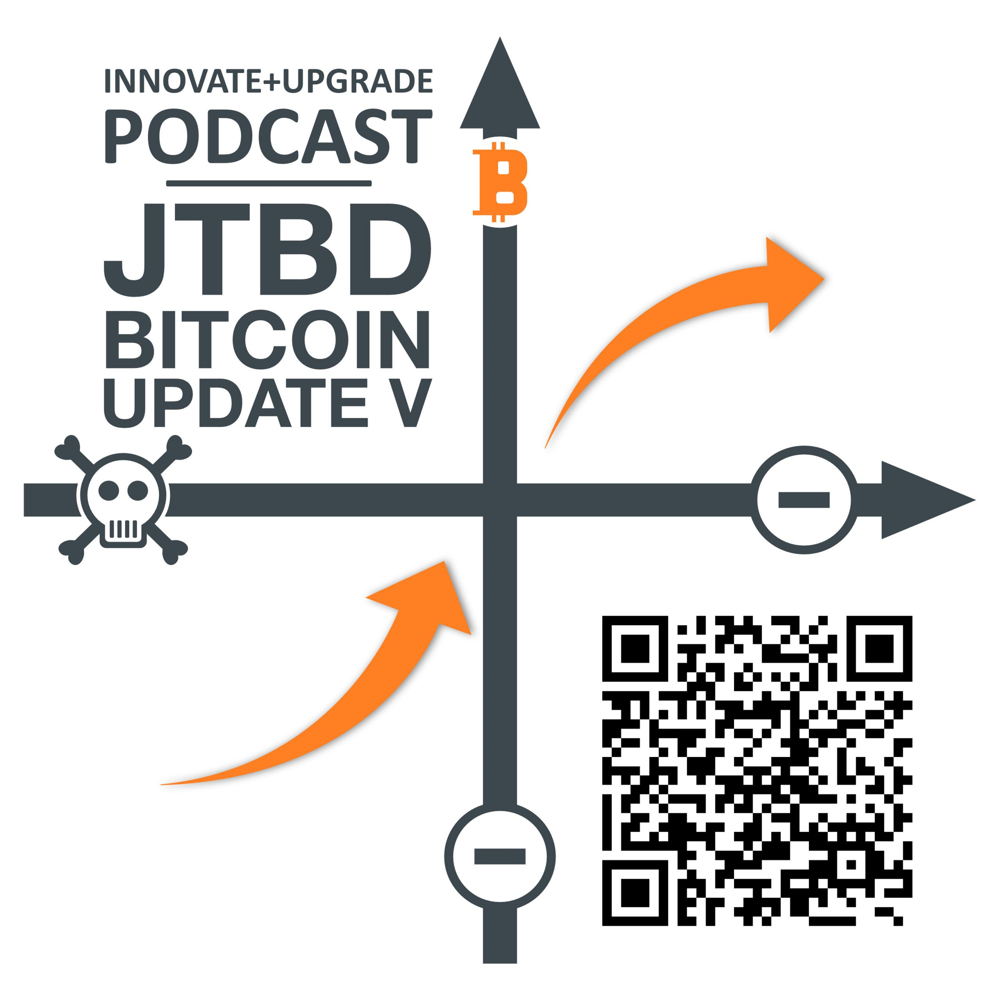

## Innovate+Upgrade mit Alexander Moths

**Alexander Moths** und Peter Rochel geben ein aktuelles Status-Update zur offenen The Wheel of Progress® [Jobs to Be Done on Bitcoin Studie](https://oberwasser-consulting.de/open-source-jtbd-research/). Heute ist Martin Betz für dieses Update zu Gast. Martin hat eine Spezialberatung zum Thema Bitcoin für Banken und Unternehmen gegründet und an der Studie partizipiert. Konkret berichten Peter und Martin über ihre Erkenntnisse aus den Interviews mit Banken und Finanzdienstleistern.

**Hier direkt I+U Staffel 2 Episode 041 anhören**:

<iframe data-osano="MARKETING" src="https://embed.podcasts.apple.com/us/podcast/jtbd-on-bitcoin-update-v/id1354901024?i=1000563065403&amp;itsct=podcast_box_player&amp;itscg=30200&amp;ls=1&amp;theme=auto" height="175px" frameborder="0" sandbox="allow-forms allow-popups allow-same-origin allow-scripts allow-top-navigation-by-user-activation" allow="autoplay *; encrypted-media *; clipboard-write" style="width: 100%; max-width: 660px; overflow: hidden; border-radius: 10px; background-color: transparent;"></iframe>

00:00:00 Intro 
00:03:45 Gründen im Bitcoin-Business 
00:05:58 Mit Bankern über Bitcoin reden 
00:08:54 Fokus auf Veränderung 
00:10:31 Verändern aktuelle Entwicklungen die BTC Adoption? 
00:15:16 Was ist spannend, wenn nicht die Preisentwicklug? 
00:17:19 Kann Bitcoin doch noch bedeutungslos werden? 
00:19:13 Welche Themen haben die Banken? 
00:24:26 Business Model Disruption und blinde Flecken der Banken 
00:36:46 JTBD für Bitcoingründer 
00:40:33 Fehleinschätzung und überraschende Erkenntnisse 
00:42:48 Anders fragen lernen 
00:45:18 Nächste Schritte in der JTBD on BTC Studie 
00:48:16 Banker - Menschen 
00:50:17 Get Out

#### Hier kannst du den Podcast kostenlos abonnieren:

## Weiterführende Links und Referenzen

- [Zur JTBD on BTC Projektseite](https://oberwasser-consulting.de/open-source-jtbd-research/)

- [Martin Betz & Consulting Bitcoin](https://www.linkedin.com/company/consulting-bitcoin/)

- [Der Nodesignal Podcast](https://nodesignal.space)

- [Oeconomia - Preisgekrönte Doku zum Thema Geldschöpfung](https://www.zdf.de/filme/dokumentarfilm-in-3sat/oeconomia-104.html)

- [BTC22 - Die Bitcoin Konferenz](https://bconf.de)

- [Strike App](https://strike.me)

- [Verein Einundzwanzig](https://einundzwanzig.space/verein/)
