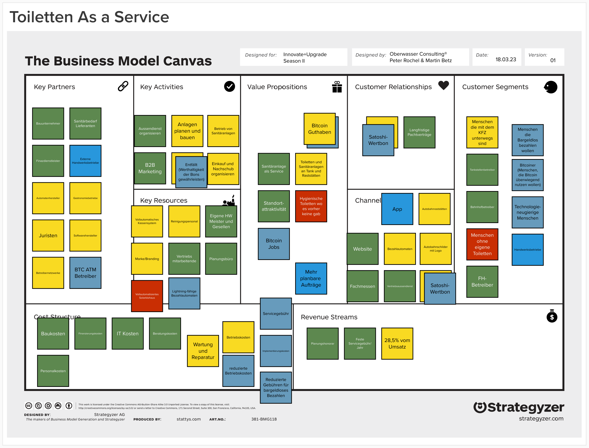

## Wie verändert Bitcoin das Business Model Design?

In dieser Podcastfolge tauchen wir tief in die Welt der Bitcoin- und Lightning-Zahlungen ein und untersuchen, wie Unternehmen mit Geschäftsmodellen ähnlich wie Sanifair von dieser innovativen Technologie profitieren können. Erfahre, wie die Integration von Lightning-Zahlungen dazu beitragen kann, Kundenzufriedenheit zu steigern, Kosten zu reduzieren und das Image eines Unternehmens als technologischer Vorreiter zu festigen.

Von der Erweiterung der Kundensegmente bis hin zur Schaffung neuer Geschäftsmöglichkeiten - wir beleuchten alle Aspekte, in denen Lightning-Zahlungen einen positiven Einfluss auf das Geschäftsmodell haben können. Dabei geben Martin Betz und Peter Rochel hilfreiche Tipps, worauf du bei der Einführung von Lightning-Zahlungen achten solltest, um regulatorischen Anforderungen zu entsprechen.

Höre diese spannende Podcastfolge und lasse dich inspirieren, wie dein Unternehmen die Vorteile der Blockchain-Technologie nutzen kann, um wettbewerbsfähig zu bleiben und neue Potenziale zu erschließen.

### Überall da zu hören, wo es Podcasts gibt...

#### Diese Episode kannst du auch hier auf der Website hören:

<iframe allow="autoplay *; encrypted-media *; fullscreen *; clipboard-write" frameborder="0" height="175" style="width:100%;max-width:660px;overflow:hidden;border-radius:10px;" sandbox="allow-forms allow-popups allow-same-origin allow-scripts allow-storage-access-by-user-activation allow-top-navigation-by-user-activation" src="https://embed.podcasts.apple.com/us/podcast/lightning-zahlungen-f%C3%BCr-unternehmen-vorteile-implementierung/id1354901024?i=1000604822774"></iframe>

## Hier findest du alle Kapitel dieser Episode mit Zeitangabe:

00:00:00 Intro 
00:03:18 Kurzeinführung Bitcoin Lightnig Netz 
00:07:02 Mit einem QR-Code den Toilettengang zahlen 
00:11:19 Auswirkungen von BTC Zahlungen auf das Business Model Design 
00:17:07 Mehr freie Liquidität und reduzierte Kostenstruktur 
00:21:31 Neues Kundensegment erreichen 
00:26:18 Bitcoin in Kanälen und Kundenbeziehung des Business Model Designs 
00:33:18 Zusätzliches Wertangebot: Bitcoinguthaben 
00:44:50 First-Mover Vorteile 
00:50:00 Bitcoins IOT Potenziale 
01:04:04 Get Out

## Business Model Canvas Beispiel für Bitcoinzahlungen

## Wünsch dir was!

**Welches Business Model sollten wir noch besprechen?** Lass es uns wissen, zum Beispiel mit einer Nachricht auf unserer Sprachbox oder per Email an podcast\[at\]oberwasser-consulting.de.

### Alle Episodenlinks:

- [Über ein Wordpress-Plugin mit BTC zahlen](https://sup.os24.work)

- [BTC Paywall - Jens Leinert und Coincharge](https://coincharge.io/blog-lightning/)

- [BTC Vortrag von Martin zu Micropayments und Streaming](https://www.youtube.com/watch?v=rxWuJ5C3p3w&t=5s)

- [Max Forster über pay per use](https://oberwasser-consulting.de/podcast045/)

- [Auf der SBC machen wir Innovationworkshops zu Bitcoin-Business Modellen](https://swiss-bitcoin-conference.com/#schedule_section)

- [Podcast der Bittcoin Effekt](https://www.podcast.de/podcast/3092179/der-bitcoin-effekt-dein-business-podcast)

- [Martin auf LinkedIn treffen oder folgen](https://www.linkedin.com/in/martin-betz/)

- [Mehr Beiträge von uns zum Thema Bitcoin](https://oberwasser-consulting.de/was-ist-bitcoin/)

## Hier eine knappe Zusammenfassung der Episode

Die Frage ist also, ob die Akzeptanz von Lightning-Zahlungen für ein Unternehmen wie Sanifair oder ähnliche Geschäftsmodelle Sinn ergibt und welche Vorteile sich daraus ergeben könnten. Um das zu analysieren, schauen wir uns verschiedene Aspekte des Geschäftsmodells an und überlegen, in welchen Bereichen Bitcoin und Lightning-Zahlungen einen Einfluss haben könnten.

## Einfluss von Bitcoin auf die neun Bausteine des Business Models

### Kundensegmente

Bei der Akzeptanz von Lightning-Zahlungen erweitert das Unternehmen möglicherweise seine Kundengruppe, indem es auch Kunden anspricht, die Bitcoin besitzen und diese zur Zahlung nutzen möchten.

### Value Proposition / Wertversprechen

Ein Unternehmen, das Lightning-Zahlungen akzeptiert, kann sich als innovativ und zukunftsorientiert präsentieren. Das kann das Image des Unternehmens verbessern und den Kunden vermitteln, dass sie sich auf dem neuesten Stand der Technik bewegen.

### Kanäle

Die Integration von Lightning-Zahlungen kann auch dazu führen, dass zusätzliche Vertriebskanäle erschlossen werden, wie beispielsweise Online-Plattformen oder Smartphone-Apps, die Bitcoin-Zahlungen akzeptieren.

### Kundenbeziehungen

Durch die Akzeptanz von Lightning-Zahlungen kann ein Unternehmen seinen Kunden mehr Zahlungsoptionen bieten und somit die Kundenzufriedenheit erhöhen. Zudem kann die Nutzung von Bitcoin als Zahlungsmittel das Vertrauen der Kunden in die Sicherheit der Transaktionen erhöhen.

### Einnahmequellen

Die Akzeptanz von Lightning-Zahlungen ermöglicht dem Unternehmen, zusätzliche Einnahmequellen zu erschließen. Zum Beispiel können Gebühren für Bitcoin-Transaktionen oder Wechselgebühren für die Umrechnung von Bitcoin in Fiat-Währungen anfallen.

### Schlüsselressourcen

Die Integration von Lightning-Zahlungen in das bestehende System erfordert technisches Know-how und möglicherweise zusätzliche Hard- und Software. Hier könnten Synergien entstehen, wenn das Unternehmen bereits auf dem Weg der Digitalisierung ist.

### Schlüsselaktivitäten

Die Einführung von Lightning-Zahlungen kann auch neue Geschäftsmöglichkeiten in anderen Bereichen eröffnen, wie zum Beispiel der Entwicklung von eigenen Wallets oder der Einrichtung von Bitcoin-Geldautomaten.

### Schlüsselpartner

Durch die Akzeptanz von Lightning-Zahlungen kann das Unternehmen neue Partnerschaften eingehen, zum Beispiel mit Krypto-Börsen oder Zahlungsdienstleistern, die Bitcoin-Zahlungen abwickeln.

### Kostenstruktur

Die Implementierung von Lightning-Zahlungen kann zu Kosteneinsparungen führen, da Bitcoin-Transaktionen in der Regel schneller und günstiger sind als traditionelle Banküberweisungen. Allerdings können auch zusätzliche Kosten entstehen, etwa für die Anpassung der bestehenden Infrastruktur oder für Schulungen der Mitarbeiter.

### Fazit

Insgesamt könnten Unternehmen wie Sanifair von der Akzeptanz von Lightning-Zahlungen profitieren, indem sie sich als innovativ und zukunftsorientiert positionieren, die Kundenzufriedenheit erhöhen und möglicherweise Kosteneinsparungen realisieren. Allerdings hängt der tatsächliche Nutzen von der konkreten Umsetzung und den spezifischen Gegebenheiten des jeweiligen Unternehmens ab. Es ist wichtig, eine sorgfältige Analyse der Chancen und Risiken durchzuführen und die Einführung von Lightning-Zahlungen auf die individuellen Bedürfnisse und Ziele des Unternehmens abzustimmen.

Ein weiterer wichtiger Aspekt, der bei der Einführung von Lightning-Zahlungen zu beachten ist, betrifft regulatorische und rechtliche Fragen. Je nach Land und Region können unterschiedliche Gesetze und Vorschriften für den Umgang mit Kryptowährungen gelten. Bevor ein Unternehmen sich für die Akzeptanz von Lightning-Zahlungen entscheidet, sollte es sich daher ausführlich über die geltenden Regelungen informieren und gegebenenfalls rechtlichen Beistand einholen.

Zusammenfassend lässt sich sagen, dass die Akzeptanz von Lightning-Zahlungen für Unternehmen mit ähnlichen Geschäftsmodellen wie Sanifair durchaus interessant sein kann. Die Nutzung von Bitcoin und anderen Kryptowährungen als Zahlungsmittel ist zwar noch nicht weit verbreitet, doch sie gewinnt zunehmend an Bedeutung und kann Unternehmen helfen, sich im Wettbewerb abzuheben.

Durch die Integration von Lightning-Zahlungen können solche Unternehmen ihre Digitalisierung vorantreiben und von den Vorteilen der Blockchain-Technologie profitieren. Allerdings ist es wichtig, eine sorgfältige Analyse und Planung durchzuführen, um sicherzustellen, dass die Einführung von Lightning-Zahlungen tatsächlich einen Mehrwert für das Unternehmen bietet und regulatorischen Anforderungen entspricht.

## Hier das komplette Transkript zur Episode:

## Intro

Business Model mit Bitcoin Impact.

Willkommen bei Innovate & Upgrade.

Mein Name ist Peter Rochel und hier geht es um Tools, Methoden und Praxis der strategischen Unternehmensentwicklung.

Es geht um Business Model Design, Jobs to be done, Purpose und Progress, Exploration, Exploitation, Innovation und Transformation.

Weil all das untrennbar miteinander verwoben ist und die Zukunft von Unternehmen bestimmt.

Auch in deinem Unternehmen.

Schön, dass du dabei bist.

So, schön, dass du dabei bist, schön, dass du zuhörst.

Heute geht es wie in der Ankündigung um das Thema Bitcoin und dessen Einfluss auf Geschäftsmodelle.

Aufhänger dafür war ein Twitter, wollte ich gerade sagen, stimmt gar nicht, ein LinkedIn-Kommentar von Nina auf die Episode, die ich mit dem Alex gemacht habe zum Thema Toiletten als Service-Angebot.

Da kam nämlich der Kommentar oder die Frage auf, wäre es denn nicht für Sunnyfair als eines der wenigen großen Unternehmen möglich, dass sie relativ schnell von der Akzeptanz von Lightning-Zahlungen profitieren könnten.

Und da haben wir gesagt, gut, das ist auf jeden Fall interessant, das mal zu diskutieren und dann lass uns doch mal schauen, an welcher Stelle in diesem Business Model, dass wir das skizziert haben, lässt sich denn etwas sinnvoll mit Bitcoin anfangen oder welche Veränderungen würden sich daraus ergeben und was macht das dann.

Und dafür habe ich den Martin wieder hier mitgebracht.

Hallo Martin.

Hallo.

Jetzt haben wir gestern schon mal, bevor wir uns dazu entschieden haben, diese Aufnahme, diese Episode kurzfristig dazwischen zu schieben und zu machen, schon mal vorab grob überlegt, wo setzen wir denn da überhaupt an und der erste Zwischenschritt war, dass wir gemerkt haben, vielleicht ergibt das doch gar nicht so viel tollen Sinn, wie wir uns das im ersten Schritt überlegt hatten.

Die Ideen waren, naja, wir könnten in den Bereichen schauen, was kann das denn machen in Bezug auf das Thema Energiekosten senken oder in Bezug auf das Thema Payment Streamings oder, oder, oder und sind dann zu dem Schluss gekommen, es ist ein bisschen komplizierter und deswegen wäre meine Idee, lass uns doch mal Stück für Stück dieses Business Model Canvas, dieses Business Model Design durchgehen und schauen an jedem einzelnen Baustein, wo gibt es da eine Möglichkeit, gibt es da überhaupt eine und für wen könnte das gegebenenfalls Sinn ergeben, was hältst du davon oder hast du eine bessere Idee, Martin?

Ich finde das eine ganz hervorragende Idee und alle Sachen, die uns darüber hinaus einfallen, können wir dann hinten dran hängen.

Genau, dann lass uns doch mal gleich vorne anfangen, das was sich direkt auf den Kommentar bezog, nämlich ob die nicht von der Akzeptanz von Lightning-Zahlungen profitieren könnten.

Da müsstest du vielleicht nochmal ganz kurz erzählen, was sind denn überhaupt Lightning-Zahlungen, hat das überhaupt irgendwas mit Bitcoin zu tun und wenn ja, was?

Obwohl wir hatten auch schon eine intensive Episode zum Thema Lightning, aber erklär es doch nochmal ganz kurz.

## Kurzeinführung Bitcoin Lightnig Netz

Bitcoin ist ja als Form von Geld eine Ebene und es gibt dazu, man nennt das Layer, verschiedene Layer, die darauf aufbauen, also ähnlich wie das Internet, das hat mehrere Schichten, die unterste ist so die Übertragungsschicht, wo das dann durch die Glasfaserkabel das Signal durchgeht und dann wird das interpretiert und dann werden Anwendungen darauf gebaut, bis man irgendwo von Glasfaser bis zum Netflix schauen tatsächlich da ist.

Das sind mehrere Schichten und ähnlich ist es bei Bitcoin auch, man hat den untersten Speicher, der vor allen Dingen für so etwas wie Wertspeicher, Vertrauen, Sicherheit usw. da ist und dann hat man darauf bauend noch andere Layer, Lightning ist einer davon, der auf das Thema schnelle Zahlungen, kostengünstige Zahlungen, sofortiges Settlement, also dass das Geld tatsächlich auch beim anderen da ist, das ist im klassischen Bankensystem ja nicht so, ausgelegt ist und darauf optimiert ist.

Und das kann man implementieren, das ist im Prinzip, das Lightning Netzwerk ist quasi eine Technologie, um halt Zahlungen, Bitcoin Zahlungen, instant abzuwickeln.

Also im Prinzip, wenn man das aus klassische Bankensystem überträgt, könnte man sagen, irgendwo liegen in irgendwelchen Zentralbankspeichern oder in Fort Knox noch ein paar Goldbarren rum, die das Ganze irgendwie noch ein bisschen absichern sollen, aber nicht bei jedem Zahlungsvorgang wird von irgendeinem Goldbarren ein Stück Gold abgeraspelt und von A nach B gebracht, sondern man hat da drüber liegend Listen angelegt, in denen im Prinzip auch nur vermerkt wird, okay, jetzt hat Person A so und so viele Anteile mehr davon und irgendwann später einmal wird das transportiert.

Und so ist das in etwa, kann man sich das so auch bei dem Bitcoin und Lightning vorstellen, dass Lightning quasi eine übergeordnete Ebene ist, wo der Transport schneller, einfacher und günstiger stattfindet, der eigentlichen Werte, die dem zugeschrieben sind?

Ja, so ein bisschen, also nur halt der große Unterschied ist, dass tatsächlich, also die Bitcoin transportiert werden bei Gold, wird ja nicht das Gold transportiert, sondern wer, aber das geht zu weit, aber ja, einfach eine Möglichkeit, um schnell Zahlungen abzuwickeln.

Und das ist für Sanifair natürlich insofern ein spannendes Thema, als das die ja momentan, ich glaube exklusiv oder ähnliche Betreiber, fast exklusiv auf Münzautomaten gehen.

Okay, aber lass uns mal von diesem Namen Sanifair wegbleiben, weil das ist ja nur als Aufhänger gewesen, damit man sich da ein bisschen was vorstellen kann.

Wir wissen nicht, wie das tatsächlich aussieht, das Business Model Design von Sanifair.

Wir haben das ja auch nur uns jetzt eben mal so hergeleitet, wie es plausibel klingt und es scheinbar ein tragfähiges Geschäftsmodell ergeben könnte.

Wahrscheinlich gibt es da schon noch ein paar Unterschiede zu dem, was Sanifair tatsächlich macht oder tut, aber es ist durchaus plausibel.

Ja, die Frage war ja, Lightning, könnten die nicht davon profitieren?

Meine kurze Antwort dann in diesem LinkedIn Post war dann, naja, es könnte möglicherweise in mehreren Bereichen ein Vorteil sein, beispielsweise im Marketing oder als Werkzeug für ein Digital Upskill im Sinne von, es könnte vielleicht dabei unterstützen, Digitalisierung unternehmensweit etwas zu beschleunigen.

Wie und warum, da kommen wir vielleicht gleich nochmal drauf, was Bitcoin damit zu tun haben könnte.

Es könnte möglich sein, dass man neue Kundensegmente dadurch hinzugewinnen könnte, es könnte was mit Kosteneffizienz zu tun haben oder Employer Branding, das wären alles Möglichkeiten und jetzt ist die Frage, wie prüft man das ab, wie checken wir jetzt, wo und wie gäbe es da tatsächlich realistische Möglichkeiten?

Dann lass uns doch mal direkt diesen Zahlungscase angehen.

Also, wenn ich, das ist das Erste, was meistens einfällt, Lightning ist ein Zahlungsnetzwerk, das heißt das Erste, woran man denkt, ist in der Regel Zahlungen.

Okay, jetzt halt Stopp, wo befinden wir uns jetzt also im Business Model Design, an welcher Stelle?

Ich würde sagen, der Betrieb von Sanitäranlagen in den Key Activities beinhaltet die Abrechnung von den Sanitäranlagen.

Okay, und wir haben dann nochmal diese Bezahlfunktion vorne raus zum Kunden hin, im Feld der Kanäle, wo wir diese Bezahlautomaten haben.

Du hast ja eben schon von Münzautomaten gesprochen, hast ja gesagt, bei denen ist ja alles über Münzeinwurfautomaten bisher geregelt, richtig?

Genau, und wir haben in den Key Partners, der steht jetzt hier noch nicht drin, aber in den Key Partners ist bei sowas in der Regel auch ein Zahlungsdienstleister mit drin, der sowas abwickelt, wenn man digitale Zahlungen anderweitig macht, dann läuft das normalerweise über eine jeweils eigene Infrastruktur.

Und es steht schon drin, es steht hier als Finanzdienstleister betitelt, bei Schlüsselpartner, weil diese Aktivitäten machen sie selbst, das wird zugekauft und das geht dann über Schlüsselpartner, genau.

Von daher, das sind die drei Bereiche.

Wenn ich mir jetzt vorstelle, ich gehe zu so einer Premium-Raststätten-Toilette, dann gehe ich da hin und dann werfe ich dort Münzgeld ein.

## Mit einem QR-Code für den Toilettengang zahlen

Dann gibt es die Möglichkeit, das Ganze über Lightning zu machen, dann würde der Ablauf im Prinzip so aussehen, dass ich halt nicht Münzen einwerfe, sondern ein QR-Code mir angezeigt wird, dann scanne ich den einmal ab und dann kann ich einmal durch die Schranke gehen und habe halt einmal dieses Abscannen des QR-Codes, löst den Bezahlvorgang aus, dass ich halt für meinen Toilettenbesuch dort bezahle.

Das hat aus meiner Sicht zwei große Vorteile, nämlich das eine, für den Toilettenbetreiber ist das Geld sofort da, also wenn ich die Münzen einwerfe, dann füllt sich ja das Münzfach des Automaten und dann muss irgendwann jemand vorbeikommen und diese ganzen Münzen mitnehmen.

Dann muss irgendjemand mal kontrollieren, ob tatsächlich die Menge der Münzen, auch die Menge von dem, was der Automat gesagt hat, was an Münzen da ist, da ist.

Also ich muss so eine gewisse Diebstahlsicherung, da habe ich auch noch einen gewissen Aufwand mit, also eine Kontrollfunktion, die schwieriger ist, weil es halt nicht digital ist und nicht automatisiert erledigt werden kann.

Und das Geld ist halt erst später da und im Zweifel muss ich die Münzen dann auch nochmal im großen Stil irgendwo in den Einzahlautomaten kippen, um das Ganze tatsächlich auf mein Konto zu bekommen.

Das heißt, die Zeit, bis ich das Geld tatsächlich habe, ist relativ lang, wohingegen ich es bei Lightning direkt habe und wenn ich jetzt als Unternehmen noch nicht direkt unbedingt Bitcoin halten möchte, dann kann ich auch hingehen und mich in Bitcoin bezahlen lassen und dafür aber direkt Euro bekommen.

Also so ein Instant-Umtausch-Mechanismus gibt es auch.

Das ist glaube ich der eine große Vorteil und der zweite große Vorteil ist, dass ich als Kunde, also jetzt sind wir natürlich noch in der Situation, wo nicht jeder Bitcoin hat, aber wir sind auch zunehmend in der Situation, wo nicht jeder Münzgeld hat.

Das heißt, es wird sicherlich einen gewissen Anteil an Leuten geben, die kein Münzgeld dabei haben oder es vielleicht nicht gerade passend haben, die dann nochmal irgendwo hinlaufen müssen und das umtauschen und es ist unangenehme Customer Experience und das direkt in Bitcoin bezahlen können.

Okay, also jetzt würde ich das gerne mal Stück für Stück ein bisschen sezieren.

Setzen wir jetzt mal das Skalpell an, am Business Model und an dem, was du gerade alles gesagt hast und gucken mal, wo, an welcher Stelle hat das welche Auswirkungen und wie gehen wir jetzt da an dieses Thema Geschäftsmodell ran.

Das heißt, so wie du es jetzt geschildert hast, ist dein Vorschlag, man könnte jetzt an die vorhandenen Bezahlautomaten, die ergänzen durch eine Möglichkeit mit Bitcoin via Lightning zu bezahlen mittels eines QR-Codes, der schlicht und ergreifend abgescannt werden muss.

Dafür braucht man dann wahrscheinlich ein Smartphone mit Kamerafunktion und irgendwas auf dem Smartphone.

Lass uns das nochmal wegpacken, was die Kundenseite angeht.

Lass uns erstmal reingehen, in welchen Bausteinen im Business Model verändert sich da was und da würde ich sagen, auf jeden Fall bei den Schlüsselressourcen.

Da brauchen wir nämlich plötzlich eine Lightning-Infrastruktur.

Was braucht es dafür genau?

Also was kommt dann da an der Stelle dazu ins Business Model Design?

An sich ist das relativ einfach implementiert.

Es gibt Anbieter, die das für einen, also auch wieder Zahlungsdienstleistende, die das für einen anbieten, wenn man sich da nicht komplett selber drum kümmern muss.

Dann ist das mehr oder minder einfach nur ein Programmierschnittstellenaufruf, wo man nur kurz sagt, hier, das ist der Betrag, dann wird ein QR-Code erzeugt, dann wird der abgescannt, wenn das bezahlt ist, dann wird gesagt, okay, ist bezahlt und dann dreht sich die Schranke.

Das ist relativ einfach.

Also bei einem großen Unternehmen wie jetzt Sanifair, die könnten das wahrscheinlich easy selber machen, das ist für interne IT, glaube ich, kein großer Aufwand.

Wenn einem einmal jemand zeigt, wie man das tatsächlich umsetzt, dann kann man das relativ leicht auch selber betreiben.

Den Umtausch-Service würde man wahrscheinlich einkaufen, in Euro.

Okay, das sind jetzt schon wieder fünf Sachen.

Lass mal langsam anfangen.

## Auswirkungen von BTC Zahlungen auf das Business Model Design

Also brauchen wir jetzt dann diese lightningfähigen Bezahlautomaten, nenn ich das jetzt mal.

Die kommen jetzt dazu.

Wir hatten gesagt, als Schlüsselpartner haben wir hier Automatenhersteller, die denen die Dinge abbauen.

Das heißt, das müsste man dann wahrscheinlich da bei denen irgendwie in Auftrag geben.

Also das ist jetzt jedenfalls, ohne das geht es nicht, wenn ich da keine Möglichkeit habe, geht das nicht.

An den Schlüsselaktivitäten, also wenn ich jetzt diese Lightning-Zahlungen entgegennehmen möchte, was ist da, verändert sich da irgendwas an dem, was wir hier in diesem Business Model als Aktivitäten definiert haben?

Wir haben gesagt, die müssen ja einen Außendienst organisieren, die müssen Business-to-Business-Marketing machen, um auf der Seite des Geschäftsmodells, was sich an Betreiber und Gastronomen und Co. richtet.

Und auf der anderen Seite für die Privatkunden müssen sie Anlagen bauen und planen, müssen diese Sanitäranlagen irgendwie in Betrieb halten und betreiben.

Da müssen sie die Werthaltigkeit der Bons gewährleisten und sie müssen Einkauf und Nachschub irgendwie organisieren.

Verändert sich in dem Bereich irgendetwas dadurch, dass jetzt diese Schlüssel-Ressource-Automaten mit Lightning-Zahlungsfähigkeit implementiert worden sind?

Müssen die da irgendwas anders machen oder fällt da irgendwas weg?

Ne, ich glaube nicht.

Also es sind so ein paar kleine Details.

Betrieb von Sanitäranlagen hast du halt eine kleinere Komponente, aber die Key-Activities verändern sich dadurch nicht.

Wenn tatsächlich alle Leute mit Lightning bezahlen würden, dann könntest du dir die Personen sparen, die die Münzen einsammeln, die Münzen müssen seltener eingesammelt werden, aber im Großen und Ganzen verändert sich daran aus meiner Sicht nichts.

Bei den Schlüsselpartnern, jetzt ist es ja der Automatenhersteller, dann bräuchten die wahrscheinlich noch irgendeinen Partner, der ihnen dabei hilft, diese Lightning-Implementierung auf die Automaten hinzubekommen.

Oder sie fragen, den hatten wir auch schon zu Gast im Podcast, den [Bastian Feder von Lightning Payments](https://oberwasser-consulting.de/bargeldlos-mit-bargeld-zahlen-bitcoin-fuer-den-einzelhandel/), ob die das hinbekommen und die mit dem Automatenhersteller kooperieren, dass sie den Zahlungssystem implementieren.

Also brauchen wir einen zusätzlichen Schlüsselpartner oder wollen wir das erstmal weglassen?

Das zählt für mich unter Finanzdienstleister mit rein.

Okay, Finanzdienstleister.

Bei den Automaten musst du gucken, ob die internetfähig sind und Display haben.

Ich glaube die meisten haben das bereits, aber das bin ich mir nicht hundertprozentig sicher gerade.

Ansonsten wäre das halt eine weitere Anforderung.

Aber es verändert nicht die kontinuierlichen Aktivitäten.

Wir haben ja hier gesagt, die brauchen da schon, also wenn sie die Werthaltigkeit sichern, dann müssen sie irgendwie diese Geräte miteinander vernetzt haben, dass die auslesbar sind, da wird ja nicht wahrscheinlich einer abends hingehen.

Und die alle ausleeren und abzählen, wieviel von den Wertbonks sind da raus aus der Maschine und ich gehe mal davon aus, dass das bereits zumindest pro Location alles miteinander vernetzt ist, mindestens mal.

Was verändert sich dann in der Kostenstruktur gegebenenfalls dadurch?

Wir haben hier Baukosten, da wird sich nichts verändern, nehme ich mal an.

Finanzierungskosten, da wird sich möglicherweise auch nichts verändern.

IT-Kosten, verändert sich da was?

Betriebskosten, Wartung und Reparatur?

Minimal.

Das ist halt ein zusätzlicher Service, den man erstmal anbietet.

Das erzeugt ein bisschen mehr IT-Kosten, aber nicht viel.

Über wie viel sprechen wir denn da in etwa?

Schwer zu sagen, vielleicht einmalig, also einmalig vielleicht 20.000, 30.000 für die Implementierung und Integration.

Für einen Standort mit 20 Klos?

Für Integration in die Software wahrscheinlich und dann eine gewisse Lizenzgebühr regelmäßig, Handling-Fee für Service-Level-Agreements und so weiter.

Aber die einmaligen Implementierungskosten sind wahrscheinlich ein paar 10.000 Euro und dann ist das durchaus wahrscheinlich machbar.

Okay, das heißt die kommen jetzt erstmal dazu.

Kommt dann nochmal was dazu, also nachdem die Implementierung finanziert wurde, haben wir dann noch irgendwelche Wartungskosten oder irgendwas?

So eine Service-Gebühr halt.

Wenn man das auslagert, dann nimmt jeder Dienstleister einen Betrag für die Erbringung des Services über die Zeit.

Okay, also da entstehen Kosten und du sagst jetzt, das hat jetzt erstmal keine Folgen, also eine Vergünstigung entsteht dadurch erstmal nicht an keiner Stelle.

## Mehr freie Liquidität und reduzierte Kostenstruktur

Das würde ich so nicht sagen, weil du hast halt den Aufwand des Lernens und was man nicht vergessen darf ist, wenn diese Münzen, sagen wir, drei Tage in diesem Automaten liegen und da liegen, keine Ahnung, da liegen jetzt 1.000 Euro in Münzen in diesem Automaten für drei Tage, dann ist das effektiv ein Kredit über 1.000 Euro über drei Tage pro Standort und rollierend.

Das heißt, das ist gebundenes Kapital, das erzeugt Opportunitätskosten, wenn das Geld sofort da ist, spart man diesen Kredit einfach ein, den man implizit mitgibt.

Und ich glaube, das ist allein ein großer Punkt und wenn man halt seltener lehren muss, weil halt nicht so schnell die Münzen sich akkumulieren, dann spart das gegebenenfalls Personalkosten ein.

Das kommt natürlich darauf an, wie das organisiert ist, aber ja.

Also wir haben dann, wenn wir jetzt mal davon, so ein Business Model Canvas bildet ja immer nur einen bestimmten Zustand ab und ist ja kein Business Plan, da ist ja keine Entwicklung eingebaut oder irgendwas.

Das heißt, wir beschreiben jetzt hier einen Zustand, wo das System schon im Betrieb ist, mehr oder weniger.

Und das geht dann also davon aus, dass wir jetzt einen Teil der bisher bar zahlenden Menschen, die diese Serviceangebote genutzt haben für sich, dann via Lightning in Bitcoin bezahlen und das reduziert den Anteil der Betriebskosten.

Richtig?

So das heißt, da haben wir in der Kostenstruktur an der Stelle mutmaßlich eine Verbesserung.

Weil du sagst, die müssen nicht mehr ausgeleert werden, das wird mit der Abrechnung alles einfacher.

Und wir haben auch an gewissen Stellen mutmaßlich etwas weniger Nebenkosten des Geldverkehrs, wobei ich halte das möglicherweise für vernachlässigbar in diesem Geschäftsmodell.

Das kann sein.

In dem Fall, da kommen wir gleich nochmal dazu, wenn wir das dann vielleicht auf der rechten Seite nochmal an die Kunden weitergeben.

Vielleicht haben wir da mit den Wertbonks nochmal was, wo das einen Einfluss hat und dann könnten wir da durchaus dazu kommen, dass das bestimmte Teile der Kostenstruktur nochmal reduziert.

Kommen wir gleich dazu.

Aber so haben wir jetzt erstmal im rechten Bereich des Business Model Canvas alles abgedeckt.

Ich fasse nochmal zusammen, wir haben jetzt Schlüsselressourcen, da haben wir jetzt neu lightningfähige Bezahlautomaten mit dazu.

Wir haben als Schlüsselpartner jetzt keinen weiter, weil du gesagt hast, das ist jetzt bei Finanzdienstleister irgendwie mit drin, die sich da mit drum kümmern.

Das gleiche gilt für den Automatenhersteller, den brauchen wir natürlich trotzdem, der muss aber dann da diese lightningfähigen Automaten eben auch zur Verfügung stellen können oder die umrüsten können.

Und wir haben bei der Kostenstruktur jetzt eine Servicegebühr, eine monatliche irgendwie mit drin.

Und wir haben, also zusätzlich, wir haben Implementierungskosten vorab und wir haben nochmal dann im Betrieb etwas reduziertere Betriebskosten.

Betriebskosten, die werden wahrscheinlich marginal ein bisschen günstiger an einigen Stellen bisher.

Was ändert sich an dem Wertangebot und für wen?

Also wir haben jetzt hier im Moment die Angebote Sanitäranlage als Service für Tankstellenbetreiber, Bahnhofsbetreiber, Ferienhausbetreiber möglicherweise.

Nee, Quatsch, nicht Ferienhaus, Flughafenbetreiber.

Und dann haben wir darüber eine Erhöhung der Standortattraktivität, das sich an diese Business-to-Business-Kundschaft richtet.

Und für Privatkunden haben wir das Angebot Toiletten und Sanitäranlagen an Tank- und Raststätten, beispielsweise für Menschen, die mit dem Kraftfahrzeug unterwegs sind und ja, dringend menschliche Bedürfnisse zu erledigen haben.

Verändert sich an diesen Wertangeboten etwas oder kommt da was dazu?

Ich glaube nicht.

Lass uns mal in Customer Relationships und Customer Segments einen kurzen Ausflug machen und dann können wir gucken, ob sich daraus ein weiteres Wertangebot ergibt.

Und zwar, was ich da sehe, ist halt das Thema Customer Segments, was halt dazu kommt, ist eine neue Kundengruppe, die wir sehen und das sind Bitcoiner.

## Neues Kundensegment erreichen

Also man muss sehen, dass Bitcoin für die Leute, die sich intensiv damit beschäftigen, ist das nicht einfach nur irgendeine Technologie, sondern das ist für die meisten von denen ein Thema, was emotional sehr stark ist, was ihnen viel gibt, wo eine Community drumherum ist, wo Leute wollen, dass Bitcoin Erfolg hat, im Sinne von es setzt sich als gesetzliche Zahlungsmittel durch und so weiter und das führt dazu, dass sie eine eigene Kundengruppe mit eigenen Kundenmechaniken sind, die sich durch ein paar Sachen auszeichnen.

Das eine ist in der Regel eine ganz gute Kaufkraft, das andere ist, dass es sehr loyale Kunden sind.

Es sind auch sehr kritische Kunden, das geht damit so ein bisschen einher, aber es sind sehr loyale Kunden.

Das heißt, es kann durchaus sein, wenn man sagt, hier kann man seinen Toilettenbesuch mit Bitcoin bezahlen, dass Leute, wenn sie überlegen, wo sie langfahren, extra die Route nehmen, wo sie zwischendurch an einer Toilette vorbeikommen, wo sie mit Bitcoin bezahlen können, weil mit Bitcoin bezahlen zu können und damit dieses Thema Bitcoin-Adoption voranbringen, für diese Kundengruppe tatsächlich ein Bedürfnis ist.

Also wir hatten das durchaus schon, dass wir Autofahrten gemacht haben und wir haben den Umweg genommen, nur um bei einem Foodtruck mit Bitcoin bezahlen zu können, einfach um das zu testen, um das auszuprobieren.

Da ist so eine vielleicht spielerische Neugier dabei, aber das ist auf jeden Fall ein Punkt, glaube ich.

Okay, ganz wichtig an dieser Stelle, diese Art und Weise des Innovationstreibens oder Betreibens ist hypothesenbasiert, das heißt, wir haben hier ganz eindeutig, das sind alles Annahmen, die wir hier treffen.

Ich halte das für plausibel, aber Annahme bleibt nach wie vor, dass wir nicht genau wissen oder wenn wir jetzt davon ausgehen, dass das lohnenswert ist, wie viele das da möglicherweise sind, auf die das dann tatsächlich zutrifft, insbesondere unter den Umständen, wenn ich irgendwo unterwegs bin und dringend mal wohin muss, ob ich dann extra noch einen Umweg fahre, ist vielleicht was anderes, als wenn ich gerade ein Hüngerchen verspüre.

Nur weil ich ein Bitcoiner bin oder ein Mensch bin, der gerne überwiegend Bitcoin nutzen möchte, aber wir nehmen das mal hin, diese Zielgruppe wird auf jeden Fall dadurch angesprochen, ob die nun spannend genug ist oder groß genug ist, mal dahingestellt.

Wo das glaube ich einen relevanten Punkt hat, ist, das ist eine überwiegend männliche Zielgruppe und Männer, so mal die Hypothese, die ich glaube eine starke Evidenz hat, nehmen diese Toilettenanlagen in der Regel weniger in Gebrauch, weil sie einfach mit den Büschen eine größere Konkurrenz zur Verfügung haben, die auch einfach günstiger ist.

Und ich könnte mir durchaus vorstellen, dass Bitcoiner in Raststätten sich häufiger für Toiletten, wo sie mit Bitcoin bezahlen können, als Büsche entscheiden.

Ob das vom Finanzfluss her eine ausreichend große Menge ist, ist eine zweite Frage, aber ich glaube es ist spannend und das ist so ein bisschen das Thema Customer Relationship, Loyalität aufbauen, Branding, Marketing, ich glaube da hat das wiederum einen Punkt.

Ob dieses Thema mit Leitend bezahlen einen eigenen Punkt in der Value Proposition bietet, weiß ich nicht, dafür finde ich es tatsächlich zu klein.

Aber ich glaube es ist ein relevanter Punkt, dass man quasi den Leuten einen anderen Anreiz, eine andere Möglichkeit gibt, Teil davon zu sein.

Das ist für diese Kundengruppe wichtig.

Du hattest vorhin das Thema, man muss ja bisher Bargeld mitbringen.

Ich bin mir gar nicht so sicher, ob man inzwischen nicht auch bargeldlos bezahlen kann an diesen Automaten.

Wenn man bargeldlos bezahlen kann, dann bietet Lightning dort klare Kostenvorteile, weil die Kosten für Kreditkarte, Apple Pay, Google Pay, Paypal und ähnliches sind deutlich, also da sprechen wir mal mindestens um den Faktor 2 bis 3 höher, als wenn man das über Lightning macht.

Wenn man das ganze selber abwickelt, kann die Differenz noch deutlich größer sein.

Ok, das hat aber dann keine Auswirkungen auf den Kunden, auf den Konsumenten, sondern wiederum auf die Betriebskosten, die zu reduzierten Nebenkosten des Geldverkehrs führt.

Bei bargeldlosen Bezahlungen.

Reduzierte Gebühren für bargeldloses Bezahlen.

Mal gucken, dass wir das noch einigermaßen richtig schreiben.

Dann haben wir Bitcoiner als Menschen.

Ich glaube, dass wir dadurch eine weitere Zielgruppe ansprechen, nicht nur Bitcoiner, sondern dass wir dadurch, indem sowas implementiert wird, nämlich auch, und das weiß ich aus sicherer Quelle, und du mit Sicherheit auch, dass überall da, wo plötzlich Bitcoin oder auch andere neue Technologien für Zahlungsmöglichkeiten eingesetzt werden, aber insbesondere Bitcoin, plötzlich ein Haufen neugieriger, nicht Bitcoin-Menschen da auftaucht und sich das gerne auch mal anguckt.

Wie funktioniert denn das überhaupt und wie geht das und ist das was?

Also das heißt, es kommen plötzlich noch Neugierige dazu, die in irgendeiner Form Technologie interessiert sind, die diesen Mythos sich mal in echt angucken wollen.

Was man an so einer Stelle zum Beispiel machen kann, um genau so eine Zielgruppe gut abzugreifen, wären glaube ich zwei Sachen.

Das eine ist, man könnte als strategischen Partner diese Bitcoin-Geldautomaten, die mehr und mehr im Kommen sind, dann eben aufstehen, wo man im Prinzip Bargeld gegen Bitcoin tauschen kann.

Was den Leuten die Möglichkeit gibt zu sagen, ich habe keine Ahnung, ich habe das noch nie genutzt, aber jetzt probiere ich es einfach mal und hole mir mal ein paar Bitcoin und bezahle damit die Toilette gleich und dann ist das einfach so ein bisschen dieses Neugier, Experimentieren, ein bisschen längere Interaktionen.

Kommt drauf an, wie dringend das Bedürfnis ist, ob man Zeit hat sich damit auseinanderzusetzen, aber dann vielleicht auch für Leute, deren Bedürfnis nicht so dringend ist, das Urinal zu verwenden und dafür das Bedürfnis zu sagen, ich möchte mal ein bisschen experimentieren.

Auch das glaube ich ganz spannend.

Das heißt wir brauchen eine weitere Schlüsselressource, in diesem Fall ein Bitcoin-ATM, also ein Bitcoin-Geldautomaten?

Ja, das würde ich glaube ich als Partner, das würde ich in der Planung von solchen Anlagen überlegen, ob man das mit rein macht.

Und der zweite Punkt dafür.

Okay, der gehört aber nicht mehr zu den Finanzdienstleistern, nehmen wir den nochmal exakt dazu, okay.

## Bitcoin in Kanälen und Kundenbeziehung des Business Model Designs

Genau, und der zweite Punkt, und das hattest du in unserer Vorbereitung ja auch schon mal angesprochen, der zweite Punkt, was man dann natürlich überlegen kann, ist ob man den Wertbong anders gestaltet und sagt, der Wertbong ist nicht mehr in einem geschlossenen Ökosystem einlösbarer Gutschein, sondern in einem offenen Ökosystem einlösbarer Gutschein, in dem man sagt, man gibt den Leuten die 50 Cent nicht als, damit kannst du jetzt zu Burger King gehen, sondern man gibt den Leuten die 50 Cent in Form von Satoshis, also der kleineren Einheit von Bitcoin, ein Bitcoin besteht aus 100 Millionen Satoshis, wodurch sie in der Lage sind, das Geld überall zu verwenden, was so ein bisschen die ganze Logik der Wertbongs verändert und die Leute aber auch so ein bisschen daran bindet, weil sie dann eine andere Beziehung nochmal aufbauen, das geht wieder dann in den Bereich Customer Relationship.

Okay, das geht dann an zwei Stellen, weil wir haben hier den Wertbong bisher bei den Kanälen, da der ja auch etwas ist, was die Leute mitnehmen in ihrem Portemonnaie, wenn sie es nicht direkt ausgeben oder eben auch hinführt zu den Angeboten, jetzt speziell auf Raststätten und Flughäfen und Co., wo sie dann im Gegenzug zu diesem Wertbong irgendeine Ware, eine Dienstleistung, einen Kaffee, ein Snickers, irgendwas zu essen oder sonst irgendwie einlösen können.

Wenn sie das nicht tun, dann haben sie den Wertbong als Mini-Reklametafel in ihrem Portemonnaie und wenn die dann so sind wie ich, dann liegen hier irgendwann drei Stück davon rum und man ärgert sich darüber, dass man jetzt schon dreimal 70 Cent, von dem man nur 50 wieder eintauschen kann, hat und die Dinger nicht mehr los wird.

Trotzdem erinnert man sich immer an das und du sagst jetzt, wenn wir diesen Wertbong alternativ als Bitcoin-Gutschrift in Form von X Satoshi, also dem entsprechenden Gegenwert dann von dem was bezahlt wurde, in Satoshi nominieren, dann könnte man diesen Wertbong zu jeder Zeit und überall, wo Bitcoin akzeptiert werden als Zahlungsmittel wieder ausgeben oder sich in sein eigenes Bitcoin-Portemonnaie stecken und einfach behalten.

Genau, ich würde einmal, damit das so ein bisschen für die Bitcoin nicht ganz so klar ist, einmal den gesamten Ablauf vielleicht schildern, damit das so ein bisschen transparenter ist.

Wenn ich heute zu so einer Toilette gehe, dann zahle ich 70 Cent und kriege davon 50 Cent als Wertbong, den ich tendenziell verliere und mich darüber ärgere.

Das ist eine negative Kundenexperience aus meiner Perspektive, weil ich mich, also wenn ich einfach 20 Cent für die Toilette bezahlen würde, wäre das für mich vollkommen okay, wenn ich 70 Cent dafür bezahle und dann 50 Cent davon zurückbekomme, fühle ich mich betrogen, obwohl ich auch 20 Cent bezahlt habe.

Du hast ein sauberes Klo gekriegt dafür und nicht so eine niedrige...

Genau, aber das ist vom Marketing her, und das ist vielleicht meine persönliche Sichtweise, aber vom Marketing her ist es so, du kommst zu uns und du kriegst das Geld zurück, um es anderweitig verwenden zu können, aber wir bescheißen dich beim Betrag.

Das ist das, wie es wirkt, obwohl es am Ende rein objektiv betrachtet 20 Cent fürs Klo, 50 Cent, die du anderweitig verwenden kannst, 50 Cent, die du im Prinzip bezahlst und nicht beliebig verwenden kannst.

Also quasi eingeschränkt.

Was man jetzt machen könnte, ist, dass man sagt, du kommst zur Toilette und du hast zwei Möglichkeiten, entweder du bezahlst mit Bitcoin und zahlst dann aber tatsächlich auch nur 20 Cent in Bitcoin, oder die Alternative ist, du zahlst mit Euro, dann zahlst du 70 Cent, kriegst einen Wertbon, auf diesem Wertbon ist ein QR-Code drauf, diesen QR-Code kannst du mit deiner Wallet abscannen und kriegst dann das Satoshi-Äquivalent, also die Menge an Bitcoin oder Teil Bitcoin, in deine Wallet, also deinen Bitcoin-Geldbeutel, gutgeschrieben.

## Zusätzliches Wertangebot: Bitcoinguthaben

Sprich, du tauscht an der Stelle Euro gegen Bitcoin ein und kannst die dann wieder an anderer Stelle, wenn du in einer Bar bist und dein Bier bezahlen möchtest, was später wieder in der Toilette landet, dann kannst du das Bier mit Bitcoin bezahlen und eben den, den du gerade auch aus dem Wertbon bekommst.

Guter Hinweis.

Du hast es halt immer dabei.

Ja, wo es dann wieder hinterher landet.

Ich habe zwei Themen.

Erstens, das heißt wir haben bei der Value Proposition, bei dem Wertversprechen, bei dem Angebot Produkt, Services, haben wir jetzt etwas, das sich an die Privatkunden richtet, das ist nämlich ein Bitcoin-Guthaben zu erhalten, für nichts weiter als einfach aufs Klo gehen.

Also, wir haben jetzt ein Wertangebot noch, das Thema Bitcoin-Guthaben, das sich natürlich an die Privatkunden richtet.

Auch das ist glaube ich was, Alle die, die quasi auf Toilette gehen, die bekommen dann ein Bitcoin-Guthaben dazu.

Ja, auch das ist glaube ich was, was man im Zweifel anderen Leuten mal zeigt, das ist auch so ein Marketing-Ding.

Niemand würde seinen Sunnyfair Wertbon zeigen und sagen, guck mal wie geil, ich habe hier so einen Wertbon, mit dem kriege ich 50% Rabatt bei McDonalds und Segafredo oder wo auch immer.

Ist ja ein sehr eingeschränktes Netzwerk.

Aber wenn man sagt, ok, guck mal hier, das waren die ersten Bitcoin, die ich jemals erhalten habe von Sunnyfair, vielleicht eine andere Geschichte.

Meine ersten Satoshi.

Wie viele Satoshi gibt es denn überhaupt für 70 Cent?

Oder 50?

50.

Wo sind wir denn gerade?

Das ist ja das Thema Moskau-Zeit, was hier keiner kennt.

Genau, also die muss es einmal tatsächlich auch nachschauen.

Momentan kriegt man dafür 3.177 Satoshi.

Das klingt viel, das ist viel Geld.

Klingt nach viel Geld.

Gut, wir haben also Bitcoin-Guthaben dabei.

Wir haben inzwischen bei den Kanälen den Satoshi-Wertbon, habe ich ihn jetzt mal genannt, mit dabei.

Das schafft eine Verbindung zwischen Wertangebot und Kunden und macht im besten Fall, so die Annahme von Martin, führt dazu, dass Menschen das auch anderen Menschen zeigen, vorführen und sagen, hey, hier, guck mal, meine ersten Bitcoin habe ich beim Pinkeln an der Raststätte XYZ bekommen oder am Flughafen oder sonst wo.

Es besteht die Möglichkeit, technologieneugierige Menschen dadurch zu begeistern und auch dazu zu bewegen, dann an dieser Raststätte, diesem Flughafen, diesem Bahnhof, diesem Fastfood-Restaurant oder was auch immer zu halten und auch ebenfalls da seine eigene Notdurft zu verrichten oder zumindest mal nur zu gucken, was reinzustecken, also Geld oder mit Bitcoin zu bezahlen.

Jetzt musst du aber ja vorher schon Bitcoin haben, um sie dann wieder zu bekommen.

Das hat dann eigentlich gar keinen Unterschied zu, ich stecke 70 Cent in Eurocent in den Automaten rein und kriege 50 als Wertbon wieder raus und jetzt muss ich vorher noch das in Satoshi umtauschen oder Bitcoin, wenn ich die nicht schon mitbringe und bekomme dann einen Bitcoin-Wert dafür zurück.

Du kannst ja einmal mit Euro hingehen, dann kriegst du einen 50 Cent Equivalent Wertbon in Satoshi und dann kannst du davon mal, wahrscheinlich mindestens zweimal nochmal auf Toilette gehen, indem du die Satoshi, die du beim ersten Mal bezahlt hast, wieder verbrätst.

Das heißt für dich als Kunde ist es deutlich günstiger, du hast wiederkehrende Kunden und wenn du lange genug dazwischen wartest, hast du eine Wertsteigerung von deinen Satoshis und kannst ganz oft auf Toilette gehen, aber dann musst du wirklich selten dort sein, aber dann kannst du mit einmal zahlen ganz häufig sein.

Du musst natürlich auch viel trinken dafür oder dir eine Blasenentzündung holen oder irgendwie sowas.

Das Thema lädt zum Abschweifen.

Das was sich dadurch noch verändert ist natürlich in dem Punkt, den wir bei den Schlüsselaktivitäten aufgeführt hatten, Werthaltigkeit der Bonds gewährleisten, wenn wir jetzt sagen, wir stellen das System komplett um, dann muss ich mich nämlich überhaupt nicht mehr um das Thema Fälschungssicherheit dieser Wertbonds kümmern, weil das mehr oder weniger durch das Bitcoin-Netzwerk abgesichert ist und komplett entfällt.

Das stimmt.

Ich glaube, was man halt dazu überlegen muss ist, wie ist die Logik auf der anderen Seite, nämlich dem B2B-Modell des Geschäfts, wie ist da der Wert der Bonds, weil natürlich, wenn ich ein offenes Ökosystem wähle, dann habe ich für den Kunden einen Nachteil, aber für zum Beispiel die Fastfood-Raststätte an der Tankstelle einen Vorteil.

Die sagen, okay, ich habe einen Vorteil, wenn die Leute eure Toilette verwenden und dann den Bond bei uns ausgeben müssen, dann erhöht das die Wahrscheinlichkeit, dass sie bei uns Geld ausgeben und man kriegt ja für nur 50 Cent nirgendwo was, was man tatsächlich nur mit diesem einen Bond bezahlen kann oder man muss irgendwie gleich 10 Bonds mit anschleppen.

Das heißt, die Wahrscheinlichkeit, dass ein Cross-Selling woanders erzeugt, und ihr hattet das in der Folge ja auch angesprochen, es kann ja durchaus sein, dass Sanifair auch gleichzeitig der McDonald's-Franchise-Nehmer an der Stelle ist und das quasi an andere Stellen mit reingeht.

Also man hat nicht diesen Lock-In-Effekt, es ist ein offeneres System, es geht einem gegebenenfalls was dadurch verloren.

Ja, das haben wir aber in unserem Business Model Design kam das nicht vor, weil da haben wir gesagt, das Angebot an die Standortbetreiber ist die Attraktivität des Standorts zu steigern, als erstes Mal durch saubere Toiletten und Klos und den Ruf, den das Ganze mit sich bringt.

Und zweitens sind die ja auch verpflichtet, auch das hatten wir thematisiert, Sanitäranlagen bereitzustellen.

In dem Moment, wo du was Essbares, Trinkbares verkaufst, musst du den Menschen die Möglichkeit geben, sich auch zu entleeren, je nach Lizenz, die du als gastronomischer Betreiber da hast.

Und wenn das nicht ausschließlich für außer Hausverzehr ist, dann musst du ja sowas bereitstellen.

Und das nimmt dir das natürlich ab, dass du sagst, ok, komm, hier kriegst du den Standort bei mir, könnt das hier machen, dafür haben meine Leute einen Klo und dieser Wert Coupon, das weiß ich gar nicht so genau, welche Rolle das tatsächlich spielt.

Ich würde mal sagen, bei dem Thema Fastfood und Co. ist das sehr untergeordnet, das ist was ganz anderes an der Raststätte, wo du ja eine recht große Auswahl auch hast an Anbietern.

Das ist ja fast schon so ein Shop-in-Shop-System da, teilweise, wenn wir da an die Fastfood-Ketten denken, die das aktuell auch gar nicht akzeptieren zum Teil.

Also teilweise sind da Betreiber mit drin, die dann gar nicht die Wertbonks akzeptieren.

Du kannst dann nur bei dem Tankstellenshop beispielsweise einlösen.

Also verändert sich dadurch jetzt nochmal was an der Value Proposition für die Betreiberinnen und Betreiber, also für die Business-Seite?

Das kommt drauf an, wie sehr sie den Kaufeinreiz, der durch einen in einem geschlossenen System wirkenden Wertbonk geschaffen wird, wie wichtig der ist.

Weil dieser Effekt fällt halt weg, zugunsten eines offenen Effekts, der andere Vorteile mit sich bringt.

Gut, das heißt wir haben jetzt alle Building-Blocks besprochen, bis auf Revenue-Streams, also die Einnahmenströme.

Was verändert sich denn gegebenenfalls dadurch?

Wir haben jetzt hier einen Anteil, 28,5% vom Umsatz an Revenue-Streams, der fällt dann natürlich weg.

Man kriegt ja immer noch das gleiche Geld für die Toilette.

Also der Anteil bleibt ja fix, der bleibt gleich, ja, richtig, feste Servicegebühr.

Was sich möglicherweise verändert, und da weiß ich tatsächlich nicht wie der Ablauf dahinter aussieht, ich würde mal davon ausgehen, dass ein signifikanter Anteil dieser Wertbonks einfach verloren wird.

Und ich vermute, dass das Verlieren von Bonks ein Teil des Revenue-Streams ist.

Dass man sagt, wir geben euch 50 Cent und nur die Hälfte von euch nutzen diese 50 Cent auch irgendwo, das heißt de facto geben wir euch 25 Cent.

Wenn man diesen Wertbonk so gestaltet, dass er nützlicher wird, dann verlieren die Leute natürlich auch weniger Wertbonks.

Und ich vermute, dieser Gewinn aus verloren gegangenen Wertbonks oder theoretisch verloren gegangenen Wertbonks ist auf der einen Seite etwas, was ein Unternehmen wie Sanifair sich dann einfach als Gewinn gutschreiben kann.

Auf der anderen Seite ist es wahrscheinlich ein größerer bürokratischer Aufwand, weil du das vorhalten musst und weil du gucken musst, wie sind die Wahrscheinlichkeiten, wie viel Prozent werden eingelöst, wie viel werden nach wie langer Zeit wahrscheinlich eingelöst und so weiter.

Das kann ja durchaus sein, dass das einen entsprechenden bürokratischen Aufwand erzeugt, dessen Kosten dann auch wegfallen würden.

Es verschlankt das.

Okay, ja, das ist natürlich prinzipiell möglich.

Wie gesagt, wir haben es hier nicht drin in dem Business Model Design, was wir da skizziert hatten, deswegen hat es hier an dieser Stelle natürlich dann erstmal keinen Einfluss.

Möglicherweise hätte es Einfluss, wenn wir das anders designt hätten, dass dadurch natürlich sich was verschiebt.

Das heißt, du veränderst die, also was sich dadurch natürlich verändert, ist die Kundenbeziehung.

Das haben wir schon mit einbezogen.

Du gewinnst dadurch, nee, du gibst damit einen Teil davon auf, von den Customer Relations.

Und das kann sich natürlich durchaus dann hinten raus auf die, logischerweise auf die Einnahmesituation könnte sich das verändern.

Also da haben wir es tatsächlich doch mit drin.

Also es ist ja das Bindungsinstrument gewesen, wenn das rausfällt oder mehr Freiheit zulässt, dann bist du weniger in einem Login-System und bist halt mehr wieder in einem Cash & Carry.

Gewinnst dadurch aber natürlich zunächst mal, vor allen Dingen auch als First Mover, diese Zielgruppe der Bitcoiner.

Das ist jetzt nochmal ein Thema, das würde ich gerne zum Abschluss, bevor wir dann zum Ende kommen, nochmal kurz thematisieren.

Ich würde gerne noch ein anderes einschieben.

Was wir jetzt gemacht haben, wir haben das Thema Lightning Zahlungen empfangen einmal durch den gesamten Business Model Canvas durchdekliniert.

Jetzt ist aber wichtig zu sagen, dass das ja nur ein kleiner Teil ist.

Also es gibt ja noch viel mehr, was man machen kann, als einfach nur Bitcoin Zahlungen empfangen.

Das ist ja wirklich, ich sag mal nur das absolute Basis Level, was man machen kann.

Ich will nicht auf alle Sachen eingehen, obwohl es eine ganze Menge schöne Sachen gibt.

Dann lass uns gegebenenfalls, lass uns mal gucken, was du noch hast, was deine Vorschläge sind und dann können wir nochmal reinhören, ob wir dazu nochmal einen weiteren Follow-Up machen.

Wir sind ja schon bei 45 Minuten fast, wo wir dann nochmal auf die weiteren Aspekte, nochmal on Detail eingehen können.

Lass uns das machen und zwar würde ich gerne auf den Punkt eingehen, Bitcoin als IoT Enabler und Everything as a Service.

Um das wirklich mal im Detail auch an einem Business Model mal durchzugehen, braucht das glaube ich mehr, aber ich würde es gerne einmal so grob skizzieren, um das mal als Inspiration mitzugeben.

## First-Mover Vorteile durch Bitcoin Lightning-Zahlungen

Gut, dann lass uns das eben kurz einmal noch parken und zunächst diesen Punkt Marketing oder Vorteile für First Mover, wie wir sie bereits beobachtet haben.

Wir haben hier eine neue Technologie, die wir einführen.

Wenn wir jetzt Technologie, wissbegierige Menschen damit anlocken und Co, dann funktioniert das natürlich nur, solange ich der Erste bin, der etwas umsetzt in einem gewissen Markt.

Wir haben das beobachten können beim Thema Einzelhandel, wo kleine Einzelhändler in attraktiven Innenstadtladen Bitcoin Zahlungen ermöglichten, als Erste ihrer Branche und plötzlich spricht das ganze Dorf rüber.

Also in dem Fall das ganze Düsseldorf zum Beispiel.

Und alle reden plötzlich über deinen Laden, den vorher niemand kannte.

Wir haben das im Hotel- und Gastrogewerbe beobachten können, das Hotel Princess, die waren ja auch schon bei dir in deinem Podcast zu Gast, wo plötzlich eine Kundschaft anrückt und sich das anguckt, aus ganz Deutschland, diesen Laden kannte vorher auch niemand.

Und es gibt weitere dutzende Beispiele dafür, das funktioniert natürlich nur, wenn ich der Erste bin, der mit sowas anfängt.

Wenn ich der Fünfte bin, Shop in Bit, auch ein Beispiel, hatten wir auch schon im Podcast, 80% Bitcoin Zahler, jeder in diesem Markt kennt diesen Laden, alle kaufen da ein.

Wer jetzt den dritten, vierten, fünften macht, der wird nicht mehr auf 80% Bitcoin Zahlerinnen und Zahler kommen.

Das ist dann schwer nachzumachen, das heißt hier gibt es einen Vorteil derjenigen, die als Erste in sowas einsteigen.

Die anderen Vorteile bleiben bestehen, aber dieser große Marketing-Effekt, den gibt es eben nur für die First-Mover in solchen Fällen.

Und ich glaube nicht nur Marketing, sondern was man sieht und das sehen wir bei allen, also wir sprechen ja zum Beispiel im Bitcoin-Effekt-Podcast auch mit ganz vielen Unternehmen.

Und so was man immer sieht ist, Marketing ist ein Thema, du hast mit den Bitcoinern eine sehr treue Kundengruppe, die vor allen Dingen nicht nur einfach bei dir kaufen, sondern die dir aktiv helfen, durch konstruktives Feedback zum Beispiel oder durch Connections und so weiter, dein Geschäft auch weiter zu entwickeln, die dir helfen erfolgreich zu sein, weit über das was eine normale Kundenbeziehung, also es sind eher Fans als Kunden, das ist das Zweite.

Das Dritte ist, in diesen ganzen auch New Work Diskussionen und so weiter, ist immer dieses Thema Purpose, dass Leute einen Purpose haben wollen, warum sie in einem Unternehmen arbeiten.

Du hast mit dieser ganzen Bitcoin-Gruppe, hast du Leute, auch hochqualifizierte Leute, die sich ja alleine um in das Thema Bitcoin reinzukommen, massiv weitergebildet haben und einfach ein Habit, also eine Gewohnheit im Weiterbilden haben.

Leute, die du in deinem Laden haben willst, die langfristig denken, die ein gutes Verständnis von finanziellen Themen auch mit sich bringen.

Und die haben ein Bedürfnis Jobs zu haben, die irgendwo einen Berührungspunkt zu Bitcoin haben und die kannst du damit einfach adressieren.

Das heißt das Thema War for Talent, Talentakquisition, bietet das auch einfach nochmal deutliche Vorteile.

Also die meisten Unternehmen zum Beispiel haben große Probleme damit irgendwie Entwickler zu bekommen.

Ich habe bei mir, weil wir ein Bitcoin-Unternehmen sind, Entwickler, die auf mich zugehoben und sagen, hey wir würden gerne für dich arbeiten, hast du irgendwas?

Und zwar mehr als ich beschäftigen kann.

Und das ist glaube ich einfach ein Unterschied, den man sich bewusst machen muss.

Gut, das haben wir jetzt hier natürlich in diesem Geschäftsmodell Design nicht skizziert.

Also da haben wir hier keine In-House-IT eingeplant, aber für das ganze Thema Digitalisierung und wenn diese Lightning-Infrastruktur und Bezahlautomaten selbstständig gewartet und gemanagt werden sollten, nicht über externe Dienstleister, bekomme ich hiermit Zugang zu dieser Zielgruppe.

Und auf der anderen Seite, auch das haben wir schon erlebt, dass wir auch Berufsgruppen, die jetzt nicht so hoch technologisch gebildet sein müssen, damit anziehen können, wenn diese Menschen Bitcoiner sind, weil sie gerne in Bitcoin bezahlt werden würden oder anteilig zumindest.

Und dann, wenn sie die Wahl haben, arbeite ich jetzt hier im Supermarkt um die Ecke als Kassierer, Kassiererin oder Regaleinräumer oder arbeite ich als irgendwo anders in egal was, wenn ich nur damit Bitcoin verdienen kann.

Plus, man hat natürlich auch nochmal die Reputation auf zum Beispiel Fachmessen oder man wird irgendwo eingeladen als jemand, der das einfach mal gemacht hat.

Wir sehen das momentan zum Beispiel bei der Kläger-Group, die als mittelständisches Unternehmen ja auch überall jetzt eingeladen werden und gefragt werden, ob sie hier mal erzählen können, wie sie das Thema Bitcoin und Bitcoin-Mining eingesetzt haben und was sie da gemacht haben.

Und das ist natürlich auch immer gut, sowohl für Netzwerk, für Reputation in der Branche, das hat ja auch alles einen Businesswert.

Okay, gut, dann haben wir ein Wertangebot als Bitcoin-Jobs im Angebot für wiederum Menschen, die überwiegend Bitcoin nutzen wollen plötzlich.

Employer-Branding.

Okay, gut, haben wir da einen Haken dran, noch ein Thema aufgemacht.

Jetzt steht noch aus, dass du einmal kurz skizzierst, was meinst du mit dem Thema IoT, also Internet of Things, wo bringt das Vorteile, wenn wir da mal Bitcoin mit reindenken, würden in so ein Geschäftsmodell und was bleibt dann noch bei Everything as a Service, was verändert sich da?

Wir haben jetzt hier Toiletten als Service.

Wollen wir da anfangen, dass du einmal kurz beschreibst, wo siehst du da interessante Veränderungen im Geschäftsmodell-Design?

Ja, also der große Überbegriff dafür ist Automatisierung beziehungsweise selbstwartende Anlagen.

Also der Grundgedanke ist, was mit Bitcoin möglich ist, was in der heutigen Geld-Zahlungsverkehr-Infrastruktur nicht möglich ist, ist, dass Maschinen eigene Konten haben, Zahlungen auslösen können und das Ganze auf einem offenen Standard, also sprich nicht innerhalb eines geschlossenen Systems, wie das zum Beispiel bei PayPal der Fall ist, wo beide Parteien PayPal nutzen müssen, sondern wo jede Partei einen unterschiedlichen Lightning-Client zum Beispiel nutzen kann und andere Maschinen bezahlen können und auch Maschinen Menschen für erbrachte Dienstleistungen bezahlen können.

Das heißt, und das ist natürlich ein bisschen weiter gesponnen, aber was man dadurch machen kann, ist, man könnte diese Anlagen so bauen, dass man im Prinzip kein eigenes oder nur noch eine sehr geringe Menge an eigenem Personal haben muss und alle anderen Aktivitäten, die da drum anfallen, von Reinigung, Reparaturen, irgendwelche sonstigen Servicetätigkeiten, Beschilderungen, Dokumentation, was auch immer, dass man das im Prinzip ausgliedert an Leute, die nicht direkt für den Toilettenbetreiber arbeiten, sondern auf so eine Mischung aus Microdropper-Freelancer-Tätigkeit arbeiten.

Also wenn man sich das zum Beispiel vorstellt, wenn man ein Uber-Taxi ruft, dann geht bei den Uber-Fahrern in der Umgebung eine kurze Nachricht, hey, hier ist eine Fahrt, willst du die annehmen?

Dauert wahrscheinlich so und so lange, gibt wahrscheinlich so und so viel Geld und dann hast du die Möglichkeit, das zu machen, dann ist da in der Regel eine gute Infrastruktur da, dann sagt einer der Uber-Fahrer, ja, ich mach das, komm da hin, fähr dich irgendwo hin.

Uber benötigt keine Autos, benötigt keine Fahrer, benötigt an der Stelle quasi nur die Plattform und nimmt für die Vermittlung dann einen gewissen Anteil.

Ein ähnliches System könnte man hier auch machen, dass die Toilette sagt, okay, hier ist ein gewisser Füllstand, hier muss eine Leerung gemacht werden, hier muss eine Wartung gemacht werden, hier funktioniert irgendwie das nicht, gegebenenfalls auch auf Basis von Kundenfeedback, dass Kunden sagen, Toilette 3 ist kaputt und dann kann die Toilette quasi selbstständig jemanden bezahlen, der dann eine, ne, dann gibt es so eine Umgebung, zum Beispiel gibt es Handwerker, die sagen, okay, ich melde mich für diesen Service an, dass ich das machen kann und dann kriegen die die Benachrichtigung, hey, hier muss eine Toilette repariert werden, möchtest du diesen Auftrag annehmen?

Gehen da hin, kommen dort hin, reparieren die Toilette, dokumentieren das als repariert und kriegen dann einen QR-Code, scannen den ab und werden damit von der Toilette quasi bezahlt dafür, dass sie die Toilette repariert haben.

Und genau sowas kann man machen, dass man quasi diese Toilette auf ein komplett selbstwartendes und komplett automatisiertes, ohne eigenes Personal benötigtes System fährt.

Und ich glaube, das ist eine Richtung, die wir insgesamt sehen werden, weil zum Beispiel, weil eigenes Personal für, also hat ja immer gewisse Risiken, ne, lasst du die tatsächlich aus, brauchst du die immer, gerade bei Sachen, die irgendwie spezialisiert sind, willst du die vielleicht nicht immer haben.

Und wenn du aber die Möglichkeit hast zu sagen, du machst so eine Art Personal-Sharing, indem Leute einfach sagen, ich arbeite da, wo gerade die Aufträge kommen und die Aufträge so, wie sie gerade bezahlt werden, dann hat das eine andere Flexibilität und ist natürlich für die Unternehmen sehr attraktiv, das einfach entsprechend zu machen.

Und das ist, glaube ich, so ein bisschen der Gedanke, kann die Toilette ihre eigene Wartung selber bezahlen und Leute damit beauftragen.

Und das kann man mit Bitcoin halt machen, weil einfach die IoT-Möglichkeiten von Bitcoin vorhanden sind.

Okay, um das nochmal ganz kurz, jetzt will ich das mal ganz grob mit abzufassen in dem Business Model Design.

Vielleicht packen wir das jetzt heute auch gleich noch mit.

Das heißt, wir haben dadurch im Business Model ein neues Wertangebot, das sich an Handwerksbetriebe richtet, nämlich mehr Aufträge.

Ich würde bezweifeln, dass das aktuell die Sorge von Handwerksbetrieben ist, nicht genug Aufträge zu haben, ganz im Gegenteil.

Aber vielleicht mehr Aufträge, die einfach abzuarbeiten sind, weil sie möglicherweise immer das Gleiche sind.

Mehr planbare Aufträge.

Und das richtet sich an Handwerksbetriebe.

Was ist denn der Kanal?

Da brauchen wir dafür noch einen Kanal.

Wie kommt der Handwerksbetrieb jetzt plötzlich an die Info ran?

Hier ist ein Auftrag, willst den haben oder nicht?

Jetzt wie bei Uber, was braucht man dafür?

Also eine Plattform für genau diese Auftragsvergabe.

Also irgendwie eine App oder sowas?

Ja, zum Beispiel.

Dann brauchen die eine App dafür.

Und erst mal fertig.

Was verändert das auf der Kostenseite oder bei den Schlüsselressourcen, Key Activities für unseren ausgedachten Anbieter?

Also Kostenseite ist, du brauchst kein eigenes Personal mehr oder weniger eigenes Personal.

Wenn du feststellst, du hast wahrscheinlich ein paar Handwerker, die du trotzdem noch hast, in dem Fall, dass irgendwie ein Auftrag mal stecken bleibt und nicht bearbeitet wird.

Das ist, glaube ich, ein Thema.

Aber du brauchst deutlich weniger.

Und du hast mehr eine Pay-per-Use-Logik.

Also du bezahlst für die Toilette tatsächlich auch nur so viel, wie kaputt geht, weil du ja nur dann die Leute beauftragst und sie nicht auf einer permanenten Payroll hast.

Okay, das heißt dann, wir hatten in unserem Beispiel hier skizziert, wir haben einen eigenen Mitarbeiterstamm von Handwerksmeistern und Gesellen.

Und den können wir jetzt reduzieren, indem wir externe Handwerksbetriebe damit reinholen als Schlüsselpartner, die frei sind.

Und wir haben dadurch in der Kostenstruktur, die haben wir hier übrigens gar nicht mit drin, Personalkosten gehabt, die haben wir vorher gar nicht mit aufgeführt, bzw. da hatten wir gesagt, das ist in den Betriebskosten mit drin, haben wir reduzierte Personalkosten, also weniger Fixkosten und mehr Variablekosten, was etwas mehr finanzielle Sicherheit gibt.

Okay, gut.

## Bitcoins IOT Potenziale für Unternehmen

Jetzt nochmal das Thema Everything as a Service.

Da hast du gesagt, Leitning bezahlen ist ja nur die absolute Oberfläche, mal gerade mit dem Fingernagel so ein bisschen an den Möglichkeiten von Bitcoin-Technologie gekratzt.

Was heißt das in Bezug auf Everything as a Service?

Wenn wir hier beim Klo sind, würde ich sagen, meine Alternative ist ein Baum, hast du ja vorhin schon angesprochen, oder ein Busch hast du gesagt.

Was ist jetzt hier, wo kommt Everything as a Service insbesondere ins Spiel?

Ich glaube, das ist genau das.

Also vielleicht haben wir da einen Unterschied, das ist wahrscheinlich mein Verständnis von Everything as a Service ist der Gedanke, dass du alles als Service machen kannst.

Und Service heißt für mich entweder als regelmäßig oder auch als Pay-per-Use, also als einmal On-Demand-Service.

Das ist für mich beides, das sind die beiden Alternativen.

Und ich glaube, das ist genau das.

Das heißt, wir integrieren hier quasi in dieses Geschäftsmodell Toilettenwartung as a Service.

Reinigung as a Service, auch sowas wie bestimmte Schwach-, man kann natürlich eine komplette Anreizstruktur um bestimmte Schwachstellen herum bauen, wie zum Beispiel wird die Dokumentation über die, zum Beispiel die Reinigung der Toiletten, wird die sauber gemacht oder nicht?

Wir hatten vor einiger Zeit ein Gespräch mit jemandem von der Hausmeister-App, das ist so ein Facility-Management-Tool, und die überlegen momentan zu sagen, wir haben das Thema, dass Leute nicht ausreichend dokumentieren, wenn sie einen Dienst erbracht haben.

Also gehen wir hin und geben einen Anreiz, also ein paar Satoshi, geben wir den Leuten dafür, dass sie die Dokumentation erbracht haben, um quasi sicherzustellen, dass das passiert, dann habe ich quasi Dokumentation as a Service.

Und so ist glaube ich die Grundlogik.

Ich kann halt um die Toilette in meinen eigenen Operations sukzessive alles als On-Demand-Services machen, anstatt dass ich es selber als Teil meines eigenen Fulfillments drin habe.

Was genau ermöglicht das denn?

Also wo ist jetzt der, warum brauche ich da Bitcoin, das verstehe ich noch nicht.

Bitcoin ermöglicht an der Stelle vor allen Dingen zwei Sachen.

Das eine ist das gerade angesprochene Machine-Payments, also Machine-to-Machine, Machine-to-Human-Payments, dass Maschinen entsprechend selber bezahlen können aufgrund bestimmter Vertragslogiken oder IT-Logiken, die ich da entsprechend hinterlege.

Das andere, was ich habe, ist das Thema Micro-Payments.

Also wenn ich meinen Service sehr kleinteilig auch im Zweifel habe und ich habe kleinere Sachen, die ich machen will, oder ich will zum Beispiel die Leute dazu inzentivieren Feedback zu geben, dann kann ich natürlich auch überlegen, ob ich denen für das Geben von Feedback 21 Satoshis gebe.

Das ist nicht viel, aber es ist ein kleiner Anreiz, was sie machen können und was die Menge an Feedback erhöht, wenn ich davon einen Mehrwert habe.

Und diese Micro-Payments ist etwas, was sich über die heutige Finanzinfrastruktur einfach nicht kostengünstig abbilden lässt, weil ich im günstigsten Case bin ich irgendwie dabei, dass ich sieben Cent pro Transaktion habe, plus noch eine prozentuale Gebühr von 0,5 bis 8 Prozent.

Und dann ist es natürlich einfach schwierig zu sagen, ich mache eine Transaktion über zehn Cent.

Und damit kann ich bestimmte Sachen halt nicht mehr machen.

Okay, das ist dann wiederum ein ganz neues Fass, was wir da aufmachen.

Beispiel dafür ist zum Beispiel die Verlagsindustrie, die ihren Content bisher nur über Abo-Modelle vermarkten können, weil Zahlungen unter 1 Euro in der Regel deutlich die Nebenkosten des Geldverkehrs für diese kleinen Beträge überschreiten.

Dazu haben wir inzwischen auch schon die ersten Prototypen gebaut, um sowas mal zu zeigen, wie sowas geht, in Form von WordPress-Plugins, wo wir solche Mikro-Beträge für den Abruf von Content zu Kleinstbeträgen, also deutlich unterhalb von einem Euro, ermöglichen.

Wer sich dafür interessiert, wir verlinken das mal in den Shownotes zu dem Jens Leinert, der solche Plugins gerade entwickelt und baut, und auch den Link, wo man sowas sich mal angucken kann, wie das überhaupt geht, dass ich mir statt eines Abos vielleicht nur ein einziges Video von dem Videokurs einzeln kaufen und buchen kann.

Daraus ergeben sich weitere Vorteile für solche Mikro-Payments, die sich an Privatkunden richten, nämlich, dass wir überhaupt keinerlei Daten mehr bevorraten müssen von diesen Menschen, weil wir keine Zahlungsdaten übermitteln, also keine personenbezogenen Daten wie E-Bahn-Nummern, daran geknüpft sind dann auch Adressdaten und Geburtsdaten und alles, was dazu gehört, das heißt, das ganze Risiko von Datenverlust reduziert sich und der Aufwand, diese Daten sicher zu verwahren, entfällt an der Stelle auch und ich kann Kleinstbeträge übertragen und du sagst jetzt, Maschine zu Maschine, da kann ich auch Bruchteile von Cents übertragen, ohne dass es irgendwelche signifikanten Nebenkosten produziert.

Also wir sind immer noch mal deutlich unter dem, es gibt keine Sockelbeträge, um es mal so zu nennen.

Und ich kann dadurch auch zum Beispiel so etwas machen wie, die Toilette ist ja Teil der Infrastruktur der Gebäude, die ist ja meistens kein isoliertes Gebäude, das heißt, ich kann zum Beispiel hingehen und sagen, wenn das Hauptgebäude von der Tankstelle eine Photovoltaikanlage auf dem Dach hat, dann kann ich den Strom der Photovoltaikanlage direkt von dem kaufen, wenn er günstiger ist, als der Strom, den ich vom Netz bekomme oder ich nehme den vom Netz oder abhänge ich, also ich kann diese Preisgestaltung da auch sehr dynamisch, weil automatisiert machen.

Wenn die gerade Überschussstrom haben, dann kriege ich den Strom für meine Toilette vielleicht umsonst oder sehr günstig und wenn die gerade zu wenig Strom haben, dann kaufe ich den entsprechend nach, kann das anders switchen, muss die Preise vielleicht nicht über einen langfristigen Stromvertrag machen, sondern kann die Preise zum Spotmarkt holen, was vielleicht günstiger ist, das muss man sich im Detail anschauen.

Aber da habe ich verschiedene Modelle, die ich fahren kann, wo ich alle möglichen Sachen quasi auch innerhalb des Gebäudes zum Beispiel wieder vernetzen kann und dann auch gerade unternehmensübergreifende Zahlungen damit sehr einfach machen kann, weil sie auf einem gemeinsamen Standard passieren.

Oder ich könnte zum Beispiel für die Lüftung das Teil des Gebäudes und dann bezahlt quasi die Toilette für die Lüftung an das Gebäude und der Gebäudebetreiber verdient quasi eine bestimmte Dienstleistung, die er für die Toilette erbringt.

Also es ist so diese Hyper-Servicization, die man damit ermöglichen kann, einfach weil du diese ganzen kleinen Zahlungen ganz genau steuern und auch unternehmensübergreifend durchführen kannst.

Wer sich jetzt auch im Detail dafür interessiert, nochmal zwei Tipps, auch das verlinke ich dann nochmal in den Shownotes.

Einmal der Vortrag von Martin auf der BTC21E in Innsbruck, der das Thema auf jeden Fall etwas tiefer auch anschneidet, was das mit diesen Micropayments auf sich hat und wie das funktionieren kann oder sogar schon funktioniert.

Und eine etwas ältere Podcast-Episode von mir mit dem Maximilian Forster zum Thema Keiner will Blockchain, alle wollen Pay-Per-Use, wo wir das nochmal genau beschrieben haben, wie das mit diesem Pay-Per-Use, das geht ja schon in die Richtung Everything-as-a-Service-Geschäftsmodell, wie das überhaupt funktioniert.

Das ist natürlich jetzt Stand von vor zwei Jahren, es hat sich aber im Grundsatz nichts geändert daran.

Also nach wie vor hochaktuell.

Gut, also es gibt einen Haufen Stellen, wo man mit Hilfe von Bitcoin-Technologie an diesem Geschäftsmodell was verändern kann, von wenig aufwendig bis wir krempeln das Ganze von links nach rechts um, inklusive Energiekostenmanagement.

Über das Thema Employer-Branding haben wir jetzt gestriffen, dann haben wir Vorteile im Marketing, in der Kommunikation nach außen, was wir da nicht besprochen haben ist, kann das nicht auch negative Außenwirkungen haben, was sollen die Leute denn von mir denken, wenn wir dieses ungeklärt, dieses Zockergeld da bei uns mit ins Spiel bringen.

Ich hoffe wir sind über diesen Punkt inzwischen hinaus, aber das kann ja sein.

Dann haben wir besprochen, wie wirkt sich das eigentlich aus auf das Erreichen neuer Zielgruppen.

Auch nochmal, dass wir damit ganz neue Zielgruppen erreichen können.

Haben wir noch irgendwas vergessen?

Achso, ja, den Wertbon, den Nutzwert für Kunden dadurch deutlich erhöhen, dieser Wertbons.

Irgendwas vergessen?

Hast du noch famous last words, Martin?

Was man natürlich machen könnte, ist irgendwelche Cross- und Upselling-Sachen.

Ihr hattet das letzte Mal die japanischen Bio-Analyse-Toiletten noch mit eingebracht.

Man könnte natürlich überlegen, ob man auf Raststätten, vielleicht auch nicht auf Raststätten, aber auf manche Sachen in Innenstädten oder in der Arzt-Gemeinschaftspraxis so was mit aufstellt und dann sagt, ok, entweder ich muss jetzt einfach nur auf Toilette, dann nehme ich die Toilette halt normal und dann kann ich aber auch sagen, ok, ich möchte die Extra-Funktion und kann das dann auch sehr leicht darüber abrechnen und sagen, ok, hier, ich möchte eine Analyse für meine Gesundheit aus meinen Exkrementen haben und dafür zahle ich jetzt nochmal extra.

Also auch natürlich diese Cross- und Upselling-Potenziale sind durch den sehr einfachen Zahlungsweg nochmal deutlich leichter zu integrieren.

Und damit vor allen Dingen auch kostengünstiger anzubieten.

Ja.

Super.

Dann, vielen Dank, dass du dabei warst und ich freue mich auf das nächste Mal.

Wenn ihr jetzt noch Ideen habt, so könnt ihr nicht das nochmal auch diskutieren, dazu wollen wir aber gerne mehr wissen.

Was war jetzt dies nochmal oder was war das?

Dann bitte einfach gerne Feedback melden und tja.

Unglaublich, was man innerhalb von nur einer Stunde alles erreichen kann, wenn man die richtige Sprache, das passende Mindset und eine geeignete Methode hat.

Aber um unser Business Model Hacking zu einem erfolgreichen Unternehmen zu machen, brauchen wir jetzt noch einen wichtigen zusätzlichen Schritt.

Ein Jobs to be done Research.

Dieser Forschungsprozess ist ein entscheidender Bestandteil unseres Innovationsrahmens und liefert uns exakte Vorgaben für das Business Model Design, das Produkt Design, sowie alle Marketingkanäle.

Also alles, was auf der Business Model Canvas auf der rechten Seite ist und es begehrenswürdig macht.

Wenn du jetzt denkst, dass auch dein Unternehmen von diesem innovativen Ansatz profitieren könnte, dann melde dich bei uns.

Als Innovationsberatung helfen wir unseren Kunden dabei, mit einem einzigartigen Prozess schnell, zuverlässig und garantiert gewinnbringend zu sein.

Lass uns gemeinsam auch dein Unternehmen auf die nächste Stufe bringen und die Erfolgsgeschichte schreiben, die es verdient hat.

Ja, das war es auch schon wieder für dieses Mal.

Und wenn du uns Feedback geben magst, weil es dir gefallen hat oder vielleicht auch nicht, oder du Anregungen oder konstruktive Kritik hast, dann teste doch mal unsere Sprachbox aus.

Einfach anklicken, findest du in den Shownotes, Anruf wird ausgelöst ins deutsche Festnetz nach Köln, keine zusätzlichen Gebühren.

Wir würden uns wahnsinnig freuen.

Und ansonsten natürlich auch wie gewohnt über Sternchen und Rezensionen bei Apple Podcast.

Das wäre wirklich grandios.

Und dann hören wir uns hoffentlich beim nächsten Mal wieder.

Mal wieder.
