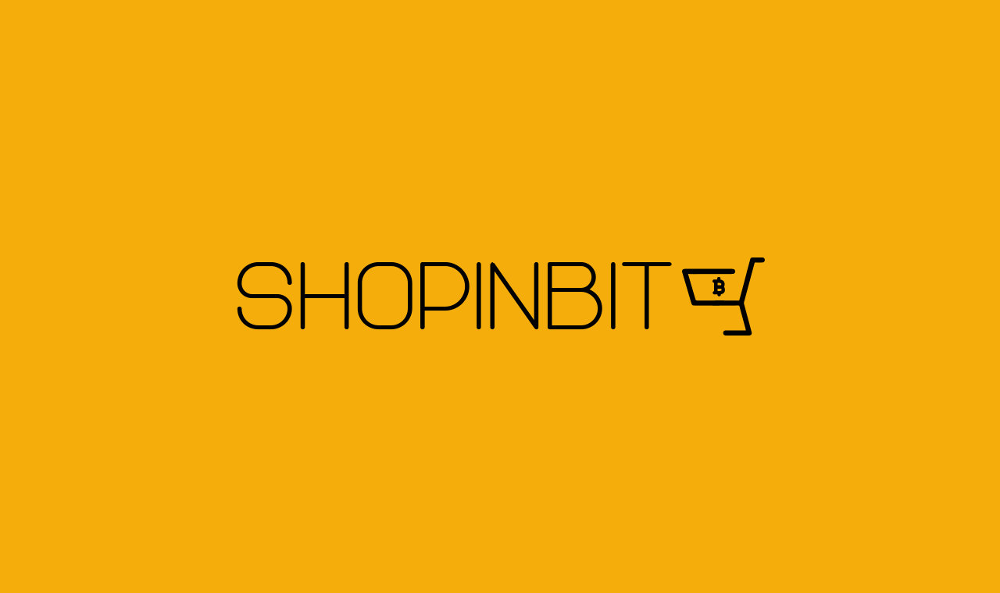

## Innovate+Upgrade mit Lawrence Bahr

**Lawrence** Bahr ist der Gründer und Inhaber von **Shopinbit**, Europas größtem **Onlinekaufhaus** in dem mit Bitcoin bezahlt werden kann – und meistens auch wird. Peter spricht mit ihm über die Gründungsidee seines Startups, dessen Entwicklung von Computer Zubhehörshop hin zum Vollsortiment und darüber, wie Bitcoin das **Kaufverhalten** von Menschen **positiv** beeinflussen kann. Aber eine andere große Frage ist hier: Ist die Verwendung von Bitcoin im Zahlungsverkehr ein unfairer Vorteil in der Kostenstruktur eine E-Commerce Business? Alle Antworten und jede Menge Inspiration für Innovation hörst du gleich hier.

**Hier kannst du die Episode direkt anhören**:

<iframe data-osano="MARKETING" src="https://embed.podcasts.apple.com/us/podcast/shopinbit-unfair-advantage/id1354901024?i=1000566097594&amp;itsct=podcast_box_player&amp;itscg=30200&amp;ls=1&amp;theme=auto" height="175px" frameborder="0" sandbox="allow-forms allow-popups allow-same-origin allow-scripts allow-top-navigation-by-user-activation" allow="autoplay *; encrypted-media *; clipboard-write" style="width: 100%; max-width: 660px; overflow: hidden; border-radius: 10px; background-color: transparent;"></iframe>

00:00:00 Intro + Feedback
00:04:36 Grafikkarte mit Bitcoin kaufen
00:07:02 Checkout Frust
00:09:07 Onlineshop ist gar nicht so einfach
00:14:30 Sind sie ein Drogendealer?
00:16:59 Vorkasse per Bitcoin ist ein Vorteil
00:21:18 Problematik Drop Shipping
00:23:41 Polnische Offenheit
00:30:28 Umgang mit Mitarbeitenden
00:33:26 Einen Markt finden
00:36:43 Warum Bitcoin ausgeben?
00:41:30 Bitcoinvorteile für den Handel
00:42:15 Wie viele Kunden zahlen tatsächlich mit Bitcoin?
00:42:36 Was ist mit Amazon?
00:44:46 Nachhaltigkeit durch deflationäre Währung
00:52:25 Unfair Advantage durch Bitcoin
00:59:05 Get Out

## Weiterführende Links und Referenzen

- [Shopinbit Website](https://shopinbit.com/de/)
- [Folge Lawrence aka Lando auf Twitter](https://twitter.com/LRothbardian)
- [Shopinbit auf Twitter](https://twitter.com/shopinbit)
- [Mehr Gelegenheiten finden um mit Bitcoin zu bezahlen geht hier bei Coinpages](https://coinpages.io/)
- [Zur Bitcoin Integration für Shopware auf Github](https://github.com/lampsolutions/LampSBtcPayShopware)
