## 18 deutschsprachige Bitcoin-Podcasts gemeinsam und kongenial auf einer Bühne vor Publikum. Kann das gut gehen?

Die deutschsprachige Bitcoin-Landschaft wächst, ist umtriebig und sehr produktiv. Wie soll man da den Überblick behalten und den oder die für sich richtigen Podcast(s) finden?
Das fragten sich auch die Hosts von 18 Bitcoin-Podcasts aus dem gesamten deutschsprachigen Raum und trafen sich kurzerhand Mitte März zu einem Arbeits- und Vernetzungstreffen in Leipzig und nahmen abends - wo schon mal alle da sind - direkt einen gemeinsamen und kongenialen Live-Mega-Mashup-Bitcoin-Podcast vor Publikum auf.
In insgesamt sechs Runden treten jeweils die Hosts von drei Bitcoin-Podcasts miteinander auf (manchmal auch gegeneinander an), um sich und/oder die anderen möglichst trefflich und unterhaltsam vorzustellen.
Ob das gelungen ist, was dabei herausgekommen ist und ob die Hosts das Publikum vor Ort begeistern konnten? Hört selbst!

### Überall da zu hören, wo es Podcasts gibt...

#### Diese Episode kannst du auch hier auf der Website hören:

<iframe id="embedPlayer" src="https://embed.podcasts.apple.com/us/podcast/sonderfolge-live-mega-mashup-bitcoin-podcast-2023/id1354901024?i=1000606914985&amp;itsct=podcast_box_player&amp;itscg=30200&amp;ls=1&amp;theme=auto" height="175px" frameborder="0" sandbox="allow-forms allow-popups allow-same-origin allow-scripts allow-top-navigation-by-user-activation" allow="autoplay *; encrypted-media *; clipboard-write" style="width: 100%; max-width: 660px; overflow: hidden; border-radius: 10px; transform: translateZ(0px); animation: 2s 6 loading-indicator; background-color: rgb(228, 228, 228);"></iframe>

## Hier findest du alle Kapitel dieser Episode mit Zeitangabe:

00:00:00 Intro 
00:01:31 Swiss Bitcoin Conference 
00:02:40 Disclaimer 
00:05:48 Begrüßung 
00:08:31 Runde 1 - Sound Money Bitcoin Podcast, Nodesignal, Einundzwanzig 
00:18:27 Runde 2 - BTC Echo Recap, Orange Relationship, Was Bitcoin bringt 
00:35:26 Runde 3 - Bitcoin Bibliothek, Bitcoin verstehen, Innovate + Upgrade 
00:52:39 Runde 4 - Blocktrainer, Einemillionsatoshi, Pleb's Taverne 
01:09:55 Runde 5 - Der Bitcoin Effekt, Konsens & Nonsens, Shield of Satoshi 
01:28:00 Runde 6 - Bitcoin, Fiat, Rock 'n' Roll, Honigdachs, Münzweg 
01:45:40 Verabschiedung

### Alle Episodenlinks:

- [Mehr Infos und alle Links zur Swiss Bitcoin Conference](https://oberwasser-consulting.de/swiss-bitcoin-conference/)

## Alle Bitcoin-Podcasts die sich in dieser Episode vorgestellt haben

[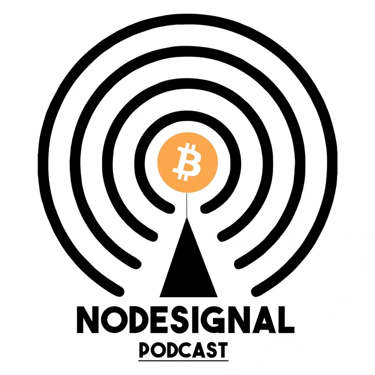](https://nodesignal.space)

[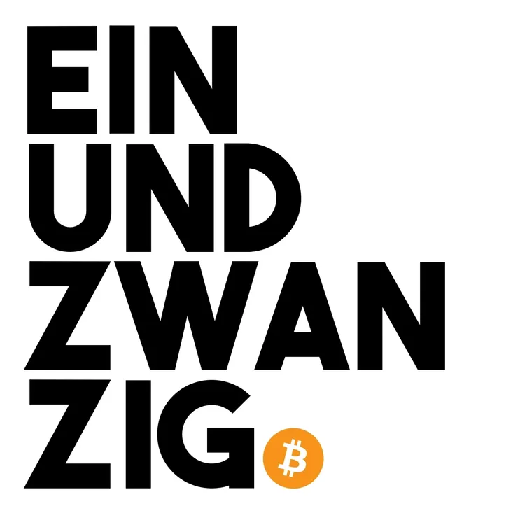](https://einundzwanzig.space)

[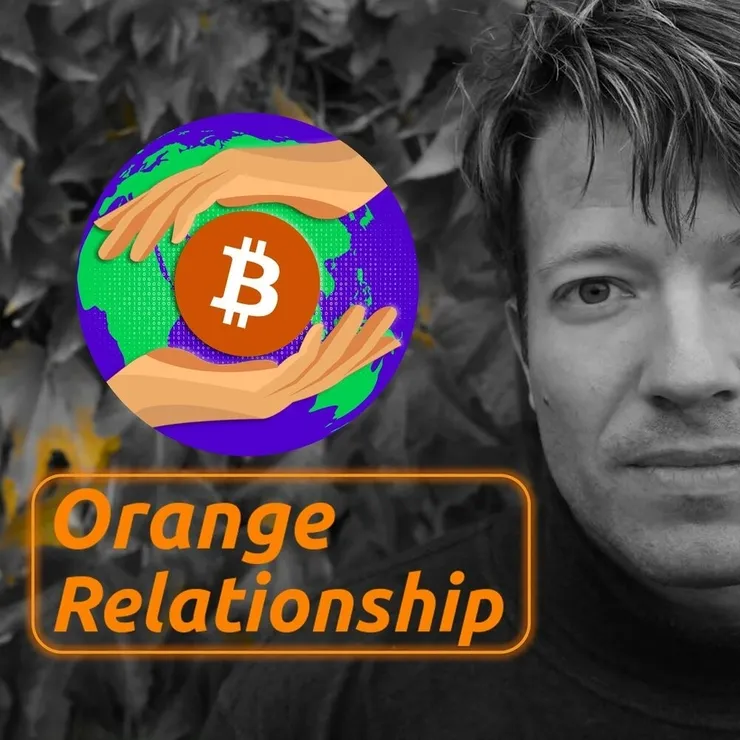](https://www.youtube.com/@OrangeRelationship/videos)

[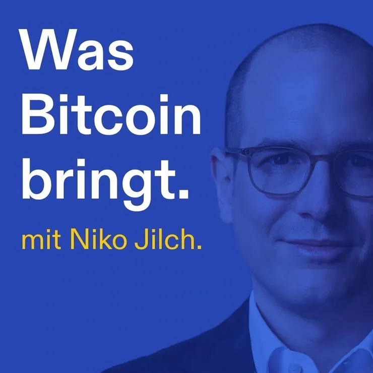](https://www.wasbitcoinbringt.com)

[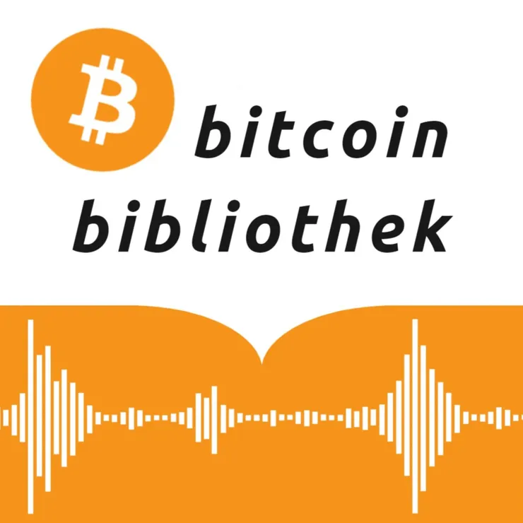](https://open.spotify.com/show/4iSQOPOXc1UjtpPpb8KTvT?si=e5b800d4564e484b&nd=1)

[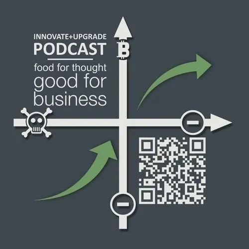](https://oberwasser-consulting.de/tag/bitcoin+podcast/)

[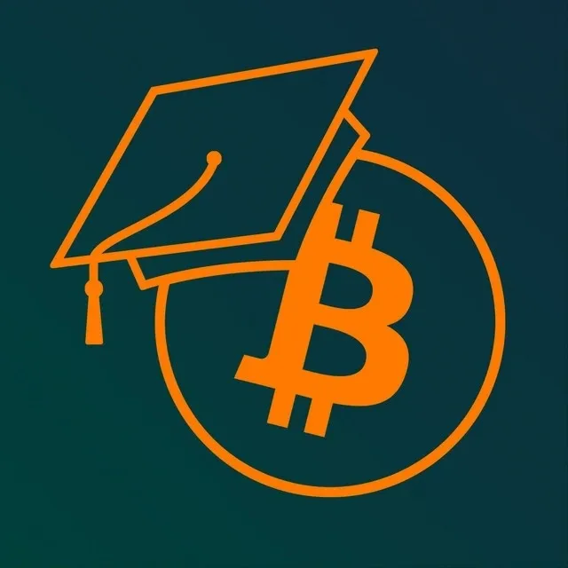](https://open.spotify.com/show/2F1zhITl4D9vHxDKJr0Qnk?si=409adb10650f4f0f&nd=1)

[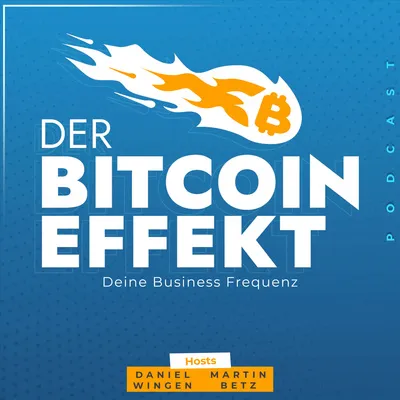](https://open.spotify.com/show/2PMBqIFhYiUDtJ4PFryaqn?si=f0c3050492fc42cd&nd=1)

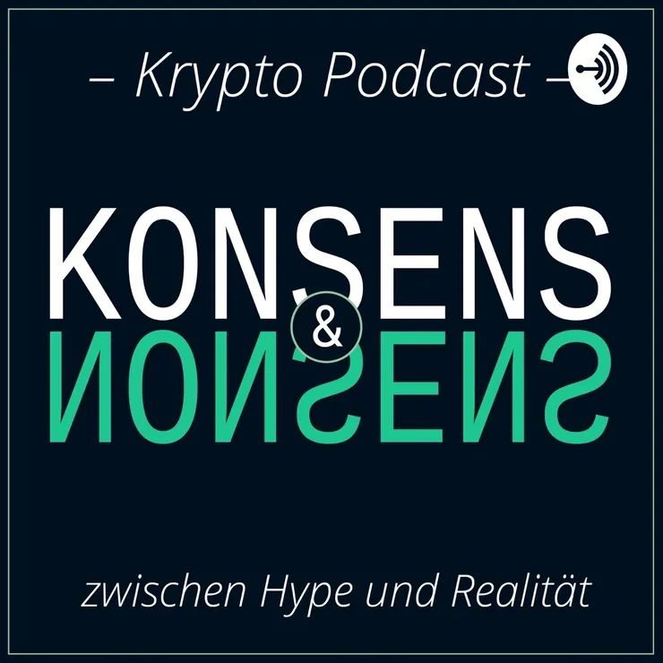

[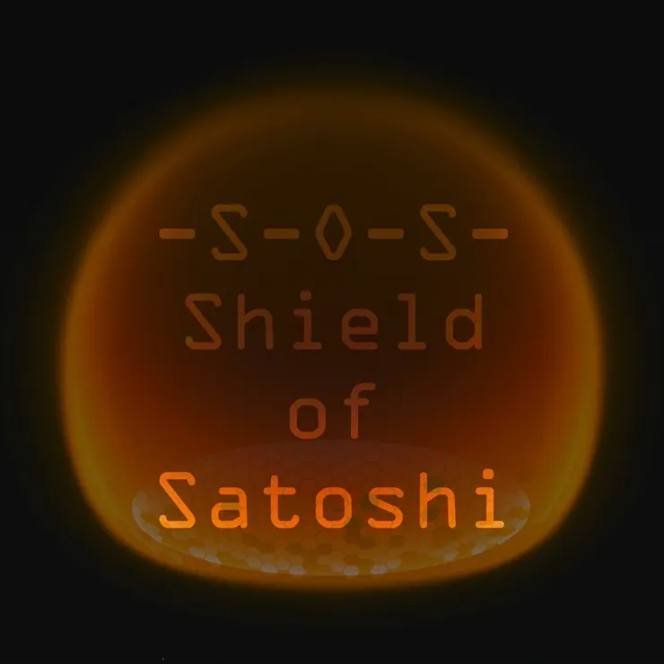](https://open.spotify.com/show/20ySeQGGHGpEolB5SFa26l?si=84f3dd7766d14f58&nd=1)

[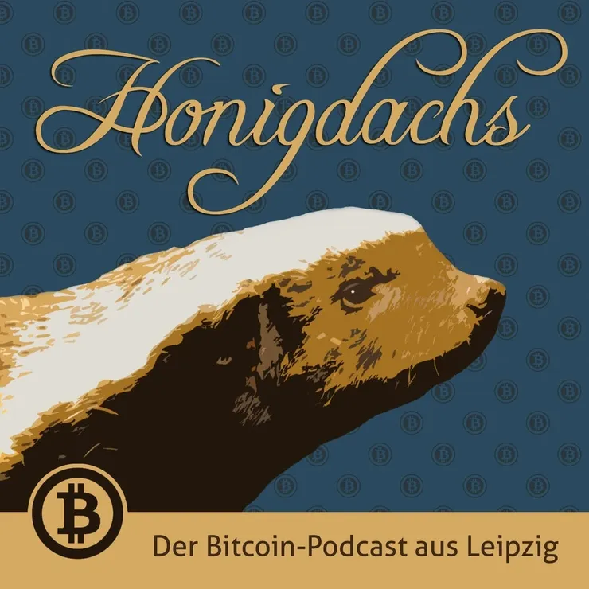](https://podcasts.apple.com/de/podcast/honigdachs/id1099608079)

[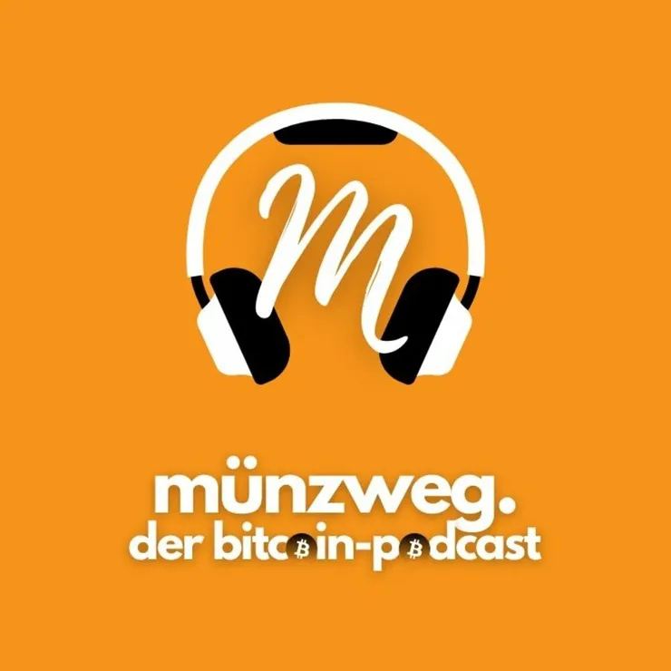](https://open.spotify.com/show/4gtKcAGys1LykJ2hhzywhW?si=8267f5f865424cb6&nd=1)
