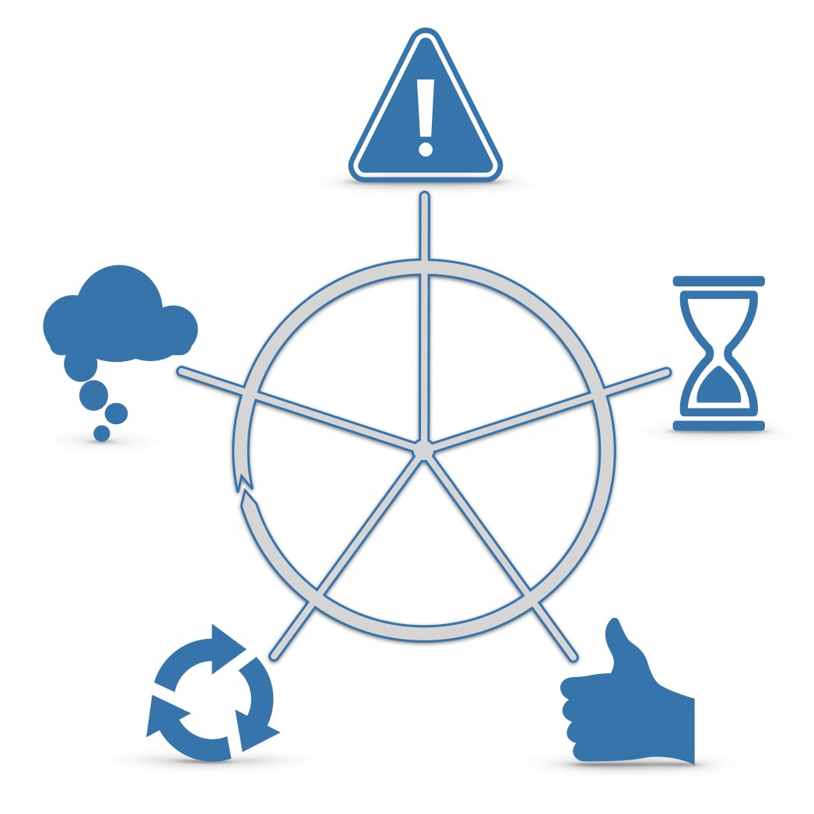
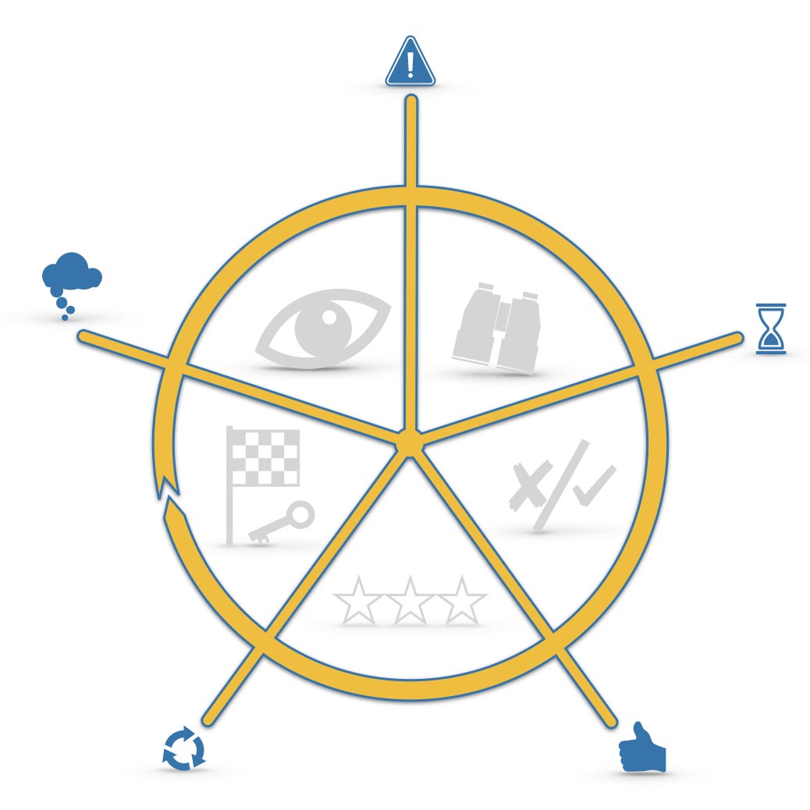
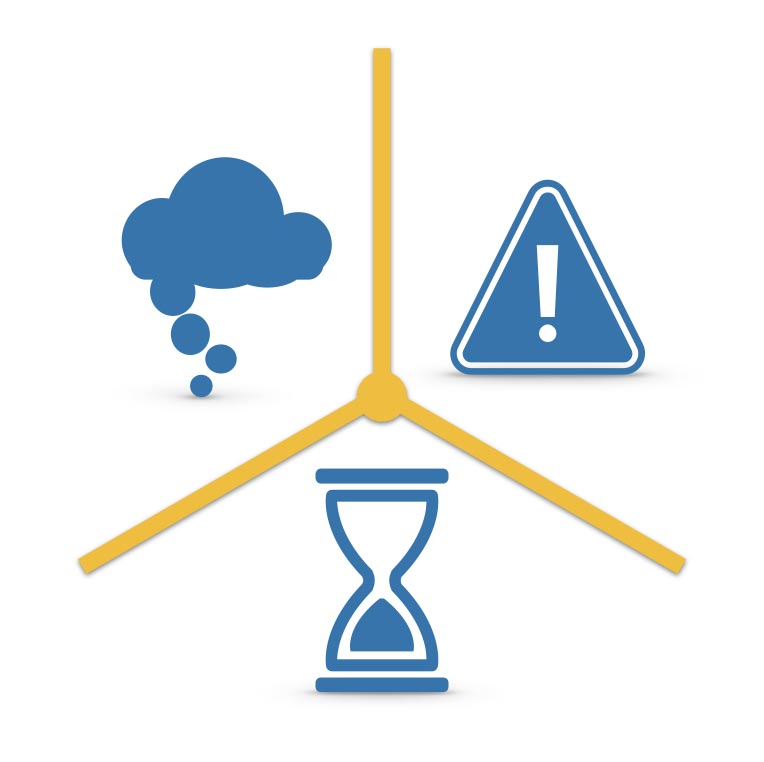
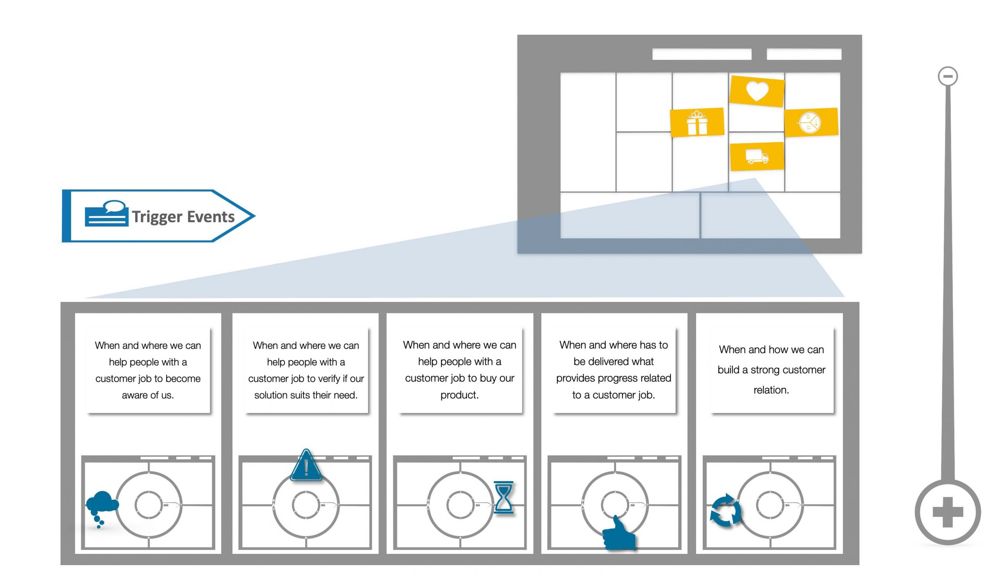

## Was ist ein Ereignis in der Timeline und welche gibt es? 

**Hier direkt I+U Staffel 2 Episode 017 anhören**

<iframe data-cookie-consent="marketing" data-cookieblock-src="https://embed.podcasts.apple.com/us/podcast/trigger-ereignisse-im-jtbd-fortschrittszyklus/id1354901024?i=1000522813249&amp;itsct=podcast_box_player&amp;itscg=30200&amp;theme=auto" height="175px" frameborder="0" sandbox="allow-forms allow-popups allow-same-origin allow-scripts allow-top-navigation-by-user-activation" allow="autoplay *; encrypted-media *;" style="width: 100%; max-width: 660px; overflow: hidden; border-top-left-radius: 10px; border-top-right-radius: 10px; border-bottom-right-radius: 10px; border-bottom-left-radius: 10px; background-color: transparent;"></iframe>

00:00:00 Intro 
00:01:07 Was sind Ereignisse 
00:01:36 Ereignistypen im Fortschrittzyklus 
00:04:46 Wofür Ereignisse gebraucht werden 
00:05:45 Get out

#### Hier kannst du den Podcast kostenlos abonnieren:

### Ereignis gesucht: Auslöser für das nächste Verhaltensmuster

Ereignisse sind die Auslöser für neue Phasen auf dem Fortschrittszyklus oder der Timeline.

Gute Beispiele für ein JTBD-Ereignis könnten etwa sein: "erfährt davon, dass...", oder "bekommt den Auftrag...", oder "...dann sagt ihr/ihm jemand, dass" und so weiter. Für alle diese Ereignisse gilt: Sie lösen die nächste Phase im Fortschrittszyklus aus.

## Fünf Ereignisse im JTBD Fortschrittszyklus

1. _Erster Gedanke_ (Wolke)

3. _Ereignis 1_ (Ausrufezeichen)

5. _Ereignis 2_ (Stundenglas)

7. _Beauftragung_ (Daumen)

9. _Wiederholte Beauftragung_ (Pfeile-Kreis)

Fortschritt erfolgt in Zyklen. Jeder Zyklus beginnt mit einem ersten Gedanken und endet mit der wiederholten Beauftragung, bevor ein neuer Zyklus startet.

### Fünf Phasen in jedem Fortschrittszyklus

Jedes dieser fünf Ereignisse löst eine Phase aus. Ohne ein Ereignis findet kein Fortschritt in eine nachfolgende Phase statt.

1. _Passive Beobachtung (Auge)_

3. _Aktive Suche (Fernglas)_

5. _Entscheidung (Check)_

7. _Erste Nutzung (Sterne)_

9. _Wiederholte Nutzung (Fahne+Schüssel)_

In jeder Phase eines Fortschrittszyklus der zu erledigenden Aufgabe [(Kunden-Job/ JTBD)](https://oberwasser-consulting.de/der-job-to-be-done-jtbd/) sind spezifische Themen Relevant. Die Ereignisse markieren den genauen Zeitpunkt ab wann welches Thema für Menschen mit dem [JTBD](https://oberwasser-consulting.de/der-job-to-be-done-jtbd/) relevant ist.

## JTBD-Hack: Wissen wann was für Kunden relevant ist

_3 Ereignisse, die insbesondere für die Gewinnung neuer Kunden von essenzieller Bedeutung sind: 1. Gedanke, Ereignis 1 und Ereignis 2._

Diese drei Ereignisse bilden eine kausale Kette die zur Beauftragung eines Produkts führen. Allein die Kenntnis des [Kunden-Jobs (JTBD)](https://oberwasser-consulting.de/der-job-to-be-done-jtbd/) und eines dieser Ereignisse ermöglichen eine Verbesserung des Return on Marketing Investment (ROMI) und der Customer Acquisition Costs (CAC).

### Ereignisse sind das Tuning-Kit für Kanalphasen im Business Model

### Das ganze Bild sehen und verstehen: JTBD Canvas

_Hilft dir dabei, so einfach wie möglich und so präzise wie nötig, Kunden-Jobs zu beschreiben: Der **The Wheel of Progress®** Canvas_

### Weitere Episoden dazu direkt hier

- [Hier erklärt Peter Rochel in 4 Minuten was außer Ereignissen noch zu einem Job to Be Done gehört](https://oberwasser-consulting.de/der-job-to-be-done-jtbd/)

- [Hier berichtet Stefan Hück wie er bei Mantrafant ROIM und CAC mit der Nutzung von Kunden-Jobs im Marketing deutlich verbessert hat](https://oberwasser-consulting.de/podcast041/)

## Hier das komplette Transkript zur Podcastepisode zum Thema Events auf der Timeline

Lass uns über Ereignisse sprechen.

Willkommen bei einem Innovate & Upgrade Shot.

Hier geht es kurz und knackig um ganz praktische Fragen aus dem Bereich Kundeninterviews, Jobs-to-Be-Done und Wheel of Progress.

Mein Name ist Peter Rochel und jetzt geht's los.

Warum ausgerechnet **Ereignisse**?

Erstens, weil ich Ereignisse für mich in meinen **Jobs-to-Be-Done-Interviews** immer versuche als erstes zu finden und das auch allen so rate zu tun.

Die Gründe dafür können wir gleich klären.

Und zweitens, warum heute Ereignisse?

Weil das genau der Punkt ist, wo ich ganz oft beobachte, dass die Menschen, die Jobs-to-Be-Done-Interviews führen oder damit anfangen, das zu machen, Ereignisse mit Verhalten verwechseln.

Das heißt, es wird dann wahrgenommen und notiert, dass Peter beispielsweise im Internet nach Jobs-to-Be-Done-Trainings sucht.

Und das wird aufgeschrieben und auch zu welchen Suchbegriffen und sonst was da gegoogelt wird oder was Menschen eben machen.

Das ist aber nicht das, was uns an der Stelle weiterbringt, wenn wir Ereignisse finden müssen für die Jobs.

Nochmal zurück, was sind überhaupt Ereignisse?

_Ereignisse sind auf dem Zyklus des Fortschritts oder auf der Timeline, kann man auch so sagen, wobei ich da lieber von Zyklus spreche, quasi die Dominosteine, die nacheinander umfallen müssen, bevor es zu einer Beauftragung von einer neuen oder anderen Lösung für einen bestimmten zu erledigenden Job aus Kundensicht gibt._

Und **Auslöser** heißt in dem Fall Auslöser für eine neue **Phase** auf diesem **Zyklus**.

Und diese Phasen sind: Erstens die Phase der passiven Beobachtung, zweitens die aktive Suchphase, drittens die Entscheidungsphase, viertens die Nutzungsphase.

Und das bedeutet, Auslöser sind **Auslöser** **für** ein anderes **Verhalten**.

Auslöser für die Phase der passiven Beobachtung ist das Ereignis, was dazu geführt hat, dass ich ein bestimmtes Thema plötzlich wahrnehme.

Dieses **Thema** war immer da, es ist mir nur nie **aufgefallen**.

Beispielsweise der Mechaniker meines Vertrauens sagt mir bei Abholung meines Wagens nach der Inspektion: "_...also pass mal auf Peter, das sieht gar nicht mehr so gut aus mit der Kiste, wahrscheinlich kriegen wir die nochmal über den TÜV, aber besser machst du dir mal Gedanken darüber, ob vielleicht mal was Neues dran ist. Der Ärger, den ich hier schon gesehen habe, das wird wahrscheinlich irgendwann wirtschaftlich nicht mehr darstellbar sein."_

Und plötzlich fallen mir auf der Straße Neuwagen einer bestimmten Marke oder was auch immer auf, die habe ich vorher nie gesehen, die waren immer da, aber ohne diesen Kommentar meines Mechanikers wäre mir das gar nicht aufgefallen.

Also das ist ein Klassiker für einen Auslöser.

Und wir brauchen genau diesen Auslöser. Nicht, dass ich diese Dinger sehe, das brauchen wir auch, aber an einer anderen Stelle, nicht für Ereignisse.

Das zweite Ereignis: Auslöser für die **aktive Suche**, was ist denn dann noch passiert, bis ich anfange mich aktiv nach Neuwagen umzugucken, im Internet zu recherchieren, vielleicht mal zu einem Händler zu gehen und eine Preisliste anzufragen oder mir mal ein Modell anzugucken oder sowas.

Was ist denn vorher passiert, was musste denn noch passieren außer diesem Kommentar?

Und die Antwort auf diese Frage, wenn wir die beantworten können, dann haben wir das Ereignis Nummer 1 in unserer Sprache.

Das letzte Ereignis, beziehungsweise nicht das letzte, aber das nächst wichtige Ereignis ist dann der **Auslöser** **für** die **Entscheidung**.

Wenn ich jetzt bei allen möglichen Händlern und sonst wie geguckt habe und im Netz mich schlau gemacht habe, was muss denn dann noch passieren, damit ich ein neues Auto kaufe?

Es ist ja nicht so, dass ich einfach so morgens aufwache und denke, so heute kaufe ich ein neues Auto.

Und wenn das so ist, warum denn dann genau an dem Tag und nicht schon einen Tag vorher oder in der Woche vorher?

Was musste also noch passieren?

Diese drei Themen oder diese drei Ereignisse sind die allerwichtigsten, die ich immer versuche als erstes zu finden oder zumindest mal eins davon.

Oftmals findet man auch nicht immer alle drei Ereignisse.

So, das vierte Ereignis im Bunde ist dann der **Auslöser für die erste Verwendung** einer neuen oder anderen Lösung.

Das heißt, also was muss denn noch passieren, wenn ich jetzt, das ist vielleicht einfacher zu verstehen, auch bei den, wenn wir jetzt mal auf Sachen beim Auto, ist es womöglich offensichtlicher, es muss natürlich vorher geliefert werden und, und, und.

Das ist dann vielleicht schon, aber auch bei Apps zum Beispiel.

Ich lade mir eine App runter, ich habe sie dann womöglich auch schon bezahlt, aber was muss denn noch passieren, damit ich sie überhaupt benutze?

Oftmals kommt es nämlich gar nicht dazu.

Und dann haben wir das fünfte Ereignis im Bunde, das letzte, nämlich die **Ursache für die wiederholte Nutzung.**

Wichtig, und das sind die Elementare, sind die ersten drei Ereignisse.

### Warum brauche ich die?

Ganz einfach, damit ich weiß, **zu welchem Zeitpunkt welche Informationen** für Menschen, die einen bestimmten Job haben, **relevant** sind.

Nämlich Informationen über eine neue, bessere Lösung und Vorteile und Vorzüge sind mit Sicherheit nicht relevant für Menschen, die noch nicht das zweite Ereignis erlebt haben.

Das perlt an denen ab, die haben noch gar kein Problem, was sie insofern betrifft, als dass sie sich höchstwahrscheinlich für meine Informationen interessieren wollen.

Für die ist aber sehr wohl relevant, was sie für sich in diesem Moment als Problem wahrnehmen.

Und ihre **Gewohnheiten** sind relevant, **nicht** aber die ganzen Vorteile und **Vorzüge** meiner Lösung.

Und schon gar kein Kaufangebot.

Ja, das bis hierhin, soweit zum Thema Ereignisse, wie wir jetzt genau Ereignisse einkreisen können oder Co. können wir vielleicht nochmal, wenn es interessiert, können wir da gerne nochmal einen Shot dazu machen.

Ansonsten war es das erstmal bis hierhin.

Über Feedback und Rezensionen freue ich mich natürlich wahnsinnig, das hilft ungemein weiter.

Und wenn du jemanden kennst, der diese Information genauso gut gebrauchen könnte, dann empfehle doch diesen Podcast weiter.

Und wenn du Unterstützung brauchst beim Führen von Jobs to Be Done Interviews oder bei der Implementierung von Jobs to Be Done Research oder Strategie in einem Unternehmenskontext, dann ruf mich gerne an und wir klären kurz, ob das Sinn ergibt und wenn ja, wie vielleicht.

Vielen Dank und bis bald.
