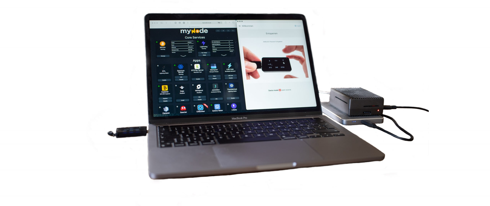

## JTBD on Bitcoin - Update IV

**Alexander Moths** und Peter Rochel geben ein neues Status-Update zur offenen The Wheel of Progress® Jobs to Be Done on **Bitcoin** Studie. Peter berichtet von den Erfahrungen aus den bisherigen JTBD Interviews und Erkenntnissen der laufenden **Research**\-Phase des [Projekts](https://oberwasser-consulting.de/open-source-jtbd-research/). Welche Jobs Bitcoin **besser** erledigt **als** das, was **Banken** heute bieten können, wer bisher Teilgenommen hat und **welche** **Muster** sich bereits herausbilden, hörst du gleich hier – oder überall, wo es Podcasts gibt.

[Hier als TeilnehmerIn für die Studie melden](mailto:hallo@oberwasser-consulting.de?subject=Ich möchte gern an der JTBD Studie teilnehme)

**Hier direkt I+U Staffel 2 Episode 035 anhören**:

<iframe data-osano="MARKETING" src="https://embed.podcasts.apple.com/us/podcast/von-banken-ohne-l%C3%B6sung-und-kleinsparern/id1354901024?i=1000550906078&amp;itsct=podcast_box_player&amp;itscg=30200&amp;ls=1&amp;theme=auto" height="175px" frameborder="0" sandbox="allow-forms allow-popups allow-same-origin allow-scripts allow-top-navigation-by-user-activation" allow="autoplay *; encrypted-media *;" style="width: 100%; max-width: 660px; overflow: hidden; border-top-left-radius: 10px; border-top-right-radius: 10px; border-bottom-right-radius: 10px; border-bottom-left-radius: 10px; background-color: transparent;"></iframe>

### Alle Themen und Kapitelmarken dieser Episode:

00:00:00 Intro 
00:01:32 Was bisher geschah 
00:02:33 StudienteilnehmerInnen 
00:05:06 Melde dich 
00:08:11 Der Job für Trading 
00:10:55 Bitcoin und die Finanzwelt 
00:13:16 Challenge für Interviewer 
00:19:44 Gut, schlecht oder was gelernt 
00:22:24 Segmente und Muster 
00:24:31 Internationaler Fokus 
00:25:22 Bitcoin Adoption in Amerika 
00:30:05 Erste erkennbare Muster 
00:34:06 Das Dilemma der Banken 
00:43:52 Was jeder tun sollte 
00:45:21 Ausblick 
00:46:29 Termine und Get Out 

#### Hier kannst du den Podcast kostenlos abonnieren:

## Weiterführende Links und Referenzen

- [Zur JTBD on BTC Projektseite](https://oberwasser-consulting.de/open-source-jtbd-research/)

- [Open Source JTBD on Bitcoin Projekt](https://oberwasser-consulting.de/open-source-jtbd-research/)

- [Open Source JTBD on Bitcoin Update II](https://oberwasser-consulting.de/innovation-beyond-progress/)

- [Open Source JTBD on Bitcoin Update III](https://oberwasser-consulting.de/jtbd-on-bitcoin-update-iii/)

- [Justdoitalex erklärt hier, warum Bitcoin dominanter Standard wird (Ab Minute 30)](https://oberwasser-consulting.de/alex-der-htgf-und-einhoerner-made-in-germany/)

- [Massenadoption im Vergleich - Internet vs. Bitcoin](https://bitcoinist.com/not-just-a-fad-bitcoin-adoption-curve-rivals-the-internet/)

- [Zum Buch der Bitcoin Standard, direkt beim Verlag](https://aprycot.media/shop/der-bitcoin-standard/)

- [Die Einundzwanzig Community](https://einundzwanzig.space/verein/)
