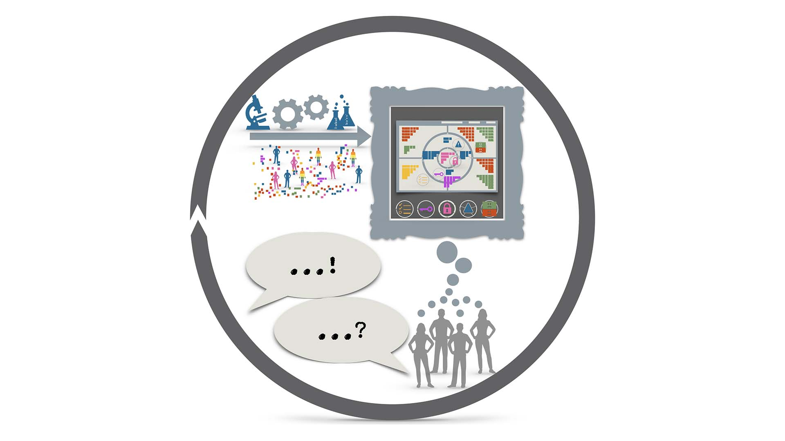
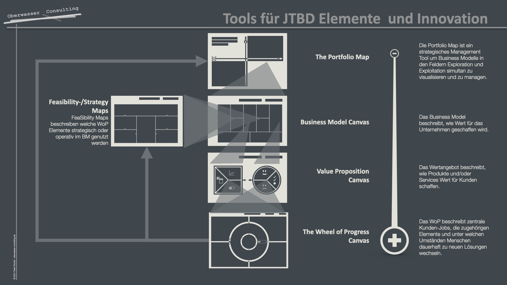

## Was Jobs to Be Done Interviews sind und wie man sie einsetzt

### Direkt hier I+U Staffel 2 Episode 024 anhören:

<iframe data-cookie-consent="marketing" data-cookieblock-src="https://embed.podcasts.apple.com/us/podcast/was-sind-jobs-to-be-done-interviews/id1354901024?i=1000534323020&amp;itsct=podcast_box_player&amp;itscg=30200&amp;ls=1&amp;theme=auto" height="175px" frameborder="0" sandbox="allow-forms allow-popups allow-same-origin allow-scripts allow-top-navigation-by-user-activation" allow="autoplay *; encrypted-media *;" style="width: 100%; max-width: 660px; overflow: hidden; border-top-left-radius: 10px; border-top-right-radius: 10px; border-bottom-right-radius: 10px; border-bottom-left-radius: 10px; background-color: transparent;"></iframe>

### Oder überall da, wo es Podcasts gibt:

00:00:00 Intro 
00:00:44 WoP Interviewmethode 
00:01:04 Ziel von JTBD/WoP Interviews 
00:01:30 Besonderheiten 
00:02:39 Kann man das lernen? 
00:05:50 Was nützt das? 
00:07:13 Get out

Jobs to Be Done Interviews sind eine spezielle Art qualitativer Tiefeninterviews. Mit einer geeigneten Methode für die Interviewtechnik lässt sich sehr präzise und sehr schnell ermitteln, wie Produkte sein müssen um erfolgreich am Markt bestehen zu können. Peter Rochel erklärt in dieser Episode, was dahinter steckt, was es genau nützt und wie man diese Interviewtechnik erlernt. Unternehmen, deren Mitarbeitende diese Interviewtechnik von uns gelernt haben und regelmäßig einsetzen sind z.Bsp.: [Focus Online,](https://www.focus.de) [pwc](https://www.pwc.de), [PRIOGO AG](https://www.priogo.com), oder [Mantrafant](https://mantrafant.com). Viele weitere [findest du hier](https://oberwasser-consulting.de/ueber/expertise/).

<figure>

<figcaption>

Daten aus JTBD Interviews zahlen direkt auf alle Unternehmensbereiche ein, egal wie groß oder klein ein Unternehmen ist. Das The Wheel of Progress liefert Sprache und Methode um JTBD Daten optimal zu erfassen und zu verwerten.

</figcaption>

</figure>

### Weitere Episoden dazu direkt hier

- [Shot zum Thema JTBD und seine Elemente](https://oberwasser-consulting.de/der-job-to-be-done-jtbd/)

- [Gute Probandinnen für JTBD Interviews finden]/gute-kandidaten-fuer-jtbd-interviews/)

- [Clubhouse Talk zum Thema Kundeninterviews](https://oberwasser-consulting.de/podcast043/)

- [Das JTBD Interview zur Kaffeekanne](https://oberwasser-consulting.de/podcast043/)

- [Tools zum Führen und Dokumentieren von Jobs to Be Done Kundeninterviews](https://oberwasser-consulting.de/jtbd-tools/)
