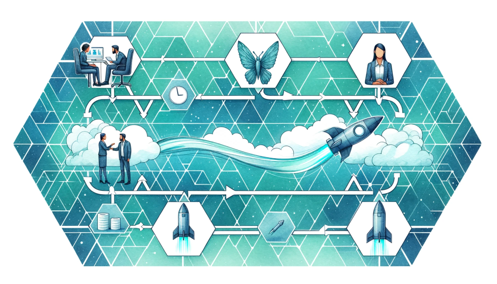
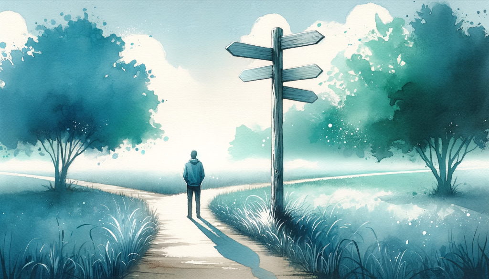
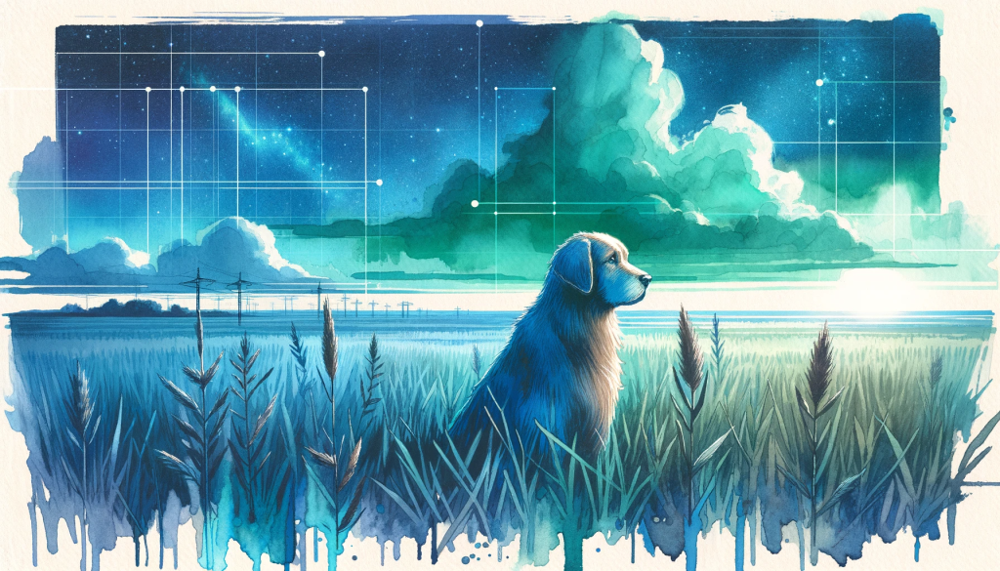
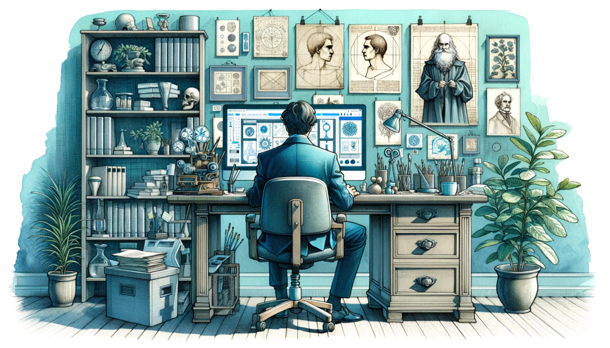
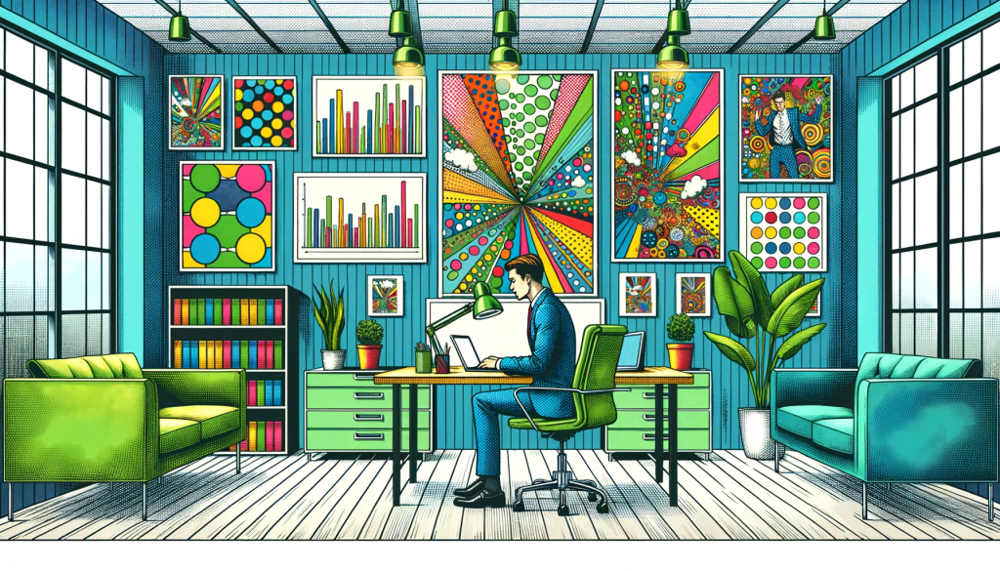
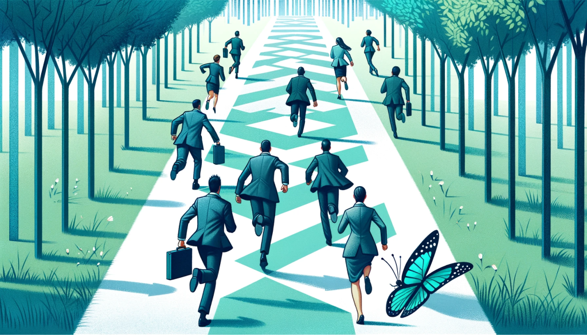
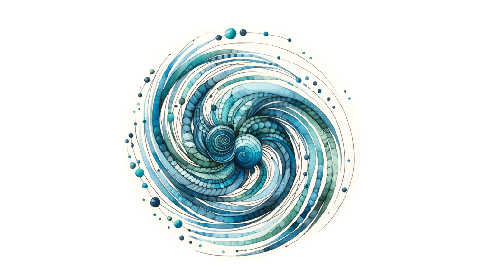
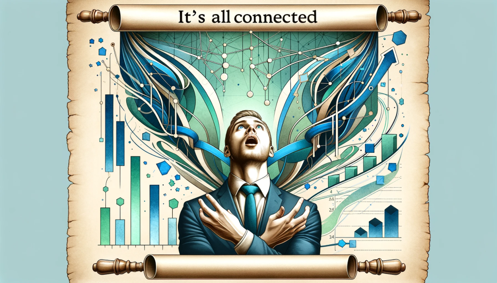
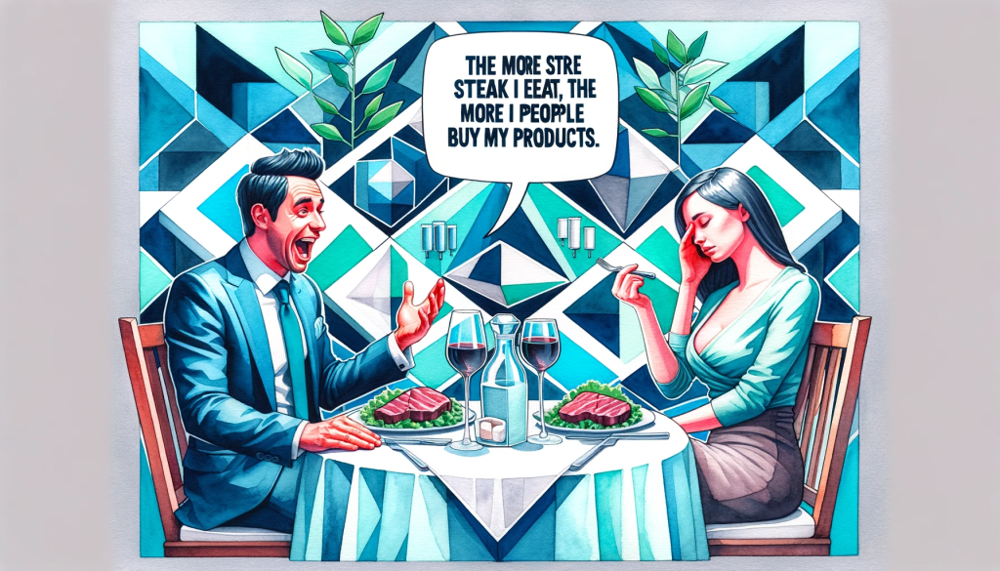

## Weihnachtsspecial: AI-Foto-Outtakes

Wie Sie wissen, sind die Bilder, die ich in diesem Newsletter verwende, alle AI-generiert. Ich verwende dafür Dalle-3 über ChatGPT. Der Stil ist eine Mischung aus "mit Wasserfarben gezeichnet" und "mit geometrischen Formen" und die Farben sind blau und mint, da dies unsere primären Unternehmensfarben sind.

Manchmal ist es ziemlich einfach, die Ideen zu visualisieren. Aber vor allem die Themen, die eher abstrakter Natur sind, bereiten mir Kopfzerbrechen. Es kann ziemlich schwierig sein, ein Bild zu finden, das die Botschaft repräsentiert, die man vermitteln will.

Als Weihnachtsgeschenk möchte ich ein paar Outtakes mit euch teilen. Das sind Bilder, die:

mir gefallen haben, aber aus irgendeinem Grund nicht verwendet werden konnten (z. B. Format, Farbe oder Störungen)

Einige, die mich zum Lachen gebracht haben, weil sie so schlecht waren

Wir verwenden denselben Bildstil auf unserer Website, also werde ich auch dort einige Bilder aus dem Entstehungsprozess hinzufügen. Zum Beispiel diese Illustration des Prozesses, wie man mit uns arbeitet. Wie Sie sehen können, hat ein übliches Projekt mit uns die folgenden Schritte:

- Wir starten eine Rakete
- Die Rakete fliegt irgendwo hin
- Wir starten eine andere Rakete
- Sie bezahlen uns
- Dadurch fliegt eine andere Rakete auf eine sehr ungewöhnliche Weise
- Wir schauen uns die Daten gemeinsam an
- Nach einiger Zeit setzen wir einen Schmetterling und eine Frau in die Rakete

Das funktionierte nicht, also änderten wir den Prozess in:

- Du schickst uns eine Mail
- Wir interviewen Sie
- Wir nehmen die Daten aus dem Interview und einige Daten aus der Cloud in einen Vertrag auf
- Es wird einige Iterationen geben und dann führen wir einige Interviews mit Kunden durch.
- Dann wird alles funktionieren
- Es ist ein Greenfield-Ansatz, der wie eine Rakete abhebt

Wir sind ziemlich zufrieden mit dem neuen Prozess 😅.

Der Weg zu diesem Bildstil hatte auch einige interessante Iterationen, wie dieses Aquarell ohne geometrisches Bild für das Bild ["Wo soll man anfangen, wenn das Geschäft nicht läuft"](/blog/wo-zu-starten-wenn-das-Geschäft-nicht-läuft/)

<figure>

<figcaption>

So verträumt 😍.

</figcaption>

</figure>

Der Stil war nicht durchgängig reproduzierbar, also haben wir den Stil verschiedener Künstler als zusätzlichen Input ausprobiert.

Unsere ["404-page not found"-Seite](/404) (die Sie hoffentlich noch nie gesehen haben), hat jetzt ein Schiff auf hoher See. Aber davor hatten wir einen niedlichen Hund, der sich in einem weiten Feld verirrt hat. Hier ist die Variante des Hundes im Stil von William Turner, der für seine Schiffsgemälde aus der Zeit der Romantik berühmt ist.

Dies war der von Syd Mead inspirierte Hund.

Interessant ist, dass man den Stil eines modernen Künstlers (wahrscheinlich nach 1950) nicht verwenden kann. Man muss den Stil extrahieren und eine indirekte Kopie erstellen. So sind wir übrigens auch auf die geometrischen Stilelemente gekommen.

Hier ist auch eine "Da-Vinci-Stil-Variante" von jemandem, der an unserem ["Mastering Jobs to be done workshop"](/leistungen/mastering-jobs-to-be-done-online-workshop/) teilgenommen hat. Mein Favorit ist der kleine Schädel im Regal links. Aber hey, Kundenforschung ist für alle da, wir urteilen nicht.

Unser dandyhafter Warhole-Teilnehmer war so interessiert, dass er sogar seinen Stuhl an den Tisch rückte 😅.

Der Beitrag über den [near win bias](/blog/we-are-so-close/) war ziemlich schwierig. Ich habe verschiedene Verfolgungsszenarien ausprobiert, wie Menschen, die versuchen, einen Schmetterling zu fangen. Irgendwann fingen sie an, vor dem Schmetterling wegzulaufen. Der Schmetterling macht sogar eine Geste mit seinen kleinen Armen: "Warum rennst du weg":

Für den [Unsicherheitsbeitrag](/blog/der-weiß-nicht-was-er-kauft/) habe ich versucht, ein verwirrtes Gehirn zu schaffen. Ich denke, das Bild ist einigermaßen zutreffend:

Auf die gleiche Weise habe ich auch versucht, unsere Logos zu entwickeln. Dieses Logo war der Moment, in dem mir klar wurde, dass, wenn die Sekundärfarben Minze, Limette und Lavendel sind, man etwas Pflanzliches bekommt. Die Sprache ist schwierig:

Ich habe Limette und Lavendel aus den Eingabeaufforderungen entfernt, aber manchmal taucht Minze in Blättern auf. Wie im [product language fit post](/blog/how-to-achieve-product-language-fit/)\-picture. Die Aufforderung, eine Konzeptvisualisierung zu zeichnen, funktioniert noch nicht so gut. Die Aufforderung ist zu offen.

Die letzten Outtakes stammen aus dem Beitrag [Korrelation vs. Kausalität](/blog/confusing-correlation-with-causality). Ich habe mir wirklich Mühe gegeben, dies in ein Bild zu packen. Ein Versuch war, dass jemand zu sehr daran glaubte, dass alle seine Daten miteinander verbunden sind. Es ist eine frühere Iteration des Bildes, die es geschafft hat, nur etwas verrückter 🤯

Und als letztes Bild haben wir hier einen Geschäftsmann, der seiner Frau sagt, dass je mehr Steak er isst, desto mehr Leute sein Produkt kaufen. Das hat es in sich:

- Pannen
- Zusätzliche Gliedmaßen
- Übermäßig überfüllter Hintergrund
- Falsche Farben
- Abgeschnittenes Format
- Die Minze-Blätter

Aber sehen Sie sich sein Gesicht an. Die Überzeugung! Das sagt eigentlich schon alles.

PS: Das Kopfbild für diesen Beitrag stammt ebenfalls aus dem Beitrag über Korrelation und Kausalität. Es handelt sich um den Versuch, den Zusammenhang zwischen dem Pro-Kopf-Käsekonsum und den Menschen, die daran sterben, dass sie sich in ihren Bettlaken verheddern, neu zu zeichnen (https://www.tylervigen.com/spurious-correlations). Sagen wir mal so, die Daten sehen käsig aus 😁.

Damit wünsche ich euch ein frohes Weihnachtsfest mit dem ersten Versuch von "draw christmas". Manche Dinge sind eben einfach zu erklären 🎄

## Zusätzliches Weihnachtsgeschenk?

Wir verschenken einen kostenlosen Platz in unserem Mastering-Workshop im Januar. Wer zuerst kommt, mahlt zuerst. Schickt uns einfach eine Mail.
