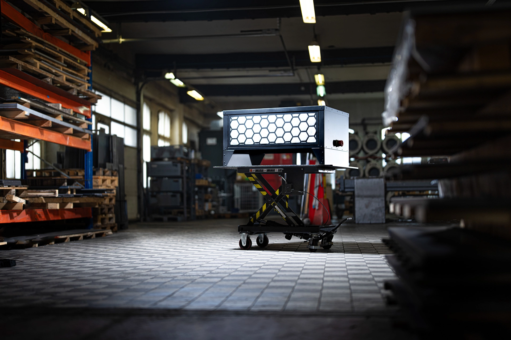
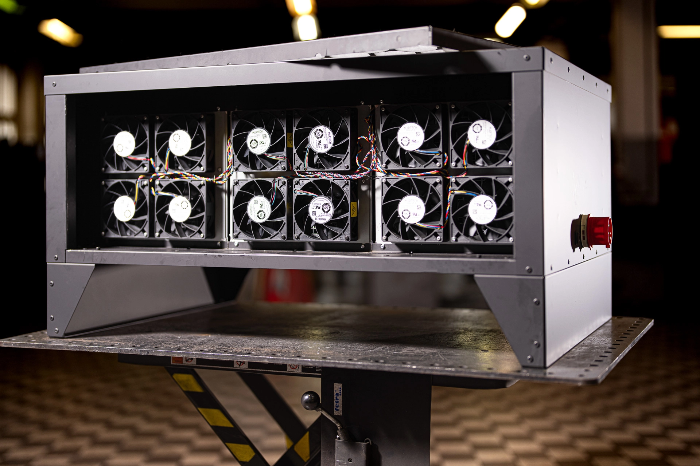
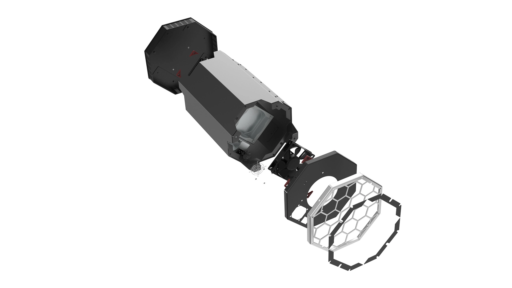

In der Welt von Maximilian Obwexer und 21energy, wir die Zukunft der Heiztechnologie neu definiert. In einer Zeit, in der die Dringlichkeit der Energiewende und die Notwendigkeit für kosteneffiziente, umweltfreundliche Lösungen immer deutlicher werden, tritt ein Unternehmen hervor, das bereit ist, die Herausforderungen anzunehmen und Lösungen anzubieten, die sowohl innovativ als auch praxistauglich sind.

## Bitcoin für die CO2-Reduktion

[Aktuelle Diskussionen](https://www.finanzen.net/nachricht/devisen/innovative-loesungen-gesucht-studie-bitcoin-mining-kann-die-energiewende-vorantreiben-12892988) und [Studien](https://www.theirm.org/news/bitcoin-and-the-energy-transition-from-risk-to-opportunity/) heben hervor, dass Bitcoin-Mining keine Energieverschwendung ist, sondern einen **[wertvollen Beitrag zur Energiewende](https://oberwasser-consulting.de/bitcoin-und-saubere-energie/)** und zur Stabilisierung der Stromnetze leisten kann. Besonders in Zeiten der Überproduktion von erneuerbarer Energie bieten Bitcoin-Mining-Anlagen eine flexible Lösung, um überschüssige Energie sinnvoll zu nutzen und die Wirtschaftlichkeit von Wind- und Solaranlagen zu steigern.

[Maximilian Obwexer](https://www.linkedin.com/in/maximilianobwexer/) und sein Unternehmen 21energy stehen an der Spitze dieser innovativen Verwendung von Bitcoin-Mining zur Wärmegewinnung und zeigen, dass technologische Innovationen zum Vorteil der Umwelt und der Gesellschaft eingesetzt werden können.

## Maximilian Obwexer, Mitbegründer und CEO von 21energy

Max, treibt die Entwicklung nachhaltiger Heizlösungen voran. Als erfahrener Unternehmer setzt er sein Engagement für Innovation ein, um mittels Bitcoin-Minern Energieeffizienz zu erhöhen. Er glaubt an die Zukunft von Bitcoin-Heizsystemen und hat seit 2019 seine Vision durch die Nutzung der Rechenleistung zur Heizung seines eigenen Hauses verwirklicht. Mit 21energy bringt er diese innovative Technologie in über 30 Länder weltweit, wobei die Produkte stets den lokalen Handwerkskunststandards entsprechen und in Österreich hergestellt werden. Maximilian ist nicht nur ein Visionär in der nachhaltigen Technologie, sondern auch aktiv in der Bitcoin-Community, wo er sein Wissen und seine Überzeugungen teilt.

## 21energy - Neudefinition der Effizienz durch Verschmelzen von Computing und Heizung.

## Kraft-Wärme-Kopplung im Computing

21energy zeigt eindrücklich, dass innovative Technologien wie Bitcoin-Mining einen entscheidenden Beitrag zur nachhaltigen Energienutzung und zur Effizienzsteigerung im Energiemanagement leistet. Mit der Verknüpfung von Hochleistungsrechenprozessen und Bitcoin Mining wird Energie für aufwändige Rechenprozesse nicht nur effizienter genutzt, sondern auch die Verbrennung fossiler Rohstoffe direkt reduziert.

### Bitcoin und die Energiewende: Beitrag zur Stromnetzstabilisierung und Integration erneuerbarer Energien

Unternehmen wie 21energy tragen mit ihren Produkten maßgeblich zur Energiewende bei, indem sie Lösungen für eine kosteneutrale und nachhaltiges Heizen bieten, die die Integration erneuerbarer Energien fördern und zur CO2-Reduktion beitragen. Durch die flexible Lastaufnahme von Bitcoin-Minern unterstützt 21energy die Stabilisierung der Stromnetze, dass reduziert insbesondere Kosten für den Einsatz erneuerbarer Energiequellen wie Wind und Sonne.

## Mehr dazu hörst du in unserem Podcast Innovate+Upgrade

Du hast Lust noch mehr über die revolutionäre Nutzung von Bitcoin-Mining zur Wärmegewinnung zu erfahren? Dann höre dir gleich hier die vollständige Episode an und entdecke, wie 21energy die Energiewende vorantreibt.

## Höre dir die Episode mit Max direkt hier an!

<iframe id="embedPlayer" src="https://embed.podcasts.apple.com/us/podcast/21energy-wie-bitcoin-mining-die-energiewende-antreibt/id1354901024?i=1000648506964&amp;itsct=podcast_box_player&amp;itscg=30200&amp;ls=1&amp;theme=auto" height="175px" frameborder="0" sandbox="allow-forms allow-popups allow-same-origin allow-scripts allow-top-navigation-by-user-activation" allow="autoplay *; encrypted-media *; clipboard-write" style="width: 100%; max-width: 660px; overflow: hidden; border-radius: 10px; transform: translateZ(0px); animation: 2s 6 loading-indicator; background-color: rgb(228, 228, 228);"></iframe>

### Peter Rochel spricht in dieser Podcastepisode mit Max über folgende Themen:

### Die Grundidee von 21energy

- Problemstellung: Hohe Heizkosten und ineffiziente Energieverwendung

- Lösungsansatz: Nutzung von Bitcoin-Mining zur Wärmegewinnung

- Entwicklungsprozess von Heizgeräten, die Bitcoin-Mining und Wärmegewinnung kombinieren

### Die Technische Umsetzung

- Herausforderungen bei der Entwicklung der Heizgeräte

- Geräuschreduktion und Anpassungen für den Wohnraumeinsatz

- Spezifikationen und Leistungsfähigkeit der Heizgeräte

### Der Unternehmerische Weg und die Produktentwicklung

- Maximilians Hintergrund und Weg ins Unternehmertum

- Gründung von 21energy und die Entwicklung von Bitcoin-Heizungen

- Markterfolg und Expansion in 30 Länder

### Funktionsweise und Effizienz von Bitcoin-Heizungen

- Erklärung des Mining-Prozesses und der Wärmeerzeugung

- Wirtschaftlichkeit und Vergleich mit traditionellen Heizmethoden

- Zukunftspläne und neue Entwicklungen im Bereich Bitcoin-Heizungen

### Nutzen und Auswirkungen auf die Energiewende

- Beitrag zur Stabilisierung von Stromnetzen und Integration erneuerbarer Energien

- Kosteneffizienz und potenzielle Ersparnisse für Nutzer

- Perspektiven für die Rolle von Bitcoin-Heizungen in der Energiewende

## Der Bitcoin Ofen in seinem natürlichen Habitat:

## **Über 21energy**

**Gründung**: 2022

**Gründer**:

- Maximilian Obwexer

- Lukas Waldner

**Unternehmenssitz**: Tirol, Österreich

**Branche**: Energie / Technologie

**Kernprodukte**:

- Ofen

- Ofen Pro

- Edge

**Zielmarkt**: Global, mit besonderem Fokus auf die EU, Schweiz, Norwegen und geplanter weltweiter Versand

**Geschäftsmodell**:

- Verkauf von Bitcoin-Heizgeräten für private und gewerbliche Nutzung

- Wärme-Contracting für Unternehmen

**Innovationsbeitrag**:

- Nutzung von Bitcoin-Mining zur Wärmeerzeugung, was zur Stabilisierung von Stromnetzen beiträgt und eine kosteneffiziente Alternative zu traditionellen Heizmethoden bietet.

- Ermöglicht die Integration erneuerbarer Energien in das Stromnetz durch flexible Lastaufnahme.

**Technische Highlights**:

- Geräuschreduktion für Wohnraumanwendung

- Energieeffizienz durch direkte Umwandlung elektrischer Energie in Wärme

- Plug-and-Play-Lösungen mit WLAN-Anbindung

**Markterfolge**:

- Expansion in 30 Länder

- Entwicklung spezifischer Lösungen für Industrie- und Privatkunden

**Zukunftsausblick**:

- Entwicklung einer Bitcoin-Zentralheizung

- Implementierung von worldwide shipping

- Beitrag zur Energiewende durch innovative Heiztechnologien

**Weiterführende Links und Kontaktinformation**:

- Webseite: [21energy.com](http://21energy.com/)

- LinkedIn: [Profil von Maximilian Obwexer](https://www.linkedin.com/in/maximilianobwexer/)

- [Podcastepisode zum Thema Bitcoin als Treiber der Clean Disruption mit Daniel Wingen](https://oberwasser-consulting.de/bitcoin-und-saubere-energie/)

- [Sammlung unserer Beiträge und Podcastepisoden zum Themenkomplex Nachhaltigkeit](/tag/nachhaltigkeit/)

- Weitere Artikel zum [Themenfeld Bitcoin findest du hier aufgelistet](/tag/bitcoin)

- Hier geht es zu unserem [Bitcoin Business Innovation Meetup](https://oberwasser-consulting.de/veranstaltungen/bitcoin-business-innovation-meetup/)

- Hier geht es zur [Mastering JTBD Ausbildung](https://oberwasser-consulting.de/veranstaltungen/mastering-jobs-to-be-done-online-workshop-deutschland/)
